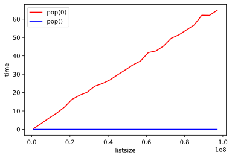

# Problem Solving with Algorithms and Data Structures

## 导论

在面向对象编程语言中，类都是对数据的构成（状态）与行为的描述，数据项被称为对象，一个对象就是类的一个实例。

赋值语句创建变量，赋值运算符将变量名与值关联，变量存的是指向数据的引用。

```python
#Python会先计算右侧表达式的结果，将指向该数据对象的引用赋给左侧变量名
theSum = 0
theSum = theSum + 1
theSum #1
```

当数据的类型发生改变，赋值语句就改变变量的引用。

```python
#变量类型从整型变成布尔类型，体现了动态特性
theSum = True
theSum #True
```

列表是指向数据对象的引用的有序集合，通过重新赋值修改会改变地址，通过切片等自带方法修改则地址不变。

```python
x=[1,2,3]
y=x
x[1]=0
y #[1, 0, 3]
```
实践：通过**牛顿迭代法**实现平方根函数

```python
#newguess=1/2(oldguess+n/oldguess)
def squareroot(n):
    root = n/2
    for k in range(20):
        root = 0.5*(root+n/root)
    return root
```
面向对象：定义类以实现**精准分数表示**

```python
class Fraction:
    def __init__(self, top, bottom):
        self.num=top
        self.den=bottom

#创建实例
myfraction = Fraction(3,5)
print(myfraction) #<__main__.Fraction object at 0x7f202c6227b8>
```
print函数要求对象将自己转换成可以被写到输出端的字符串，而myfraction只能显示储存在变量中的实际引用（地址本身）

```python
#方法一是定义一个show方法将Fraction对象打印
class Fraction:
    def __init__(self, top, bottom):
        self.num=top
        self.den=bottom
    def show(self):
        print(self.num,'/',self.den)

myfraction = Fraction(3,5)
myfraction.show() #3 / 5
```

```python
#方法二告诉Fraction类如何将自己转换成字符串
#python所有类都存在的标准方法__str__，这里需要重写默认实现
class Fraction:
    def __init__(self, top, bottom):
        self.num=top
        self.den=bottom
    def __str__(self):
        return str(self.num) + '/' +str(self.den)

myfraction = Fraction(3,5)
print(myfraction) #3/5

myfraction.__str__() #'3/5'
str(myfraction) #'3/5'
```

```python
#加号无法处理Fraction类，接下来重写Fraction类的__add__方法
#a/b与c/d相加的结果是(ad+cb)/bd，分子是ad+cb，分母是bd
class Fraction:
    def __init__(self, top, bottom):
        self.num=top
        self.den=bottom
    def __str__(self):
        return str(self.num) + '/' +str(self.den)
    def __add__(self, fraction2):
        newnum = self.num*fraction2.den+self.den*fraction2.num
        newden = self.den*fraction2.den
        return Fraction(newnum,newden)

f1 = Fraction(1,4)
f2 = Fraction(1,2)
f3 = f1+f2
print(f3) #6/8 没有化成最简
```
欧几里得算法求最大公因数：
1. 对于m与n，如果m能被n整除则最大公因数是n；
2. 如果不能,则结果是n与[m除以n余数]的最大公因数(回到1形成迭代)
```python
def gcd(m,n):
    while m%n != 0:
        oldm = m
        oldn = n
        m = oldn
        n = oldm%oldn
    return n
```

```python
class Fraction:
    def __init__(self, top, bottom):
        self.num=top
        self.den=bottom
    def __str__(self):
        return str(self.num) + '/' +str(self.den)
    def __add__(self, fraction2):
        newnum = self.num*fraction2.den+self.den*fraction2.num
        newden = self.den*fraction2.den
        common = gcd(newnum, newden)
        return Fraction(newnum//common,newden//common)

f1 = Fraction(1,4)
f2 = Fraction(1,2)
f3 = f1+f2
print(f3) #3/4
```

```python
#通过重写__eq__方法实现深相等(浅相等为同一引用)
class Fraction:
    def __init__(self, top, bottom):
        self.num=top
        self.den=bottom
    def __str__(self):
        return str(self.num) + '/' +str(self.den)
    def __add__(self, fraction2):
        newnum = self.num*fraction2.den+self.den*fraction2.num
        newden = self.den*fraction2.den
        common = gcd(newnum, newden)
        return Fraction(newnum//common,newden//common)
    def __eq__(self, other):
        firstnum = self.num*other.den
        secondnum = other.num*self.den
        return firstnum == secondnum
```
面向对象：**继承** ( IS-A关系 )
列表字符串元组从有序集合继承了共同的数据组织与操作,并通过额外特征彼此区分。为探索继承的层次结构，实现逻辑门继承结构: AND gate, OR gate, NOT gate.

```python
#最通用的类LogicGate，有一个用于识别的标签以及一个输出。还需要方法获得逻辑门标签，以及方法进行逻辑运算以获得输出。
class LogicGate:
    def __init__(self,n):
        self.label = n
        self.output = None
    def getLabel(self):
        return self.label
    def getOutput(self):
        self.output = self.performGateLogic()
        #待定义运算逻辑，交给不同的继承层次结构解决
        return self.output

#使用super函数调用父类并初始化继承项,再构造独有数据并初始化
class BinaryGate(LogicGate):
    def __init__(self, n):
        super().__init__(n)
        self.pinA = None
        self.pinB = None

    def getPinA(self):
        return int(input("Pin A"+self.getLabel()+'...'))
        #调用getLabel()实现getPinA方法

    def getPinB(self):
        return int(input("Pin B"+self.getLabel()+'...'))
        #调用getLabel()实现getPinB方法

class UnaryGate(LogicGate):
    def __init__(self, n):
        super().__init__(n)
        self.pin = None

    def getPin(self):
        return int(input("Pin"+self.getLabel()+'...'))
```

```python
#实现AND gate
class AndGate(BinaryGate):
    def __init__(self,n):
        super().__init__(n)
    def performGateLogic(self):
        a = self.getPinA()
        b = self.getPinB()
        if a==1 and b==1:
            return 1
        else:
            return 0
```

```python
#实现OR gate
class OrGate(BinaryGate):
    def __init__(self,n):
        super().__init__(n)
    def performGateLogic(self):
        a = self.getPinA()
        b = self.getPinB()
        if a==0 and b==0:
            return 0
        else:
            return 1
```

```python
#实现NOT gate
class NotGate(UnaryGate):
    def __init__(self,n):
        super().__init__(n)
    def performGateLogic(self):
        i = self.getPin
        if i == 1:
            return 0
        else:
            return 1
#用于识别的标签n有什么作用？
```
为了将逻辑门连接，要实现Connector类。每个连接器对象包含fromgate和togate两个逻辑门实例。并给之前的逻辑门增添setNextPin方法以使每个togate能选择适当输入。
```python
#面向对象，Connector与LogicGate是HAS-A关系，包含但不继承。
class Connector:
    def __init__(self, fgate, tgate):
        self.fromgate = fgate
        self.togate = tgate
        
        tgate.setNextPin(self)
    def getFrom(self):
        return self.fromgate
    def getTo(self):
        return self.togate
```

```python
class BinaryGate(LogicGate):
    def __init__(self, n):
        super().__init__(n)
        self.pinA = None
        self.pinB = None

    def getPinA(self):
        return int(input("Pin A"+self.getLabel()+'...'))

    def getPinB(self):
        return int(input("Pin B"+self.getLabel()+'...'))
    
    #增加setNextPin，默认选择PinA，若已连接则选PinB，都选了则无法连接
    def setNextPin(self, source):
        if self.pinA == None:
            self.pinA = source
        else:
            if self.pinB == None:
                self.pinB = source
            else:
                raise RuntimeError("Error: No Empty Pins")

class UnaryGate(LogicGate):
    def __init__(self, n):
        super().__init__(n)
        self.pin = None

    def getPin(self):
        return int(input("Pin"+self.getLabel()+'...'))
    
    #同样增加setNextPin，逻辑与上面类似
    def setNextPin(self, source):
        if self.pin == None:
            self.pin = source
        else:
            raise RuntimeError("Error: No Empty Pins")
```
改变了setNextPin后，输入来源有两个：外部以及上一个逻辑门，继续对getPinA, getPinB, getPin进行修改。若输入没有与任何逻辑门连接，那就要求用户输入；若有连接，就访问该连接并获得fromgate的输出值。

```python
class LogicGate:
    def __init__(self,n):
        self.label = n
        self.output = None
    def getLabel(self):
        return self.label
    def getOutput(self):
        self.output = self.performGateLogic()
        return self.output

class Connector:
    def __init__(self, fgate, tgate):
        self.fromgate = fgate
        self.togate = tgate
        
        tgate.setNextPin(self)
    def getFrom(self):
        return self.fromgate
    def getTo(self):
        return self.togate

class BinaryGate(LogicGate):
    def __init__(self, n):
        super().__init__(n)
        self.pinA = None
        self.pinB = None

    #判断输入或传入getFrom()
    def getPinA(self):
        if self.pinA == None:
            return int(input("Enter Pin A: "+self.getLabel()+'--->'))
        else:
            return self.pinA.getFrom().getOutput()

    def getPinB(self):
        if self.pinB == None:
            return int(input("Enter Pin B: "+self.getLabel()+'--->'))
        else:
            return self.pinB.getFrom().getOutput()
    
    def setNextPin(self, source):
        if self.pinA == None:
            self.pinA = source
        else:
            if self.pinB == None:
                self.pinB = source
            else:
                raise RuntimeError("Error: No Empty Pins")

class UnaryGate(LogicGate):
    def __init__(self, n):
        super().__init__(n)
        self.pin = None

    def getPin(self):
        if self.pin == None:
            return int(input("Enter Pin: "+self.getLabel()+'--->'))
        else:
            return self.pin.getFrom().getOutput()
    
    def setNextPin(self, source):
        if self.pin == None:
            self.pin = source
        else:
            raise RuntimeError("Error: No Empty Pins")

class AndGate(BinaryGate):
    def __init__(self,n):
        super().__init__(n)
    def performGateLogic(self):
        a = self.getPinA()
        b = self.getPinB()
        if a==1 and b==1:
            return 1
        else:
            return 0

class OrGate(BinaryGate):
    def __init__(self,n):
        super().__init__(n)
    def performGateLogic(self):
        a = self.getPinA()
        b = self.getPinB()
        if a==0 and b==0:
            return 0
        else:
            return 1

class NotGate(UnaryGate):
    def __init__(self,n):
        super().__init__(n)
    def performGateLogic(self):
        i = self.getPin()
        if i == 1:
            return 0
        else:
            return 1
```

```python
g1 = AndGate("G1")
g2 = AndGate("G2")
g3 = OrGate("G3")
g4 = NotGate("G4")
c1 = Connector(g1, g3)
c2 = Connector(g2, g3)
c3 = Connector(g3, g4)

g4.getOutput()
"""
Enter Pin A: G1--->0
Enter Pin B: G1--->1
Enter Pin A: G2--->1
Enter Pin B: G2--->1
0
"""
```

## 算法分析
#### 大$O$记法
常见大O函数排序：常数、对数、线性、对数线性、平方、立方、指数
$T(n)=3n^2+2n+4$
在 $T(n)$ 中 $n^2$ 起主导作用，所以这段代码的时间复杂度是 $O(n^2)$

异序词检测，编写一个布尔函数，接受两个字符串并判断是否是异序词：

```python
#lun
def eqmix(str1,str2):
    strx = list(str2)
    try:
        for i in str1:
            strx.remove(i)
        if strx == []:
            return 1
        else:
            return 0
    except ValueError:
        return 0 #eqmix('python'*10000,'typhon'*10000) --> 0.39s
```
+ 清点法：

```python
#sucks
def anagramSolution1(s1, s2):
    alist = list(s2)

    pos1 = 0
    stillOK = True

    while pos1 < len(s1) and stillOK:
        pos2 = 0
        found = False
        while pos2 < len(alist) and not found:
            if s1[pos1] == alist[pos2]:
                found = True
            else:
                pos2 += 1
            
        if found:
            alist[pos2] = None
        else:
            stillOK = False
            
        pos1 = pos1 + 1
        
    return stillOK #anagramSolution1('python'*10000,'typhon'*10000) --> 243.7338s
```
对于s1中的n个字符，检查每一个时都要遍历s2中的n个字符，访问次数即1到n之和：

$\sum_{i=1}^n{i}=\frac{n(n+1)}{2}=\frac{1}{2}n^2+\frac{1}{2}n$ ，时间复杂度为$O(n^2)$

+ 排序法:

```python
#将字符串转化为列表，再使用内建sort方法对列表排序
def anagramSolution2(s1,s2):
    alist1 = list(s1)
    alist2 = list(s2)

    alist1.sort()
    alist2.sort()
    
    pos = 0
    matches = True

    while pos < len(s1) and matches:
        if alist1[pos] == alist2[pos]:
            pos = pos + 1
        else:
            matches = False
        #这个过程和"=="原理相同

    return matches #anagramSolution2('python'*10000,'typhon'*10000) --> 0.0233s
```
虽然只有一次遍历，但两次调用sort()方法使得时间复杂度稍稍超出$O(n)$

+ 蛮力法，生成s1所有可能的组合，即 n! ，当n较大时增长比$2^n$还快，排除。

+ 计数法，创建两个计数器列表，每个列表有26个计数器

```python
def anagramSolution4(s1, s2):
    c1 = [0] * 26
    c2 = [0] * 26
    
    for i in range(len(s1)):
        pos = ord(s1[i])-ord('a')
        c1[pos] = c1[pos] + 1
    #ord()函数以一个字符（长度为1的字符串）作为参数，返回对应的ASCII数值，或者Unicode数值。
    
    for i in range(len(s2)):
        pos = ord(s2[i])-ord('a')
        c2[pos] = c2[pos] + 1
    
    j = 0
    stillOK = True
    while j < 26 and stillOK:
        if c1[j] == c2[j]:
            j = j+1
        else:
            stillOK = False

    return stillOK #anagramSolution4('python'*10000,'typhon'*10000) -->0.0203s
```
前两次循环都是n，第三个循环为26，因为不存在循环嵌套，$T(n)=2n+26$，即$O(n)$
虽然这个方法执行时间是线性的，但需要额外空间存储计时器，即用空间换时间。如果有数百万字符，计算资源的问题就会出现。

#### 数据结构性能

**列表**

两个常见操作是索引和给某个位置赋值，无论列表多长，这两个操作所花的时间恒定，即常数阶。

另一种常见的操作是加长列表。有两种方式，要么采用追加方法，要么执行连接操作。追加方法是常数阶段，如果待连接列表的长度是k，那么连接操作的时间复杂度就是$O(k)$ 。

```python
def test1():
    l = []
    for i in range(1000):
        l = l + [i] #连接操作

def test2():
    l = []
    for i in range(1000):
        l.append(i) #追加方法

def test3():
    l = [i for i in range(1000)]
    #列表解析式

def test4():
    l = list(range(1000)) 
    #列表构造器调用range函数
```
使用timeit模块实现跨平台计时：创建Timer对象，第一个参数是待计时的Python语句，第二个参数是建立测试的语句，可选参数number为语句执行次数，默认是100万次。

```python
from timeit import Timer

t1 = Timer("test1()", "from __main__ import test1")
print("concat", t1.timeit(number=1000), "milliseconds")

t2 = Timer("test2()", "from __main__ import test2")
print("append", t2.timeit(number=1000), "milliseconds")

t3 = Timer("test3()", "from __main__ import test3")
print("comprehension", t3.timeit(number=1000), "milliseconds")

t4 = Timer("test4()", "from __main__ import test4")
print("list range", t4.timeit(number=1000), "milliseconds")

"""
concat 0.8996472359995096 milliseconds
append 0.05303773900050146 milliseconds
comprehension 0.025937612999769044 milliseconds
list range 0.014922981000381697 milliseconds
"""
```

`from __main__ import test1` 将 test1 函数从 `__main__` 命名空间导入到timeit设置计时的命名空间，以在一个干净的环境中运行计时测试，以免某些变量干扰函数的性能。

>pop()--O(1), pop(i)、切片删除反转连接--O(n), 排序--O(nlogn), 连接--O(k), 乘法--O(nk)

```python
#pop的性能分析
import timeit

popzero = timeit.Timer("x.pop(0)","from __main__ import x")
popend = timeit.Timer("x.pop()","from __main__ import x")

x = list(range(2000000))
popzero.timeit(number=1000) #1.235624552000445

x = list(range(2000000))
popend.timeit(number=1000) #5.850999968970427e-05
```
pop(0)和pop()存在极大性能差异，接下来查看两者时间复杂度

```python
popzero = Timer("x.pop(0)", "from __main__ import x")
popend = Timer("x.pop()", "from __main__ import x")
print("pop(0) pop()")

for i in range(1000000, 100000001, 1000000):

    x = list(range(i))
    pt = popend.timeit(number=1000)

    x = list(range(i))
    pz = popzero.timeit(number=1000)

    print("%15.5f, %15.5f " %(pz,pt))
```

可以看出列表越长，pop(0)耗时越长，而pop()则很稳定。

**字典**
字典的取值操作和赋值操作都是常数阶，另一个重要的字典操作就是包含（检查某个键是否在字典中），也是常数阶。字典的大$O$效率如下：
>复制--O(n), 取值--O(1), 赋值--O(1), 删除--O(1), 包含--O(1), 遍历--O(n)

创建一个列表随机选取数看是否在列表中，观察随着列表的变长耗时的变化。再以数字为键创建字典重复上述实验：
```python
#比较列表和字典的包含操作
import timeit
import random

leng = []
lt = []
dt = []

for i in range(10000, 1000001, 20000):
    t = timeit.Timer("random.randrange(%d) in x" % i,
    "from __main__ import random, x")

    x = list(range(i))
    lst_time = t.timeit(number=1000)

    x = {j:None for j in range(i)}
    d_time = t.timeit(number=1000)

    leng.append(i)
    lt.append(lst_time)
    dt.append(d_time)
```

即列表的包含操作在耗时上的增长是线性的，而字典则是恒定的。

小结：算法分析师一种独立于实现的算法度量方法，大$O$记法使得算法可以根据随问题规模增长而起主导作用的部分进行归类

## 基本数据结构

线性数据结构：有序的数据集合，其元素的顺序取决于添加顺序或移除顺序，如栈、队列、双端队列和列表。区分它们的是元素的添加方式和移除方式，尤其是添加操作和移除操作发生的位置。

#### 栈

有序集合，添加操作和移除操作总发生在同一端，即顶端，另一端被称为底端。

排序方式为 LIFO，last-in first-out 即后进先出，是一种基于在集合中的时间来排序的方式，最近添加的元素靠近顶端而旧元素靠近底端。考虑到栈添加元素和移除元素的反转特性，可以在如 URL 的存放和返回浏览中用到该结构。

栈抽象数据类型由下面的结构和操作定义：
+ stack() 创建一个空栈
+ push(item) 将一个元素添加到栈的顶端，需要参数 item，且无返回值
+ pop() 将栈顶端的元素移除，返回该元素并修改栈的内容
+ peek() 返回栈顶端的元素，不修改栈内容
+ isEmpty() 检查栈是否为空，返回布尔值
+ size() 返回栈中元素的数目，返回整数

创建新类并通过方法实现栈的操作，使用原生集合中的列表：

```python
class Stack:

    def __init__(self):
        self.items = []
    
    def isEmpty(self):
        return self.items == []

    def push(self, item):
        self.items.append(item)
    
    def pop(self):
        return self.items.pop()
    
    def peek(self):
        return self.items[len(self.items)-1]
    
    def size(self):
        return len(self.items)
```
展示栈操作及其返回结果：

```python
s = Stack()
s.isEmpty() #True

s.push(4)
s.push('dog')
s.peek() #'dog'

s.push(True)
s.size() #3

s.isEmpty() #False

s.push(8.4)
s.pop() #8.4
s.pop() #True

s.size() #2
```
也可以选择将列表的头部作为栈的顶端，此时要用到 pop() 方法和 insert() 方法访问下标为0的元素：

```python
class Stack:

    def __init__(self):
        self.items = []

    def isEmpty(self):
        return self.item == []

    def push(self, item):
        self.items.insert(0, item)

    def pop(self):
        return self.items.pop(0)
    
    def peek(self):
        return self.items[0]
    
    def size(self):
        return len(self.items)
```
改变抽象数据类型的实现却保留其逻辑特征，这种能力体现了抽象思想。不过上述第二种实现的性能受制于栈中的元素个数，因为 insert(0) 和 pop(0) 的时间复杂度都是 $O(n)$ 。

接下来运用栈来解决括号匹配问题，遇到左括号便通过push将其加入栈中，遇到右括号就调用pop操作。在处理完匹配的括号串之后，栈应该是空的。

```python
def parChecker(symbolString):

    s = Stack()
    balanced = True
    index = 0

    while index < len(symbolString) and balanced:
        symbol = symbolString[index]

        if symbol == "(":
            s.push(symbol)
        else:
            if s.isEmpty():
                balanced = False
            else:
                s.pop()

        index = index + 1

    if balanced and s.isEmpty():
        return True
    else:
        return False

"""
x = "()(()"
parChecker(x) #False
"""
```
接下来进行拓展，实现符号类型匹配。我们在右符号出现时，调用辅助函数来匹配：

```python
def parChecker(symbolString):      
    s = Stack()

    balanced = True
    index = 0

    while index < len(symbolString) and balanced:
        symbol = symbolString[index]

        if symbol in "([{":
            s.push(symbol)
        else:
            if s.isEmpty():
                balanced = False
            else:
                top = s.pop()
                if not matches(top, symbol):
                    balanced = False
        
        index = index + 1

    if balanced and s.isEmpty():
        return True
    else:
        return False

def matches(open, close):
    opens = "([{"
    closers = ")]}"

    return opens.index(open) == closers.index(close) #字符串的index方法？

#测试
parChecker("[](}") 
#False
```
几乎所有记法都有需要正确匹配和嵌套的符号，可见在处理编程语言的语法结构时，栈是十分重要的数据结构。

**将十进制转换为二进制**

$233=2\times10^2+3\times10^1+3\times10^0$
$1\times2^7+1\times2^6+1\times2^5+0\times2^4+1\times2^3+0\times2^2+0\times2^1+1\times2^0$

通过“除以2”算法使用栈以保存二进制结果的每一位，将rem值反转即对应的二进制数：

`233//2=116(rem=1), 116//2=58(rem=0), 58//2=29(rem=0), 29//2=14(rem=1)`

`14//2=7(rem=0), 7//2=3(rem=1), 3//2=1(rem=1), 1//2=0(rem=1)`

```python
def divideBy2(decNumber):
    remstack = Stack()

    while decNumber > 0:
        rem = decNumber % 2
        remstack.push(rem)
        decNumber = decNumber // 2

    binString = ""
    while not remstack.isEmpty():
        binString = binString + str(remstack.pop())

    return binString

#测试
divideBy2(233)
#'11101001'
```
拓展到八进制和十六进制，注意余数要十六进制即添加ABCDEF：

```python
def baseConverter(decNumber, base):
    digits = "0123456789ABCDEFG"
    remstack = Stack()

    while decNumber > 0:
        rem = decNumber % base
        remstack.push(digits[rem])
        decNumber = decNumber // base

    binString = ""
    while not remstack.isEmpty():
        binString = binString + str(remstack.pop())

    return binString

#测试
baseConverter(223, 8) #'337'
baseConverter(223, 16) #'DF'
```

**前序、中序和后序表达式**
