# Machine Learning with Scikit-Learn & TensorFlow

<br/>

## 机器学习分类
* 监督学习 _supervised learning_
  
    训练数据带标签 _labels_ ，任务为分类 _Classification_ 与回归 _Regression_ ，
    机器学习中的属性 _attribute_ 与特征 _feature_ 的细微区别：属性为数据所属种类，而特征为属性加属性值。

    - k近邻 _k-Nearest Neighbors_
    - 线性回归 _Linear Regression_
    - 逻辑回归 _Logistic Regression_
    - 支持向量机 _SVM_
    - 决策树与随机森林 _Decision Trees & Random Forests_
    - 神经网络 _Neural networks_

* 无监督学习 _unsupervised learning_

    训练数据无标签，常见模型如下：
    
    - 聚类 _Clustering_
    _k-Means_
    层次聚类 _HCA_
    期望最大化
    - 可视化与降维 _Visualization and dimensionality reduction_
    主成分分析 _PCA_
    核 _PCA_
    局部线性嵌入 _LLE_
    _t-SNE_
    - 关联规则学习 _Association rule learning_ 
* 半监督学习 _semisupervised learning_ 

    部分标记的训练数据 _partially labeled_ 

* 强化学习 _reinforcement learning_


根据数据输入方式不同，分为批量学习与在线学习 _Batch & Online Learning_ ：

>后者可以接受小批次的新训练数据 _mini_batches_ 持续学习，而前者训练数据多为完整的数据集 _full dataset_

根据泛化方式 _generalize_ 不同，分为基于实例学习与基于模型学习 _Instance-based & Model-based learning_
``` python
import matplotlib
import matplotlib.pyplot as plt
import numpy as np
import pandas as pd
import sklearn

#load the data
oecd_bli = pd.read_csv("oecd_bli_2015.csv", thousands=',')
gdp_per_capita = pd.read_csv("gdp_per_capita.csv",thousands=',',delimiter='\t',encoding='latin1',na_values="n/a")

#prepare the data
country_stats = prepare_country_stats(oecd_bli, gdp_per_capita)#注意是伪代码或者说是待定义函数
X = np.c_[country_stats["GDP per capita"]]
y = np.c_[country_stats["Life satisfaction"]]

#visualize the data
country_stats.plot(kind='scatter', x="GDP per capita", y='Life satisfaction')
plt.show()

#select a linear model
lin_reg_model = sklearn.linear_model.LinearRegression()

#train the model
lin_reg_model.fit(X, y)

#Make a prediction for Cyprus
X_new = [[22587]] # Cyprus' GDP per capita
print(lin_reg_model.predict(X_new)) # outputs
```
<br/>


## 回归 Regression

构建一个可以预测加州任何地区房价中位数的模型，以给后续Pipeline中的投资模型提供数据。
>多变量回归的批量学习 _multivariate regression with batch learning_

### 数据读取与分组

```python
#function to fetch the data
import os
import tarfile#标准库，用于解压打开文件
from six.moves import urllib
#six.moves解决python2,3的兼容性问题,urllib为爬取网页
DOWNLOAD_ROOT = "https://www.dcc.fc.up.pt/~ltorgo/Regression/cal_housing.tgz"
HOUSING_PATH = "datasets/housing"

def fetch_housing_data(housing_url=DOWNLOAD_ROOT, housing_path=HOUSING_PATH):
    #爬取制定网页保存在制定位置
    if not os.path.isdir(housing_path):
        os.makedirs(housing_path)
    tgz_path = os.path.join(housing_path, "housing.tgz")#连接路径
    urllib.request.urlretrieve(housing_url, tgz_path)
    #将指定url数据下载到本地指定位置
    housing_tgz = tarfile.open(tgz_path)
    housing_tgz.extractall(path=housing_path)
    #打开并解压
    housing_tgz.close()

import pandas as pd
def load_housing_data(housing_path=HOUSING_PATH):
    csv_path = os.path.join(housing_path,"CaliforniaHousing")
    return pd.read_csv(csv_path)

fetch_housing_data()
housing = load_housing_data()
housing.head()

"""得到DataFrame文件并读取
longitude latitude hMAge tRooms tBedrs pop households mIncome mHouseValue 
0 	-122.23 	37.88 	41.0 	880.0 	129.0 	322.0 	126.0 	8.3252 	452600.0
1 	-122.22 	37.86 	21.0 	7099.0 	1106.0 	2401.0 	1138.0 	8.3014 	358500.0
2 	-122.24 	37.85 	52.0 	1467.0 	190.0 	496.0 	177.0 	7.2574 	352100.0
3 	-122.25 	37.85 	52.0 	1274.0 	235.0 	558.0 	219.0 	5.6431 	341300.0
4 	-122.25 	37.85 	52.0 	1627.0 	280.0 	565.0 	259.0 	3.8462 	342200.0"""
```
接下来将数据分组
```python
import numpy as np

def split_train_test(data, test_ratio):
    shuffled_indices = np.random.permutation(len(data))
    #np.random.permutation()随机序列列表
    test_set_size = int(len(data) * test_ratio)
    test_indices = shuffled_indices[:test_set_size]
    train_indices = shuffled_indices[test_set_size:]
    return data.iloc[train_indices],data.iloc[test_indices]
    #iloc通过行号提取行数据
```
完成训练集与测试集分组，但每运行一次产生的数据集不一样会导致模型最终学习了整个数据集。解决方法之是每次运行完保存数据，或者在调用np.random.permutation()之前设置一个随机数生成器的种子,比如np.random.seed(42)以生成相同的随机索引。但这样仍会在更新数据后失效，最好的方法是对每个实例使用一个**标识符** _identifier_ 来决定是否放入测试集，计算每个实例标识符的hash值，只取hash的最后一个字节，如果该值小于等于256的20%就放入测试集。这样确保了测试集在多个运行里都是一致的，即便更新数据集也一样：
```python
import hashlib
#接受传入内容并得到hash值(散列函数，将任意长度的值转换为固定长度的输出)
def test_set_check(identifier, test_ratio, hash):
    return hash(np.int64(identifier)).digest()[-1] < 256 * test_ratio 
    #digest()返回摘要,范围0～255
def split_train_test_by_id(data, test_ratio, id_column, hash=hashlib.md5):
    ids = data[id_column]
    in_test_set = ids.apply(lambda id_: test_set_check(id_, test_ratio, hash))
    return data.loc[~in_test_set], data.loc[in_test_set]
    #loc[]通过标签索引行数据
```
这里 _housing_ 数据集没有标识数据，最简单的解决方法是使用行索引作为ID:
```python
housing_with_id = housing.reset_index()
train_set, test_set = split_train_test_by_id(housing_with_id, 0.2, "index")
```
如果在添加新数据时不能保证不删除之前的行，则可以用稳定的特征来创建唯一标识符，比如经纬度:
```python
housing_with_id["id"] = housing["longitude"]*1000 + housing["latitude"]#这里的特征名称有出入
train_set, test_set = split_train_test_by_id(housing_with_id, 0.2, "id")
```
Scikit-Learn提供的**train_test_split**与之前定义的split_train_test几乎相同，通过random_state参数设置随机生成器种子，它能接受多个行数相同的数据集进行一致的拆分，可以通过 test_size 参数调整测试集占比（比如0.2）。但这种方法在数据集较小时可能会产生抽样偏差，当数据不平衡时应该采取**分层抽样** _stratified sampling_ 且每一层都要有足够数量的实例：比如收入中位数大多聚集在2～5，也有部分远超6，将收入中位数除以1.5,然后使用ceil进行取整，最后将所有大于5的类别合并为类别5

```python
housing["income_cat"] = np.ceil(housing["median_income"]/1.5)
housing["income_cat"].where(housing["income_cat"] < 5, 5.0, inplace=True)
#注意这里不是np.where(condition, x, y):满足条件(condition)，输出x，不满足输出y
#housing["income_cat"]是pandas.seris,df.where(df < 0, -df) == np.where(df < 0, df, -df),inplace取代原数据
```
现在可以根据收入类别进行分层抽样了，使用 _Scikit-Learn_ 的 _Stratified-Shuffle Split_ 类:
```python
from sklearn.model_selection import StratifiedShuffleSplit
split = StratifiedShuffleSplit(n_splits=1, test_size=0.2, random_state=42)
#n_splits为打乱的迭代次数，利用split函数对housing数据集按中收分层进行分割得到索引位置train_index和test_index,并用loc提取数据
for train_index, test_index in split.split(housing, housing["income_cat"]):
    start_train_set = housing.loc[train_index]
    start_test_set = housing.loc[test_index]
#like the ShuffleSplit strategy, stratified random splits do not guarantee that all folds will be different, although this is still very likely for sizeable datasets.
```
查看一下 _income_ 各类别占比
```python
housing["income_cat"].value_counts()/len(housing)
3.0    0.350581
2.0    0.318847
4.0    0.176308
5.0    0.114438
1.0    0.039826

#再查看一下训练集与测试集中的类别占比
strat_train_set["income_cat"].value_counts()/len(strat_train_set)
3.0    0.350594
2.0    0.318859
4.0    0.176296
5.0    0.114402
1.0    0.039850

strat_test_set["income_cat"].value_counts()/len(strat_test_set)
3.0    0.350533
2.0    0.318798
4.0    0.176357
5.0    0.114583
1.0    0.039729

train_set["income_cat"].value_counts()/len(train_set)
3.0    0.348595
2.0    0.317466
4.0    0.178537
5.0    0.115673
1.0    0.039729

test_set["income_cat"].value_counts()/len(test_set)
3.0    0.358527
2.0    0.324370
4.0    0.167393
5.0    0.109496
1.0    0.040213
```
可见在分层抽样下，训练集、测试集与完整数据分布基本一致，而随机的train_test_split则稍有偏差。在 train_test_split() 中加入**stratify参数**，比如 stratify=y ,这里是 housing["income_cat"]

```python
from sklearn.model_selection import train_test_split
train_set, test_set = train_test_split(housing, test_size=0.2,stratify=housing["income_cat"],random_state=42)
train_set["income_cat"].value_counts()/len(train_set)
test_set["income_cat"].value_counts()/len(test_set)
3.0    0.350594
2.0    0.318859
4.0    0.176296
5.0    0.114402
1.0    0.039850
Name: income_cat, dtype: float64
3.0    0.350533
2.0    0.318798
4.0    0.176357
5.0    0.114583
1.0    0.039729
Name: income_cat, dtype: float64
```
得到与整体分布更接近的样本采样，现在删除 _income_cat_ 属性，将数据复原:
```python
for set in (strat_train_set, strat_test_set):
    set.drop(["income_cat"], axis=1, inplace=True)
```
### 数据探索

_Put the test set aside and only explore the training set._
```python
#创建副本进行探索
housing = strat_train_set.copy()
#建立一个各区域的分布图，设置alpha=0.1突出高密度区域
housing.plot(kind="scatter", x="longitude", y="latitude",alpha=0.1)
```
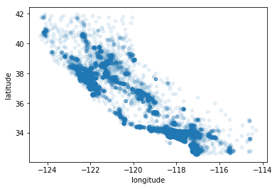
圆半径大小代表人口数量 _s_ ，颜色代表价格 _c_ ，我们使用名为jet的预定义颜色表 _cmap_ 来进行可视化：

```python
housing.plot(kind="scatter", x="longitude", y="latitude",alpha=0.4,s=housing["population"]/100,label="population",c="median_house_value",cmap=plt.get_cmap("jet"),colorbar=True)
plt.legend()
```
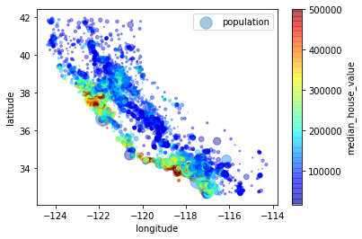
可以通过corr()方法计算每对属性间的标准相关系数 _standard correlation coefficient_ (也叫皮尔逊相关系数 _Pearson's_ )

```python
corr_matrix = housing.corr()
#来看一下各系数与median_house_value之间的关系
corr_matrix["median_house_value"].sort_values(ascending=False)

"""
median_house_value    1.000000
median_income         0.688075
total_rooms           0.134153
housing_median_age    0.105623
households            0.065843
total_bedrooms        0.049686
population           -0.024650
longitude            -0.045967
latitude             -0.144160
Name: median_house_value, dtype: float64"""
```
还可以使用Pandas绘制 _scatter_matrix_ 函数，我们选取那些与房价中位数相关的属性：
```python
from pandas.plotting import scatter_matrix
attributes = ["median_house_value","median_income","total_rooms","housing_median_age"]
scatter_matrix(housing[attributes], figsize=(12, 8))
```
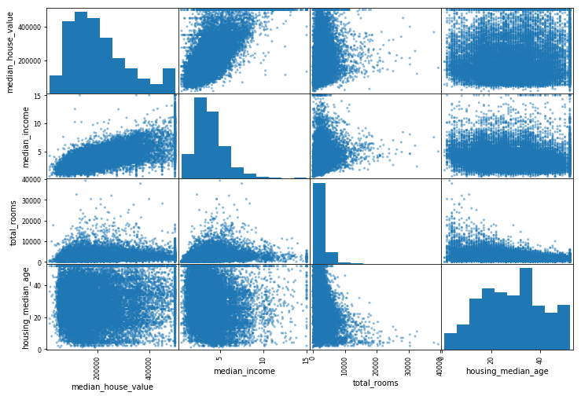
在输入数据之前还能尝试各自属性的组合:

```python
housing["rooms_per_household"] = housing["total_rooms"]/housing["households"]
housing["bedrooms_per_room"] = housing["total_bedrooms"]/housing["total_rooms"]
housing["population_per_household"] = housing["population"]/housing["households"]
#来看一下关联矩阵 correlation matrix
corr_matrix = housing.corr()
corr_matrix["median_house_value"].sort_values(ascending=False)
```

```python
median_house_value          1.000000
median_income               0.688075
rooms_per_household         0.151948
total_rooms                 0.134153
housing_median_age          0.105623
households                  0.065843
total_bedrooms              0.049686
population_per_household   -0.023737
population                 -0.024650
longitude                  -0.045967
latitude                   -0.144160
bedrooms_per_room          -0.255880
Name: median_house_value, dtype: float64
```
发现 _bedrooms_per_room_ 与 _median_house_value_ 负相关，而 _rooms_per_household_ 与也比 _total_rooms_ 更具信息量

### 预处理：缺失值

通过编写函数来预处理数据的好处：
+ 可以在任何数据集上重现这些转换
+ 可以逐渐建立起转换函数的函数库
+ 实时系统中用于处理数据并 _feed_ 给算法
+ 尝试多种转换方式看哪种转换组合的效果最好

回到干净的数据集 _strat_train_set_ ，把**预测器**与**标签**分开(注意drop会创建副本不会影响 _strat_train_set_ )
```python
housing = strat_train_set.drop("median_house_value", axis=1)
housing_labels = strat_train_set["median_house_value"].copy()
```
根据 _housing.info_ 得知 _total_bedrooms_ 和 _bedrooms_per_room_ 有所缺失。对于缺失的特征，需要创建函数辅助处理，可以放弃这些地区、属性或者将缺失值设置为某个值（零均值或中位数）。通过DataFrame的dropna()、drop()和fillna()方法可以完成这些操作：

```python
housing.dropna(subset=["total_bedrooms"])#法1
housing.drop("total_bedrooms",axis=1)#法2
median = housing["total_bedrooms"].median()
housing["total_bedrooms"].fillna(median)#法3
```
Scikit-Learn提供了一个非常容易上手的类 _class_ 来处理缺失值：**SimpleImputer**，首先创建实例并指定替代值类型：
```python
from sklearn.impute import SimpleInputer
imputer = SimpleImputer(strategy="median")
#把ocean_proximity排除在外因为它不是数值,没有中位数，无法根据中位数填补缺失值
housing_num = housing.drop("ocean_proximity".axis=1)
#使用fit()方法将imputer实例适配到训练集
imputer.fit(housing_num)
#这里imputer计算了每个属性的中位数值以实现填补并将结果存储在实例变量imputer.statistics_中
```
虽然 _total_bedrooms_ 存在缺失值，但我们无法确认系统启动后新数据是否一定不存在任何缺失值。此时可以使用这个imputer将缺失值转化为中位数得到一个Numpy array,再放回DataFrame中:
```python
X = imputer.transform(housing_num)
housing_tr = pd.DataFrame(X, columns=housing_num.columns)
#也可以在得到imputer实例和housing_num数据集后利用fit_transform一步实现拟合与转换:
```
<br/>

**_Scikit-Learn Design_**

>估计器 _estimators_ ：根据数据集对某些参数进行估计的任意对象都能被称为估计器，通过fit方法执行并以数据集作为参数，如 _strategy_ 这类的其他参数作为超参数 _hyperparameter_ (用于创建 _SimpleImputer_ 实例)

>转换器 _transformers_ ：有些估计器可以用于转换数据集，这些被称为转换器，由transform()方法与待转换数据一起执行并返回转换后的数据集，所有转换器都能使用 _fit_transform_ 方法。

>预测器 _predictors_ ：有些估计器能基于一个给定的数据集进行预测，被称为预测器。预测器的predict()方法会接受一个新实例的数据集，然后返回一个包含相应预测的数据集。score()方法则用来衡量给定测试集的预测质量。

+ 可检查 _Inspection_ ：所有估计器的超参数都可以通过公共实例变量直接访问(e.g., imputer.strategy)直接访问，所有估计器的学习参数也可以通过带下划线后缀的公共实例变量来访问, imputer.statistics_ 得到是housing_num.median().values
+ 类不扩散 _Nonproliferation of classes_ ：数据集被表示为 Numpy 数组或者 Scipy 稀疏矩阵，而不是自定义类型。超参数只是字符串或者数字。
+ 组合方式 _Composition_ ：现有构建代码块 _blocks_ 尽最大可能重用，任意序列的转换器加上预测器就能创建一个 _Pipeline_
+ 合理默认值 _Sensible defaults_ ：_Scikit-Learn_ 为大多数参数提供了合理的默认值，从而可以快速搭建起一个基础工作系统 _baseline working system_

<br/>

### 预处理：标签数据

之前我们排除的分类属性ocean_proximity是文本属性，无法计算中位数，其实大部分机器学习算法都适合处理纯数字，对于这一类标签数据，Scikit-Learn 提供了转换器 **LabelEncoder** : 
```python
from sklearn.preprocessing import LabelEncoder
encoder = LabelEncoder()
housing_cat = housing["ocean_proximity"]
housing_cat_encoded = encoder.fit_transform(housing_cat)
housing_cat_encoded
#array([0, 0, 4, ..., 1, 0, 3])

#可以通过classes_属性来查看编译器encoder所学到的映射mapping
print(encoder.classes_)
#['<1H OCEAN' 'INLAND' 'ISLAND' 'NEAR BAY' 'NEAR OCEAN']对应[0, 1, 2, 3, 4]
```
这种代表方式的问题是算法会假设两个相近的数字比较远的更相似，而实际情况可能不是。常见的解决方式是给每个类别创建一个二进制属性，即 **one-hot 编码**。

Scikit-Learn preprocessing 模块的 **OneHotEncoder** 转换器，可以将整数分类转换为独热向量。不过 fit_transform() 只接受 ndarray 并输出 SciPy 稀疏矩阵，由于pd.Series的shape为(a,)并非(a, 1)，需要先提取values再reshape(-1,1) 化为一列才能处理。得到的稀疏矩阵仅储存非零元素的位置，所以更节约内存。

```python
encoder = OneHotEncoder(sparse=False) #输出正常数组
housing_cat_1hot = encoder.fit_transform(housing_cat.values.reshape(-1,1))
#如果上面没设sparse参数可通过housing_cat_1hot.toarray()转换
"""
array([[0., 0., 0., 0., 1.],
       [0., 1., 0., 0., 0.],
       [1., 0., 0., 0., 0.],
       ...,
       [1., 0., 0., 0., 0.],
       [1., 0., 0., 0., 0.],
       [0., 1., 0., 0., 0.]])"""
```


<br/>

### 预处理：定制转换器

由于 _Scikit-Learn_ 依赖于 _duck typing_ 而不是继承 _inheritance_ 。当需要特定转换器时，只需**创建一个类**，然后定义fit()、transform()、fit_transform() 。

添加 **TransformerMixin** 作为基类可以在定义了 fit() 和 transform() 方法后直接得到 fit_transform() ；选择 **BaseEstimator** 作为基类，并在函数构造中避免 *args 和 **kargs（元组参数和字典参数），还能获得两个非常有用的自动调整超参数的方法 get_params() 和 set_params() ，以下定制转换器用来添加组合后的属性：

```python
from sklearn.base import BaseEstimator, TransformerMixin
rooms_ix, bedrooms_ix, population_ix, household_ix = 3, 4, 5, 6
#各属性在housing_num中所属的列

class CombinedAttributesAdder(BaseEstimator, TransformerMixin):
    def __init__(self, add_bedrooms_per_room=True):#no *args or **kwargs
        self.add_bedrooms_per_room = add_bedrooms_per_room
    def fit(self, X, y=None):
        return self #nothing else to do
    def transform(self, X, y=None):
        rooms_per_household=X[:,rooms_ix]/X[:,household_ix]
        population_per_household=X[:,population_ix]/X[:,household_ix]
        if self.add_bedrooms_per_room:
            bedrooms_per_room = X[:,bedrooms_ix]/X[:,household_ix]
            return np.c_[X, rooms_per_household, population_per_household,bedrooms_per_room]
        else:
            return np.c_[X, rooms_per_household, population_per_household]
        #np.c_ 按列合并数组
        
attr_adder = CombinedAttributesAdder(add_bedrooms_per_room=False)
housing_extra_attribs = attr_adder.transform(housing.values)

#超参数 add_bedrooms_per_room ,用来控制该步骤的开关。自动化执行的步骤越多，能尝试的组合也就越多。
```
数值差异过大会导致算法性能不佳，常用的两种**特征缩放**方法是 _min-max sacling_ 归一化和 _standardization_ 标准化。归一化即将值减去最小值并除以最大值和最小值的差使得最终范围在0～1之间。_Scikit-Learn_ 提供了名为 **MinMaxScaler** 的转换器，并可以通过超参数 feature_range 进行更改。标准化则是减去平均值再除以方差，受异常值的影响较小，不会把数值限制在一个特定的范围，对于有些算法比如神经网络来说可能存在问题，_Scikit-Learn_ 标准化的转换器是**StandardScaler**。

>跟所有转换一样，缩放器仅用来拟合训练集，而不是完整的数据集

<br/>

### 预处理：转换流水线

_Scikit-Learn_ 提供了 Pipeline 类来支持一系列的转换，以下为示例：

```python
from sklearn.pipeline import Pipeline
from sklearn.preprocessing import StandardScaler

num_pipeline = Pipeline([
    ('imputer', SimpleImputer(strategy="median")),
    ('attribs_adder',CombinedAttributesAdder()), 
    #TransformerMixin基类可直接调用fit_transform()
    ('std_scaler',StandardScaler())
])

housing_num_tr = num_pipeline.fit_transform(housing_num)
```
Pipeline 构造函数会通过一系列名称/估计器 (name/estimator) 的配对来定义步骤的序列，除了最后一个，之前的估计器必须是转换器，即有 fit_transform() 方法。当对Pipeline调用方法时会在所有转换器上调用 fit_transfrom() 方法，将前面调用的输出作为参数传递给下一个调用方法。

Pipeline 的方法与最终估计器的调用方法一致，本例中最后一个估计器是 StandardScaler ，因此可以直接使用 transform() 方法和 fit_transform() 方法。

接下来为了同时在分类值上应用 LabelBinarizer（把文本转换为独热），需要用到 Scikit-Learn 的 **FeatureUnion** 类，即特征联合。可以接受多个待转换对象，只需分别提供转换器列表（可以是Pipelines），就能依次调用transform()或者fit()方法，并将输出串联到复合特征空间。以下是一个完整的处理数值和分类属性的Pipline：

```python
from sklearn.pipeline import FeatureUnion

num_attribs = list(housing_num) #housing_num中各属性
cat_attribs = ["ocean_proximity"]

num_pipeline = Pipeline([
    ('selector',DataFrameSelector(num_attribs)), #选择待处理的数值特征
    ('imputer',SimpleImputer(strategy="median")),#求出中位数并填补缺失
    ('attribs_adder',CombinedAttributesAdder()), #加上组合属性
    ('std_scaler',StandardScaler()),             #进行标准化
])

cat_pipeline = Pipeline([
    ('selector',DataFrameSelector2(cat_attribs)), #选出待处理分类特征
    ('label_binarizer',OneHotEncoder(sparse=False)), #转换为独热向量并以标准数组输出
])

full_pipeline = FeatureUnion(transformer_list=[
    ("num_pipeline",num_pipeline),               
    ("cat_pipeline",cat_pipeline),
])
```
对了，还需要定义一下上例中的 DataFrameSelector() ，它选出指定类型特征并将结果从DataFrame转换为Numpy数组:
```python
from sklearn.base import BaseEstimator, TransformerMixin
class DataFrameSelector(BaseEstimator, TransformerMixin):
    def __init__(self, attribute_names):
        self.attribute_names=attribute_names
    def fit(self, X, y=None):
        return self
    def transform(self, X):
        return X[self.attribute_names].values

class DataFrameSelector2(BaseEstimator, TransformerMixin):
    def __init__(self, attribute_names):
        self.attribute_names=attribute_names
    def fit(self, X, y=None):
        return self
    def transform(self, X):
        return X[self.attribute_names].values.reshape(-1,1)
```

在FeatureUnion的Pipeline中替换：

```python
housing_prepared = full_pipeline.fit_transform(housing)
housing_prepared
#housing_prepared.shape为(16512, 16)与书中(16513, 17)不同
#num:8+cat:5+add:3=16
```
<br/>

### 模型选择与评估

从线性回归模型开始：

```python
from sklearn.linear_model import LinearRegression
lin_reg = LinearRegression()
lin_reg.fit(housing_prepared, housing_labels)

some_data = housing.iloc[:5]
some_labels = housing_labels.iloc[:5]
some_data_prepared = full_pipeline.transform(some_data)
print("Predictions:\n",np.around(lin_reg.predict(some_data_prepared)))
print("Labels:\n",list(some_labels))

"""
Predictions:
 [211881. 321219. 210878.  62198. 194848.]
Labels:
[286600.0, 340600.0, 196900.0, 46300.0, 254500.0]
"""
```


回归问题常用的性能衡量指标 _Performance Measure_ 是**均方根误差**。

_Root Mean Square Error_ :_It measures the standard deviation of the errors the system makes in its predictions._

RMSE$(X,h)=\sqrt{{1\over m}\sum_{i=1}^m(h(x^{(i)})-y^{(i)})^2}\,$

当出现很多离群点时 _outlier_ ，我们通常会用**平均绝对误差** _Mean Aboslute Error_

MAE$(X,h)={1\over m}\sum_{i=1}^m|h(x^{(i)})-y^{(i)}|\,$

> RMSE对应欧几里得范数，L2范数写作$\parallel . \parallel _2$
> MAE对应曼哈顿范数，L1范数写作$\parallel . \parallel_1$
> L0表示向量中非0元素的个数，Lp则是 $\parallel v \parallel _p=(|v_0|^p+|v_1|^p+...+|v_n|^p)^{1\over p}$


RMSE对离群点的敏感程度高于MAE，当离群点很少时优先选择RMSE进行评估。用**sklearn.metrics**模块的**mean_squared_error**函数来测量训练集上的MSE，再求平方根得到RMSE 。

```python
from sklearn.metrics import mean_squared_error

housing_predictions = lin_reg.predict(housing_prepared)
lin_mse = mean_squared_error(housing_labels, housing_predictions)
lin_rmse = np.sqrt(lin_mse) #68911.49637588045
```


大多数地区的房价中位数在120000到265000之间，所以这个预测误差差强人意。通常在欠拟合时，可以选择更强大的模型，或者为训练模型提供更好的特征，再或者减少对模型的限制（正则化）。我们尝试一下DecisionTreeRegressor：

```python
from sklearn.tree import DecisionTreeRegressor
tree_reg = DecisionTreeRegressor()
tree_reg.fit(housing_prepared, housing_labels)

housing_predictions = tree_reg.predict(housing_prepared)
tree_mse = mean_squared_error(housing_labels, housing_predictions)
tree_rmse = np.sqrt(tree_mse) #0
```
RMSE为0，极有可能过拟合。


我们需要拿出部分用于训练，另一部分用于模型验证。一种方法是使用 **train_test_split** 函数，另一种是使用交叉验证 **cross_val_score**，传入模型、数据、标签、评估方式与折数。以下是K-折交叉验证的代码，将训练集随机分割成10个不同的子集，每次挑选1个进行评估，另外9个进行训练，产生一个包含10次评估分数的列表。

```python
from sklearn.model_selection import cross_val_score
scores = cross_val_score(tree_reg, housing_prepared, housing_labels, scoring="neg_mean_squared_error", cv=10)
rmse_scores = np.sqrt(-scores)
```
Scikit-Learn交叉验证的得分是MSE的负数，所以为得到RMSE需要取负值求平方根。来看看结果：

```python
def display_scores(scores):
    print("Scores:",scores)
    print("Mean:",scores.mean())
    print("Standard deviation:",scores.std())
display_scores(rmse_scores)

"""
Scores: [69446.17322491 68573.17026052 70222.96673604 72645.5123251
 68148.61712134 74340.91209792 73857.73237391 70829.25079841
 76758.25414382 69888.59320288]
Mean: 71471.11822848504
Standard deviation: 2669.7646210032563"""
```
RMSE的均值比线性回归还糟糕，交叉验证不仅可以得到模型性能的评估值，还可以衡量该评估的精确度（即标准差）。接下来看一下线性模型的评分：

```python
lin_scores = cross_val_score(lin_reg, housing_prepared, housing_labels, scoring="neg_mean_squared_error",cv=10)
lin_rmse_scores = np.sqrt(-lin_scores)
display_scores(lin_rmse_scores)
"""
Scores: [67474.11780426 67233.22466524 69301.86479972 74716.01783105
 68426.80214612 71609.98356263 65200.14338307 68687.78826919
 72262.43484426 68111.81213342]
Mean: 69302.41894389638
Standard deviation: 2653.460699447043"""
```
决策树确实严重过拟合了，来看看最后一个模型RandomForestRegressor：

```python
from sklearn.ensemble import RandomForestRegressor
forest_reg = RandomForestRegressor()
forest_reg.fit(housing_prepared, housing_labels)

housing_predictions = forest_reg.predict(housing_prepared)
forest_mse = mean_squared_error(housing_labels, housing_predictions)
tree_rmse = np.sqrt(forest_mse)
tree_rmse #18781.044667270027

forest_reg_scores = cross_val_score(forest_reg, housing_prepared, housing_labels, scoring="neg_mean_squared_error",cv=10)
forest_rmse_scores = np.sqrt(-forest_reg_scores)

display_scores(forest_rmse_scores)
"""
Scores: [49667.82885713 47559.50920685 49912.7619866  52847.90520482
 49503.35788784 54392.18195777 49534.25454753 48141.15339194
 53330.88218057 50496.84842538]
Mean: 50538.66836464148
Standard deviation: 2140.9028742731366"""
```
效果得到提升，书上说训练集得分低于测试集存在过拟合（难道不是欠拟合？）

用 train_test_split  得到的评估得分则提升明显：

```python
from sklearn.model_selection import train_test_split
X_train,X_test,y_train,y_test = train_test_split(housing_prepared,housing_labels)

print('Train score:{:.3f}'.format(forest_reg.score(X_train, y_train))) #Train score:0.974
print('Test score:{:.3f}'.format(forest_reg.score(X_test, y_test))) #Test score:0.973

print('Train score:{:.3f}'.format(lin_reg.score(X_train, y_train))) #Train score:0.646
print('Test score:{:.3f}'.format(lin_reg.score(X_test, y_test))) #Test score:0.646
```
妥善保存模型，参数和超参数，以及交叉验证的评分和实际预测的结果，这样就能轻松对比不同模型。通过Python的pickel模块或是sklearn.externals.joblib，可以保存sklearn模型，更有效地将大型Numpy数组序列化：

```python
from sklearn.externals import joblib
joblib.dump(my_model,"my_model.pkl")
#and later...
my_model_loaded = joblib.load("my_model.pkl")
```

<br/>

### 微调模型

可以用 sklearn 的 GridSearchCV **网格搜索交叉验证**，使用交叉验证来评估所有组合：

```python
from sklearn.model_selection import GridSearchCV
#创建参数列表，列表由字典组成，字典的键为模型的参数，值为待评估参数值
param_id = [
    {'n_estimators':[3,10,30],'max_features':[2,4,6,8]},
    {'bootstrap':[False],'n_estimators':[3,10],'max_features':[2,3,4]}
]
forest_reg = RandomForestRegressor()

grid_search = GridSearchCV(forest_reg, param_grid, cv=5, scoring='neg_mean_squared_error')
grid_search.fit(housing_prepared, housing_labels) #还有fit，predict，score 等方法
```
**sklearn.model_selection**模块的**GridSearchCV**类接受模型对象、字典组成的参数列表、折数cv、评估方法scoring 。

先评估传入列表中第一个 dict 中 n_estimators 和 max_features 的3X4种超参数组合，再尝试第二个dict中2X3种组合且bootstrap为False。**grid_search.best_params** 输出 {'max_features': 6, 'n_estimators': 30}，n_estimators 的待选择参数最大值就是30，所以可以尝试更高的值看评分是否继续改善，也可以直接得到最好的估算器 grid_search.best_estimator_：

```python
RandomForestRegressor(bootstrap=True, ccp_alpha=0.0, criterion='mse',
                      max_depth=None, max_features=6, max_leaf_nodes=None,
                      max_samples=None, min_impurity_decrease=0.0,
                      min_impurity_split=None, min_samples_leaf=1,
                      min_samples_split=2, min_weight_fraction_leaf=0.0,
                      n_estimators=30, n_jobs=None, oob_score=False,
                      random_state=None, verbose=0, warm_start=False)
```
可以通过通过以下代码查看评估分数:

```python
cvres = grid_search.cv_results_
for mean_score, params in zip(cvres["mean_test_score"],cvres["params"]):
    print(np.sqrt(-mean_score),params)

"""mean_test_score即交叉验证得分neg_mean_squared_error
64224.53778180021 {'max_features': 2, 'n_estimators': 3}
55615.95389014503 {'max_features': 2, 'n_estimators': 10}
53354.46171627235 {'max_features': 2, 'n_estimators': 30}
60941.834046096104 {'max_features': 4, 'n_estimators': 3}
52708.887304172014 {'max_features': 4, 'n_estimators': 10}
50350.54562467355 {'max_features': 4, 'n_estimators': 30}
59064.866569536745 {'max_features': 6, 'n_estimators': 3}
51738.49779800306 {'max_features': 6, 'n_estimators': 10}
50013.298214917035 {'max_features': 6, 'n_estimators': 30}
...
51813.13032113271 {'bootstrap': False, 'max_features': 4, 'n_estimators': 10}"""
```

有些数据准备步骤也能当超参数来处理，例如是否使用转换器 CombinedAttributesAdder 的超参数 add_bedrooms_per_room 。网格搜索还能用于自动查找处理异常值、缺失特征与特征选择等问题。

当超参数的搜索范围较大时，通常会选择**随机搜索**RandomizedSearchCV，它的使用与网格搜索相似，只是在每次迭代iteration时为每个超参数选择一个随机值，然后对一定数量的随机组合进行评估。还有一种将表现最优的模型组合起来的微调方法，叫作**集成方法**，以后会细讲。

网格搜索还可以指出每个属性的相对重要性：`grid_search.best_estimator.feature_importances_`，并根据重要性删除一些不太有用的特征。现在在测试集上评估最终的模型 grid_search.best_estimator_ ：

```python
 final_model = grid_search.best_estimator_ #根据最佳参数确定的估计器
 
 X_test = strat_test_set.drop("median_house_value",axis=1)
 y_test = strat_test_set["median_house_value"].copy()

 X_test_prepared = full_pipeline.transform(X_test) #不需要再fit了
 final_predictions = final_model.predict(X_test_prepared)

 final_mse = mean_squared_error(y_test, final_predictions)
 final_rmse = np.sqrt(final_mse)#47611.75169361235
```

<br/>


## 分类 Classification

### MNIST与分类器

```python
from sklearn.datasets import fetch_openml
mnist = fetch_openml('mnist_784', version='active')
#要好久...或者下面这种也可以导入
from tensorflow.examples.tutorials.mnist import input_data
mnist = input_data.read_data_sets('MNIST_data', one_hot=True)
```
来看一下这些数组:
```python
X, y = mnist["data"], mnist["target"]
X.shape #(70000, 784)
y.shape #(70000,)
```
共7万张图片，每张图片784个特征(28X28)，使用 Matplotlib 的 imshow() 函数将其显示出来：

```python
import matplotlib
import matplotlib.pyplot as plt 

some_digit = X[36000]
some_digit_image = some_digit.reshape(28, 28)

plt.imshow(some_digit_image, cmap=matplotlib.cm.binary, interpolation="nearest")
plt.axis("off")
plt.show()

y[36000] #确实是'9'
```
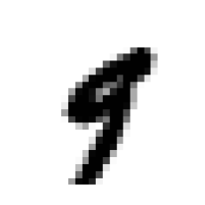
MNIST数据集前6万张为训练集，后1万张为测试集。我们将训练集数据洗牌，保证交叉验证时所有折叠都差不多，同时也保证了不会有连续的相似输入。

```python
import numpy as np
X_train, X_test, y_train, y_test = X[:60000], X[60000:], y[:60000], y[60000:]
shuffle_index = np.random.permutation(60000) #生成取值0～59999的随机一维数组
X_train, y_train = X_train[shuffle_index], y_train[shuffle_index] #将训练集顺序打乱
```
注意，如果处理时间序列数据则不能洗牌。接下来先训练一个二元分类器，只识别5，先创建目标向量(对应标签)：

```python
y_train_5 = (y_train == '5') #将10分类数据变成二元，得到一个shape为(60000,)的布尔数组
y_test_5 = (y_test == '5')
```
选择随机梯度下降(SGD)分类器，使用sklearn的SGDClassifier，能有效处理大型数据集。同时因为SGD独立处理训练实例，所以很适合在线学习。

```python
from sklearn.linear_model import SGDClassifier
sgd_clf = SGDClassifier(random_state=42) #设置参数以复现
sgd_clf.fit(X_train, y_train_5)
```
模型训练完毕，选择X_test_5中的几个进行测试:

```python
np.where(y_test_5 == True) #随便选几个，X_test[8],X_test[15],X_test[23]
sgd_clf.predict(X_test[8].reshape(1,-1)) #array([ False])
sgd_clf.predict(X_test[15].reshape(1,-1)) #array([ True])
sgd_clf.predict(X_test[23].reshape(1,-1)) #array([ True])
#有对有错
```
<br/>

### 混淆矩阵、P-R图与ROC

评估分类器比评估回归器要困难，这里还是使用交叉验证。**implementing Cross-Validation** 为了在交叉验证过程中获得更多控制，比如分层，这里手工实现交叉验证:

```python
from sklearn.model_selection import StratifiedKFold
from sklearn.base import clone

skfolds = StratifiedKFold(n_splits=3, random_state=42) #得到3折分类器，分层保证分类前后比例一致

for train_index, test_index in skfolds.split(X_train,y_train_5): 
#分类器的split(X,y)方法返回切片后的训练集测试集索引，kfolds只需要参数X但skfolds还需要y作为分层标签
    clone_clf = clone(sgd_clf)
    X_train_folds = X_train[train_index]
    y_train_folds = (y_train_5[train_index])
    X_test_fold = X_train[test_index]
    y_test_fold = (y_train_5[test_index])#split的是X_train，train_fold和test_fold都在其中

    clone_clf.fit(X_train_folds, y_train_folds)
    y_pred = clone_clf.predict(X_test_fold)
    n_correct = sum(y_pred == y_test_fold)
    print(n_correct / len(y_pred)) #0.9276 0.9616 0.9634
```
每个折叠由StratifiedKFold执行分层抽样产生，每个迭代会创建一个分类器副本，训练后用测试集进行预测，最后计算正确预测的次数并输出准确率。接下来用 cross_val_score() 函数评估 SGDClassifier 模型，采用K-fold交叉验证(3折)。

```python
from sklearn.model_selection import cross_val_score
cross_val_score(sgd_clf, X_train, y_train_5, cv=3, scoring="accuracy")
#array([0.95655, 0.96465, 0.96325])
```
看起来精度都很高，接下来随意定义一个常数分类器，将每张图都分类为"非5":

```python
from sklearn.base import BaseEstimator

class Never5Classifier(BaseEstimator):
    def fit(self, X, y=None):
        pass
    def predict(self, X):
        return np.zeros((len(X),1),dtype=bool)
    
never_5_clf = Never5Classifier()
cross_val_score(never_5_clf, X_train, y_train_5, cv=3, scoring="accuracy")
#array([0.90895, 0.9099 , 0.9101 ])，精度同样很高
```
说明精度通常无法成为分类器的首要性能指标，特别是在处理偏斜数据集时。


**混淆矩阵** Confusion Matrix

计算混淆矩阵，需要先有一组预测才能将其与实际目标比较，这里使用 **cross_val_predict()** 函数，传入模型、数据集、标签以及折数cv。

```python
from sklearn.model_selection import cross_val_predict
y_train_pred = cross_val_predict(sgd_clf, X_train, y_train_5, cv=3)
```
与 cross_val_score() 函数一样，cross_val_predict() 函数同样执行K-fold交叉验证，但返回的是每个折叠的预测，在这里是布尔数组。sklearn.metrics 模块的confusion_matrix() 函数根据正类标签和决策结果（实际分类和预测分类）得到混淆矩阵：

```python
from sklearn.metrics import confusion_matrix
confusion_matrix(y_train_5, y_train_pred)
"""
array([[52125,  2454],
       [  764,  4657]])"""
```
混淆矩阵的行是正确的类别，列是预测类别，二元分类的右下角对应的行是正类，列为预测的正类。上例第一行表示所有非5，即所有负类。它们中有52125个被正确地分为非5(真负类true negatives)，而2454张被错误地划分为5(假正类false positives)。第二行表示所有的5，即所有正类。有764张被错误的分为非5类(false negatives)，4657张被正确地分类在5类(true positives)。完美的分类器应该只存在真正类和真负类，即混淆矩阵的对角线。接下来介绍评估函数：**precision_score()** , **recall_score()** 和 **f1_score()**，参数都是正类标签和决策结果，在这里即两组布尔数组。

正类预测的准确率 **Precision**，也叫查准率

$precision=\frac{TP}{TP+FP}$

召回率**Recall**，也称查全率

$recall=\frac{TP}{TP+FN}$

```python
from sklearn.metrics import precision_score, recall_score
precision_score(y_train_5, y_train_pred) #0.6549 即4192/(4192+2153)
recall_score(y_train_5, y_train_pred) #0.8591 即4657/(4657+764)
```
这两个指标已不像准确率那么高了，当它说一张图片是5时，预测只有65.49%的时候是准确的，并且只有85.91%的数字5被识别出来。将精度与召回率合成一个单一指标，称为 **$F_1$分数**，即两者的调和平均数，只有在两者都很高时才能得到较高分数:

$F_1=\frac{2}{\frac{1}{precision}+\frac{1}{recall}}=\frac{2}{\frac{TP+FP}{TP}+\frac{TP+FN}{TP}}$

```python
from sklearn.metrics import f1_score
f1_score(y_train_5, y_train_pred) #0.7432
```


**决策分数与P-R 图**

如何知道模型调整中的查准率P和查全率R之间的动态关系？SGDClassifier 对于每个实例，基于决策函数计算出一个决策分数，再根据与阈值的大小关系判为正类或负类，所以基于不同的阈值查全率和查准率此消彼长。sklearn不允许直接设置阈值，但是可以通过调用分类器的decision_function()方法返回**单个决策分数**，通过这些分数设置阈值即得到预测结果：

```python
y_scores = sgd_clf.decision_function([some_digit])
y_scores #array([-7202.31479923])
threshold = -7500
y_some_digit_pred = (y_scores > threshold)
y_some_digit_pred #array([ True])

threshold = 7000 #提高阈值
y_some_digit_pred = (y_scores > threshold)
y_some_digit_pred #array([False])
```


如何得到查准率、查全率与阈值之间的关系？

先使用 **cross_val_predict()** 交叉验证预测函数得到训练集中所有实例的**决策分数 y_scores**，参数为模型、数据集、折数和方法，这里方法选择 **decision_function**:

```python
y_scores = cross_val_predict(sgd_clf, X_train, y_train_5, cv=3, method="decision_function")
```


再调用 **precision_recall_curve()** 即P-R曲线函数，参数为正类标签 y_train_5 与全部决策分数 y_scores，返回所有可能的精度和召回率及对应的阈值:

```python
from sklearn.metrics import precision_recall_curve
precision, recalls, thresholds = precision_recall_curve(y_train_5, y_scores)
#注意precision和recalls的 array,shape = [n_thresholds + 1]，分别多了1和0
```
最后使用matplotlib绘制精度与召回率相对于阈值的函数图:

```python
def plot_precision_recall_vs_threshold(precision, recalls, thresholds):
    plt.plot(thresholds, precision[:-1],"b--",label="Precision") 
    plt.plot(thresholds, recalls[:-1],"g-",label="Recall")
    #除去最后一位数因为p和r多了最后一位数
    plt.xlabel("Threshold")
    plt.legend(loc="upper left")
    plt.ylim([0,1])
    plt.xlim([-20000,20000])

plot_precision_recall_vs_threshold(precision, recalls, thresholds)
plt.show()
```
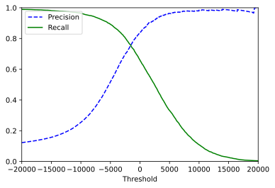
一般来说，随着阈值提升，精度会提高，召回率会下降。注意在某些时候，提高阈值反而会使精度下降；但召回率一定是持续下降的：

$precision=\frac{TP}{TP+FP}$，$recall=\frac{TP}{TP+FN}$

阈值提高时，TP和FP都可能减少，但FN不会减少，$recall=1-\frac{FN}{TP+FN}$右边分式恒增，整体恒减。我们选择的阈值为-700：

```python
y_train_pred_90 = (y_scores > -700)
#筛选出决策分数大于-700的作为决策结果，即将阈值设置为-700，由正类标签和决策结果(这里都是布尔值)得到此时的精度和召回率
precision_score(y_train_5, y_train_pred_90) #0.8069
recall_score(y_train_5, y_train_pred_90) #0.7037
```
得到一个折中的选择器，此时有80%精度和70%的召回率，我们绘制**P-R图**:

```python
def plot_pr_sgd():
    plt.plot(recalls, precision,"b--",label="SGD") 
    plt.xlabel("recalls")
    plt.ylabel("precision")
    plt.legend(loc="bottom left")
    plt.ylim([0,1])
    plt.xlim([0,1])
plot_pr_sgd()
```
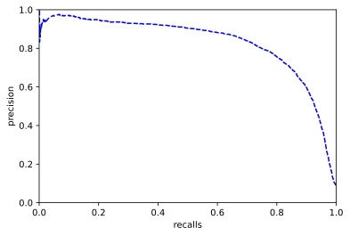


**ROC曲线**
ROC曲线绘制的是真正类率TPR（被正确分为正类的正类实例占比，即召回率$\frac{TP}{TP+FN}$）与假正类率FPR（被错误分为正类的负类实例占比，$\frac{FP}{FP+TN}$)。FPR等于1-真负类率TNR，即1-特异度。
要绘制ROC曲线，首先要使用 **roc_curve()** 函数计算多种阈值的FPR、TPR以及阈值，参数依然是**正类标签**与**决策分数**:

```python
from sklearn.metrics import roc_curve
fpr, tpr, thresholds = roc_curve(y_train_5, y_scores)#正类标签与决策分数
```
ROC曲线横轴为FPR假正类率，纵轴为TPR真正类率，使用Matplotlib绘制FPR对TPR的曲线：

```python
def plot_roc_curve(fpr, tpr, label=None):
    plt.plot(fpr, tpr, linewidth=2, label=label) #绘制曲线
    plt.plot([0,1],[0,1],'k--') #绘制虚线
    plt.axis([0,1,0,1]) #轴的范围
    plt.xlabel('False Positive Rate')
    plt.ylabel('True Positive Rate')

plot_roc_curve(fpr, tpr)
plt.show()
```
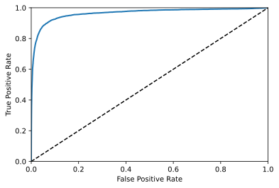
同样，召回率TPR越高，假正类FPR就越多。虚线表示纯随机分类的ROC曲线，优秀的分类器应该靠左上角远离这条线。AUC是曲线下面积，可以衡量比较分类器，随机分类器AUC等于0.5，完美分类器则是1。sklearn提供了ROC AUC的函数  **roc_auc_score()**，传入正类标签和决策分数：

```python
from sklearn.metrics import roc_auc_score
roc_auc_score(y_train_5, y_scores) #0.9652601846998695
```
>经验法则：当正类非常少见，或者更关注假正类时，应该选择PR曲线，反之则是ROC曲线。上例中PR曲线更能显示出分类器还有改进空间。

接下来训练一个RandomForestClassifier分类器，并比较它和SGDClassifier分类器的ROC曲线和ROC AUC分数。首先用函数 **cross_val_predict()** 获取所有实例的决策分数，因为工作方式不同，RandomForestClassifier 类没有 decision_function() 方法，而是sklearn中的另一种方法：**predict_proba()**，即 **method="predict_proba"** 。它会返回一个数组，每行为一个实例，每列为一个类别，即给定实例属于某类别的概率:

```python
from sklearn.ensemble import RandomForestClassifier

forest_clf = RandomForestClassifier(random_state=42)
y_probas_forest = cross_val_predict(forest_clf, X_train, y_train_5, cv=3, method = "predict_proba")
```

要绘制ROC曲线需要**决策分数**而不是每个类别的概率，随机森林不直接提供决策分数，简单的办法是直接拿正类概率作为决策分数。
函数**roc_curve**接受正类标签和决策分数，返回 fpr, tpr, thresholds 
```python
y_scores_forest = y_probas_forest[:, 1]
fpr_forest, tpr_forest, thresholds_forest = roc_curve(y_train_5, y_scores_forest)
```
现在根据fpr和tpr绘制ROC曲线:

```python
plt.plot(fpr, tpr, "b:",label="SGD")
plot_roc_curve(fpr_forest, tpr_forest, "Random Forest")
plt.legend(loc="bottom right")
plt.show()

roc_auc_score(y_train_5, y_scores_forest) #0.9982643772216961
precision_score(y_train_5, y_scores_forest)
recall_score(y_train_5, y_scores_forest)
```
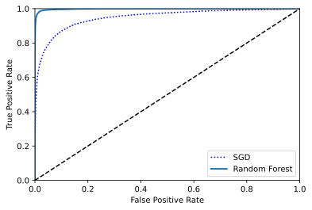

顺便绘制一下的P-R曲线对比图:

```python
from sklearn.metrics import precision_recall_curve
precision_rf, recalls_rf, thresholds_rf = precision_recall_curve(y_train_5,y_scores_forest)
plt.plot(recalls_rf, precision_rf, "r",label="Random Forest")
plt.xlabel("Precision")
plt.ylabel("Recalls")
plt.xlim([0,1])
plt.ylim([0,1])
plot_pr_sgd()
plt.legend(loc="bottom left")
```
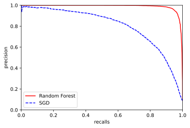

<br/>

### 多类别分类器

随机森林或者朴素贝叶斯可以直接处理多分类，但支持向量机或线性分类器只支持二元分类。二元分类器解决多分类问题，可以用一对多策略OvA，针对每个类别训练一个二元分类器并获得每个实例的决策分数，最后根据最高分归类。这是大多数二元分类器使用的方法。

另一种方法是为每一对类别训练一个二元分类器，一对一策略OvO，统计哪个类别获胜最多。如果存在N个类别需要训练$N(N-1)/2$个分类器，会很麻烦，但是优点是每个分类器训练时只需用到部分训练集，很适合支持向量分类器这样训练数据集规模较小的分类器。

Scikit-Learn 可以检测到你尝试用二分类算法进行多类别分类，自动运行 OvA (SVM除外，会使用OvO)，尝试一下 SGDClassifier：

```python
sgd_clf.fit(X_train, y_train)
sgd_clf.predict([some_digit]) #array(['4'], dtype='<U1')，实际是y[36000]='9'
```
在 sklearn 内部训练了10个二元分类器，我们调用 **decision_function()** 方法返回这10个决策分数:

```python
some_digit_scores = sgd_clf.decision_function([some_digit])
"""
array([[-42776.50220583, -20474.29071157, -25078.16881794,
        -12547.06380114,  -1130.02850545, -10005.25975074,
        -28513.96430584,  -5639.10079092,  -6992.25592381,
         -8300.79496841]])"""
np.argmax(some_digit_scores) #4
sgd_clf.classes_ 
#array(['0', '1', '2', '3', '4', '5', '6', '7', '8', '9'], dtype='<U1')
sgd_clf.classes_[4] #'4'
```
也可以强制 Scikit-Learn 使用一对一或一对多策略，使用 OneVsOneClassifier 或 OneVsRestClassifier 类。需创建一个实例，再将二元分类器传给其构造函数。

```python
from sklearn.multiclass import OneVsOneClassifier
ovo_clf = OneVsOneClassifier(SGDClassifier(random_state=42))
ovo_clf.fit(X_train, y_train)
ovo_clf.predict([some_digit])
#array(['4'], dtype=object)一对一策略同样分类错误...

len(ovo_clf.estimators_)#45
```
接下来看一看随机森林:

```python
forest_clf.fit(X_train, y_train)
forest_clf.predict([some_digit])
#array(['9'], dtype=object)对了，some_digit即X[36000]是否在训练集中？

x_in_it = False
for i in X_train:
    if (X[36000]==i).all() == True:
        x_in_it = True
        break
print(x_in_it) #True
#in it...怎么判定一个数组在不在多个数组中？in无效，'=='得到布尔数组再用all()方法。
#试试X[65000],'3'

ovo_clf.predict(X[65000].reshape(1,-1))
#array(['5'], dtype=object)，错了，再跑一次就对了
forest_clf.predict(X[65000].reshape(1,-1))
#array(['3'], dtype=object)，对了
```
可以调用predict_proba()方法得到随机森林分类器的概率列表:

```python
forest_clf.predict_proba(X[65000].reshape(1,-1))
#array([[0.04, 0.  , 0.01, 0.84, 0.01, 0.08, 0.  , 0.01, 0.01, 0.  ]]) 
#注意sgd没有这个方法，但有decision_function()方法返回每个类别决策分数
```
再次利用交叉验证cross_val_score()函数评估SGDClassifier和的准确性:

```python
cross_val_score(sgd_clf, X_train, y_train, cv=3, scoring="accuracy")
#array([0.8606 , 0.87995, 0.87525])
cross_val_score(forest_clf, X_train, y_train, cv=3, scoring="accuracy")
#array([0.9653 , 0.96595, 0.9642 ])
```
准确率不错，但可以通过将输入简单缩放进一步提高:

```python
from sklearn.preprocessing import StandardScaler
scaler = StandardScaler()
X_train_scaled = scaler.fit_transform(X_train.astype(np.float64))
cross_val_score(sgd_clf, X_train_scaled, y_train, cv=3, scoring="accuracy") 
#array([0.8982 , 0.907  , 0.90525])
#交叉验证将训练和测试结合，不需担心数据泄露
```
随机森林一般不需要数据缩放，我们来尝试一下:

```python
from sklearn.preprocessing import StandardScaler
scaler = StandardScaler()
X_train_scaled = scaler.fit_transform(X_train.astype(np.float64))
cross_val_score(forest_clf, X_train_scaled, y_train, cv=3, scoring="accuracy")
#array([0.9655, 0.9662, 0.964 ]) 好吧几乎没区别...
```

<br/>

### 错误分析

假设已经找到一个有潜力的模型，现在希望找到一些方法对其进一步改进，其中一种就是**错误分析**。
首先来看混淆矩阵，使用cross_val_predict()函数进行预测，然后调用confusion_matrix()函数:

```python
y_train_pred = cross_val_predict(sgd_clf, X_train_scaled, y_train, cv=3)
conf_mx = confusion_matrix(y_train, y_train_pred)
conf_mx
"""
array([[5597,    0,   19,   10,    8,   40,   33,    6,  208,    2],
       [   1, 6416,   48,   17,    3,   43,    4,    8,  193,    9],
       [  22,   24, 5259,   90,   74,   21,   64,   35,  360,    9],
       [  26,   22,  112, 5238,    0,  197,   23,   41,  401,   71],
       [  12,   13,   42,   11, 5233,   10,   30,   16,  305,  170],
       [  24,   14,   29,  155,   52, 4470,   77,   15,  521,   64],
       [  29,   14,   53,    3,   37,   93, 5558,    2,  129,    0],
       [  19,   11,   50,   25,   56,    9,    4, 5693,  178,  220],
       [  20,   66,   46,   96,    4,  114,   28,    9, 5421,   47],
       [  23,   22,   29,   59,  123,   37,    1,  163,  373, 5119]])"""
```
使用Matplotlib的matshow()函数来查看混淆矩阵的图像表示：

```python
plt.matshow(conf_mx,cmap=plt.cm.hsv) #配色自己调？
plt.show()
```
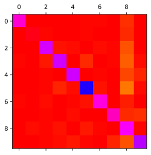
数字5很突出，但这里突出的是数量而不是错误率。将混淆矩阵中的每个值除以响应类别中的图片数量:

```python
row_sums = conf_mx.sum(axis=1, keepdims=True)
#行axis=1是类别列axis=0是预测类别，shape是(10, 1)
norm_conf_mx = conf_mx / row_sums #得到新的混淆矩阵
```
用0填充对角线，只保留错误，再重新绘图分析错误率：

```python
np.fill_diagonal(norm_conf_mx, 0)
plt.matshow(norm_conf_mx)#cmap=plt.cm.hsv显示不准，选默认配色
plt.show()
```
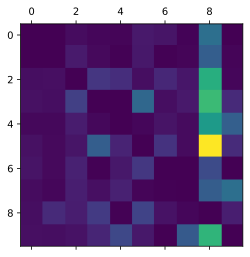
看得出主要问题在预测数字8上，我们可以收集更多这些数字的训练数据，或者开发一些新特征来改进分类器，如计算闭环数量？或者对图片预处理让闭环模式更突出?分析单个错误也可以提供洞察，来分析一下5和8（模型经常将5识别为8）：

```python
cl_a, cl_b= '5', '8'
X_aa = X_train[(y_train == cl_a) & (y_train_pred == cl_a)]
X_ab = X_train[(y_train == cl_a) & (y_train_pred == cl_b)]
X_ba = X_train[(y_train == cl_b) & (y_train_pred == cl_a)]
X_bb = X_train[(y_train == cl_b) & (y_train_pred == cl_b)]

plt.figure(figsize=(8, 8))
plt.subplot(221); plot_digits(X_aa[:25], images_per_row=5)
plt.subplot(222); plot_digits(X_ab[:25], images_per_row=5)
plt.subplot(223); plot_digits(X_ba[:25], images_per_row=5)
plt.subplot(224); plot_digits(X_bb[:25], images_per_row=5)
plt.show()
#wtf?没有定义plot_digits()
```

```python
def plot_digits(instances, images_per_row=10, **options):
    size = 28
    images_per_row = min(len(instances), images_per_row)
    images = [instance.reshape(size,size) for instance in instances] #二维数组变三维数组
    n_rows = (len(instances) - 1) // images_per_row + 1 #不足一行排成一行
    row_images = []
    n_empty = n_rows * images_per_row - len(instances) #最后一行剩余数量
    images.append(np.zeros((size, size * n_empty))) #纵向为size，横向为size*n_empty
    for row in range(n_rows):
        rimages = images[row * images_per_row : (row + 1) * images_per_row] 
        row_images.append(np.concatenate(rimages, axis=1)) #将三维数组切片到二维再按行合并
    image = np.concatenate(row_images, axis=0) #将已合并的图像按列合并
    plt.imshow(image, cmap = plt.cm.binary, **options)
    plt.axis("off")
```
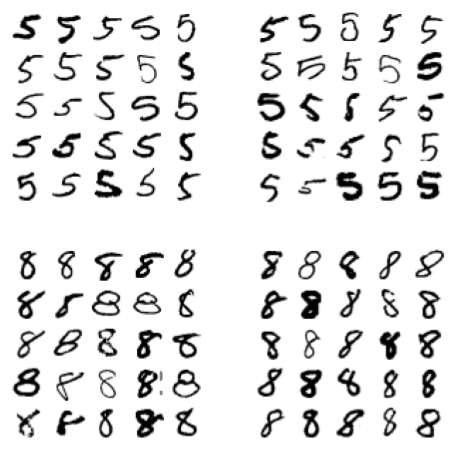

由右上那块可见这个分类器对图像移位和旋转非常敏感，所以数据预处理会减少这类错误。用同样方法，将随机森林的混淆矩阵可视化，可见主要问题是4被识别为9，我们将图片打印出来：:

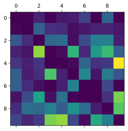

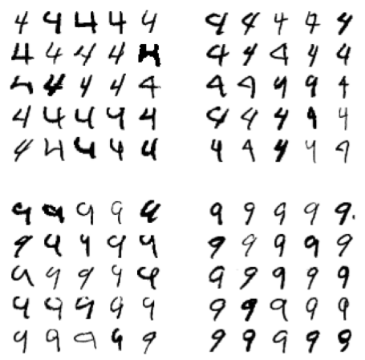

<br/>

**多标签分类**
当一个实例中有多个类别（多标签），我们就需要用到多标签分类系统 multilabel：

```python
from sklearn.neighbors import KNeighborsClassifier

#通过astype将字符串numpy数组转换为整型numpy数组
from sklearn.neighbors import KNeighborsClassifier
 
y_train = y_train.astype(np.int16)

y_train_large = (y_train >= 7)
y_train_odd = (y_train % 2 == 1)
y_multilabel = np.c_[y_train_large, y_train_odd]
#通过np.c_建立multilabel替代原先的y_train

knn_clf = KNeighborsClassifier()
knn_clf.fit(X_train, y_multilabel)
```
现在来预测:

```python
y[65000] #'3'
knn_clf.predict(x[65000].reshape(1,-1))
#array([[False,  True]])
```
评估多标签分类器的方法很多，可以通过平均F1分数衡量:

```python
y_train_knn_pred = cross_val_predict(knn_clf, X_train, y_train, cv=3)
f1_score(y_train, y_train_knn_pred, average="macro") #问题：运行时间超长是不是因为y_train改成字符串?
#这里的average参数可以修改成权重weighted
```
<br/>


## 线性训练模型

### 线性回归

**LinearRegression**线性模型就是对输入特征加权求和，再加上一个偏置项（截距）常数，以此进行预测：

$\hat{y}=\theta_0+\theta_1x_1+\theta_2x_2+...+\theta_nx_n$

向量化的线性回归模型预测：

$\hat{y}=h_\theta(X)=\theta^T{\cdot}X$

$h_\theta$ 是使用模型参数$\theta$的假设函数，转置后的 $\theta$ 由列向量变成行向量，$x$ 是实例特征向量 $x_0$ 到 $x_n$ 其中 $x_0$ 为 1 。

回归模型最常见的性能指标是均方根误差（RMSE），而在实践中均方误差（MSE）也叫**成本函数**:

$MSE(X, h_\theta)=\frac{1}{m}\sum^m_{i=1}(\theta^T{\cdot}X^{(i)}-y^{(i)})^2$

使得成本函数最小的 $\theta$ 值的**标准方程**：

$\hat\theta=(X^T{\cdot}X)^{-1}{\cdot}X^T{\cdot}y$


$y$ 是 $y^{(1)}$ 到 $y^{(m)}$ 即目标值向量。最终的多元线性回归模型为：

$\hat{y}=\hat{x}{\cdot}\hat{\theta}$ ，其中 $\hat{x}=(x_i;1)$


```python
#生成一些数据来测试公式:
import numpy as np

X = 2 * np.random.rand(100, 1) #rand()根据给定维度生成[0,1）间的数据
y = 4 + 3 * X +np.random.randn(100, 1) #返回一组标准正态分布
```
借助标准方程实现线性模型的 $\hat\theta$ 计算并完成预测：

```python
#添加theta0对应的x0，并通过np.c_进行横向合并，纵向为np.r_
X_b = np.c_[np.ones((100,1)), X] 
#用Numpy的线性代数模块np.linalg中的inv()函数求逆矩阵
theta_best = np.linalg.inv(X_b.T.dot(X_b)).dot(X_b.T).dot(y)

"""
array([[3.8503802 ],
       [3.20339254]])"""
```
我们期待 $\theta_0$=4, $\theta_1$=3 得到的是3.85和3.2，因为噪声的存在使得不可能完全还原。接下来进行预测：

```python
X_new = np.array([[0],[2]]) #X_new.shape是(2,1)
X_new_b = np.c_[np.ones((2, 1)), X_new] #合并后shape(2,2)
y_predict = X_new_b.dot(theta_best)
y_predict
"""
array([[ 3.8503802 ],
       [10.25716528]])"""
```

```python
plt.plot(X_new, y_predict, "r-")
plt.plot(X, y, "b.")
plt.axis([0, 2, 0, 15])
plt.show()
```
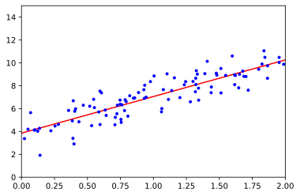


Scikit-Learn的**LinearRegression**等效代码如下：

```python
from sklearn.linear_model import LinearRegression
lin_reg = LinearRegression()
lin_reg.fit(X, y)
lin_reg.intercept_, lin_reg.coef_
#(array([3.8503802]), array([[3.20339254]]))
lin_reg.predict(X_new)
"""
array([[ 3.8503802 ],
       [10.25716528]])"""
```
计算复杂度：标准方程求逆的矩阵$X^TX$是一个 n x n 矩阵（n是特征数量），对这种矩阵求逆的计算复杂度通常为 $O(n^{2.4})$ 到 $O(n^{3})$ 之间。线性模型一经完成训练，预测速度就非常快，计算复杂度相对于实例与特征数量来说都是线性的。

<br/>

### 梯度下降

梯度下降 **Gradient Descent** 是一种通用优化算法，能为大范围的问题找到最优解，中心思想是迭代地调整参数从而使成本函数最小化。通过测量参数向量 $\theta$ 值相关的误差函数的局部梯度，并不断沿着降低梯度的方向调整，直到梯度降为0 。

具体来说，首先使用一个随机的 $\theta$ 值（这被称为随机初始化），然后逐步改进，每一步都尝试降低一点成本函数（如MSE），直到算法收敛出一个最小值。

梯度下降中一个重要参数是每一步的步长，这取决于超参数学习率。学习率过低会导致需要大量迭代，耗时过长；过高则导致算法发散无法找到解决方案。

两个主要挑战：如果随机初始化，算法会可能收敛到一个局部最小值，也可能经过很长时间多次迭代后依然远离最小值（处于高原）。在线性模型中，MSE成本函数是个凸函数即不存在局部最小值，同时它也是连续函数，斜率不会产生陡峭的变化。

但即便成本函数是碗状的，但如果不同特征的尺寸差别巨大使得一侧曲线拉长依旧会形成“高原”，花费大量时间。为保证所有特征值大小比例相近，可以使用Scikit-Learn的StandardScaler类。


**批量梯度下降**

实现梯度下降，需要计算每个模型关于参数$\theta_j$的成本函数的梯度，即关于该参数成本函数的偏导数$\frac{\partial}{\partial{\theta_j}}MSE(\theta)$

$\frac{\partial}{\partial{\theta_j}}MSE(\theta)=\frac{2}{m}\sum^m_{i=1}(\theta^T{\cdot}x^{(i)}-y^{(i)})x^{(i)}_j$

得到梯度向量 ${\nabla}MSE(\theta)=\begin{pmatrix}\frac{\partial}{\partial{\theta_j}}MSE(\theta)\\\frac{\partial}{\partial{\theta_j}}MSE(\theta)\\{\vdots}\\\frac{\partial}{\partial{\theta_j}}MSE(\theta)\end{pmatrix}=\frac{2}{m}X^T{\cdot}(X{\cdot}\theta-y)$

该公式在计算梯度下降的每一步都基于完整的训练集 X ，在面对非常庞大的训练集时，算法会变得极慢。但即便如此，梯度下降随特征数量扩展的表现依然比标准方程要更快，比如在训练的线性模型拥有几十万个特征时。

一旦有了梯度向量，哪个点向上，就朝反方向下坡。即从 $\theta$ 中减去 ${\nabla}MSE(\theta)$ ，这时学习率 $\eta$ 就发挥作用了：用梯度向量乘以 $\eta$ 确定下坡步长的大小 。

$\theta^{(next step)}=\theta-\eta\nabla_{\theta}MSE(\theta)$

接下来快速实现：

```python
eta = 0.1 # learning rate
n_iterations = 1000
m = 100 #训练样本数量

theta = np.random.randn(2,1) # random initialization

for iteration in range(n_iterations):
    gradients = 2/m * X_b.T.dot(X_b.dot(theta)-y)
    theta = theta - eta * gradients
"""
array([[4.11314008],
       [2.97895637]])"""
```
尝试使用其他学习率eta，并将这个过程绘图：

```python
eta = 0.0001 #0.1 #0.5
n_iterations = 1000
m = 100 

theta = np.random.randn(2,1)
x = np.linspace(0,2,100)

for iteration in range(n_iterations):
    gradients = 2/m * X_b.T.dot(X_b.dot(theta)-y)
    theta = theta - eta * gradients

    if iteration % 100 == 0:
        intercept = theta[0][0]
        coef = theta[1][0]
        yy = x*coef + intercept

        plt.plot(x, yy, label=iteration)
        plt.plot(X, y, "b.")
        plt.axis([0, 2, 0, 15])
        plt.xlabel('x')
        plt.ylabel('y')
        plt.title(eta)
        plt.legend()
```
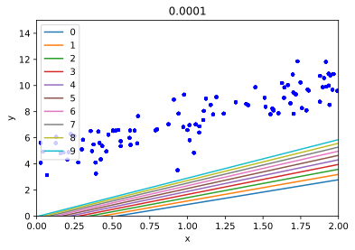
上图学习效率过低，若找到最终解需要迭代次数很大
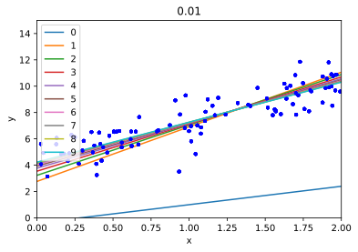
上图线01间的空白表示梯度下降初期迭代效率高，几次迭代就找到解
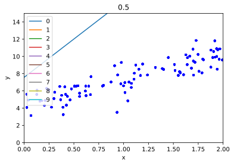
上图算法发散，直接跳过了数据区域

为找到合适的学习率，可以使用网格搜索，但需要限制迭代次数以淘汰耗时太长的模型。可以在初始阶段设置一个较大的迭代次数，但在梯度向量变得很微小时中断算法，即设置范数容差。

$收敛率=O(\frac{1}{iterations})$
<br/>

**随机梯度下降 Stochastic Gradient Descent**

随机梯度下降的每一步在训练集中随机选择一个实例，并基于单个实例计算梯度。由于算法的随机性质，它比批量梯度下降要不规则多，即便达到了最小值依然会持续反弹。得益于这一点，当成本函数同样不规则时，随机梯度下降有助于跳出局部最小找到全局最小值。

为了较准确地定位最小值，有一个办法是逐步降低学习率，开始学习率较大再逐步减小，即模拟退火。确定每个迭代学习率的函数叫做**学习计划**。如果学习率降得太快可能会陷入局部最小值，或者停在半途中。如果学习率降得太慢，则耗时将非常久，提前结束训练只能得到次优解。接下来实现随机梯度下降:

```python
n_epochs = 50
t0, t1 = 5, 50 #学习计划超参数

def learning_schedule(t):
    return t0 / (t + t1)

theta = np.random.randn(2,1)

for epoch in range(n_epochs):
    for i in range(m):
        random_index = np.random.randint(m)
        xi = X_b[random_index:random_index+1] #二维数组,即矩阵
        yi = y[random_index:random_index+1]
        gradients = 2 * xi.T.dot(xi.dot(theta) - yi)
        eta = learning_schedule(epoch * m + i)
        theta = theta - eta * gradients

"""
array([[4.25816069],
       [2.83683168]])"""
```
在Scikit-Learn里，用SGD执行线性回归可以使用**SGDRegressor**类，其默认优化的成本函数是平方误差:

```python
from sklearn.linear_model import SGDRegressor
sgd_reg = SGDRegressor(eta0=0.1, penalty=None)
sgd_reg.fit(X, y.ravel())
"""
SGDRegressor(alpha=0.0001, average=False, early_stopping=False, epsilon=0.1,
             eta0=0.1, fit_intercept=True, l1_ratio=0.15,
             learning_rate='invscaling', loss='squared_loss', max_iter=1000,
             n_iter_no_change=5, penalty=None, power_t=0.25, random_state=None,
             shuffle=True, tol=0.001, validation_fraction=0.1, verbose=0,
             warm_start=False)"""

sgd_reg.intercept_, sgd_reg.coef_
#(array([4.19280537]), array([2.91587029]))
```

**小批量梯度下降**：每一步梯度计算基于一小部分随机的实例集。相比于随机梯度下降，小批量主要优势是可以从矩阵运算的硬件优化中获得性能提升。

<br/>

### 多项式回归

对于非线性数据，一个简单的方法就是将每个特征的幂次方添加一个新特征，然后在这个拓展过的特征集上训练线性模型。来看一下$y=ax^2+bx+c$ 加上随机噪声。
```python
m = 100
X = 6 * np.random.rand(m, 1) - 3
y = 0.5 * X**2 + X + 2 + np.random.randn(m, 1)
```
使用Scikit-Learn的 PolynomialFeatures 类来对训练数据进行转换，将每个特征的平方作为新特征加入训练集：

```python
from sklearn.preprocessing import PolynomialFeatures
poly_features = PolynomialFeatures(degree=2, include_bias=False)
X_poly = poly_features.fit_transform(X)
X[0] #array([-2.63025418])
X_poly[0] #array([-2.63025418,  6.91823707])
```
X_poly现在包含原本的特征X和该特征的平方。将多项式特征与线性回归模型一起使用，可以得到**多项式回归(polynomial regression)模型**，现在对这个拓展后的训练集匹配一个LinearRegression模型：

```python
lin_reg = LinearRegression()
lin_reg.fit(X_poly, y)
lin_reg.intercept_, lin_reg.coef_
#(array([2.01850842]), array([[0.9069566 , 0.47403023]]))
```
估计模型为 $\hat{y}=0.47x^2_1+0.91x_1+2.02$ 而实际上为 $y=0.5x^2_1+1.0x_2+2.0+g$ , g 为高斯噪声。

注意，当存在多个特征时，多项式回归能发现特征和特征之间的关系，因为 PolynomialFeatures 会在给定阶数degree下添加所有特征组合。比如，特征a和b在degree=3下会添加特征$a^2$、$a^3$、$b^2$和 $b^3$，还会添加组合$ab$、$a^2b$、$ab^2$ 。
>PolynomialFeatures(degree=d)可以将一个包含n个特征的数组转换为包含$\frac{(n+d)!}{d!n!}$个特征的数组，要小心特征组合的数量爆炸。


**学习曲线**

高阶多项式回归容易过拟合而线性模型容易欠拟合，可以通过交叉验证在训练集和验证集上的表现来评估模型泛化性能。也可以通过观察学习曲线，即模型在训练集和验证集上关于“训练集大小”的性能函数，我们需要在不同大小的训练子集上多次训练模型：

```python
from sklearn.metrics import mean_squared_error
from sklearn.model_selection import train_test_split

def plot_learning_curves(model, X, y):
    X_train, X_val, y_train, y_val = train_test_split(X, y, test_size=0.2)
    train_errors, val_errors = [], []
    for m in range(1, len(X_train)):
        model.fit(X_train[:m], y_train[:m])
        y_train_predict = model.predict(X_train[:m])
        y_val_predict = model.predict(X_val)

        train_errors.append(mean_squared_error(y_train_predict, y_train[:m]))
        val_errors.append(mean_squared_error(y_val_predict, y_val))
        
    plt.plot(np.sqrt(train_errors), "r-+", linewidth=2, label="train")
    plt.plot(np.sqrt(val_errors), "b-", linewidth=3, label="val")
    plt.xlabel('trainsize')
    plt.ylabel('RMSE')
    plt.legend()

lin_reg = LinearRegression()
plot_learning_curves(lin_reg, X, y)
```
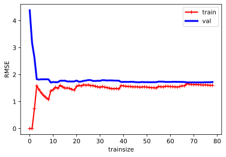
当训练集只有一两个实例时模型可以完美拟合，到后来添加新实例也不会让训练集平均误差上升或下降。而验证集在训练集实例很少时不能很好泛化，随着模型学习更多的训练数据，验证集误差慢慢下降，最终接近训练集的曲线。

这是典型的模型欠拟合，两条曲线均到达高地且非常接近，但误差都很大。在添加训练集也无法改善时，需要使用更复杂的模型以找到更好的特征。现在来看看10阶多项式模型：

```python
from sklearn.pipeline import Pipeline

polynomial_regression = Pipeline((
    ("poly_features", PolynomialFeatures(degree=10, include_bias=False)),
    ("sgd_reg", LinearRegression()),
))

plot_learning_curves(polynomial_regression, X, y)
```
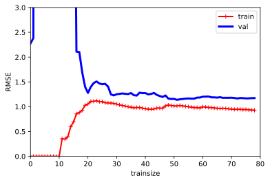
训练数据的误差远低于线性回归模型，且训练集上的表现比测试集上要好得多，这也是过度拟合的标志。随着训练集的变大，两条曲线会更加接近，过拟合程度也会改善。

>偏差/方差权衡：
偏差导致的泛化误差主要原因是错误的假设，比如假设数据是线性而实际上是二次的，高偏差模型可能导致欠拟合，可换用复杂性高的模型。
方差导致的误差主要由高自由度或过于复杂（敏感）的模型导致，很容易对训练模型过拟合。可对模型正则化以降低复杂度。
不可避免误差：主要是数据噪声所致，减少方法是清理数据（修复或检测移出异常值）

<br/>


### 正则化线性模型

为避免过拟合，将多项式模型正则化的简单方法就是降低多项式阶数。而多线性模型来说，正则化通常是通过约束模型的权重来实现。接下来介绍岭回归(Ridge Regression)、Lasso 回归以及弹性网络(Elastic Net)。


**岭回归**

岭回归是线性回归的正则化版，在成本函数中添加一个等于$\alpha\sum^n_{i=1}\theta^2_i$的正则项，使得模型不仅需要拟合数据还得让模型权重保持最小。注意，正则项只能在训练时加入成本函数中，一旦训练完成则需要未经正则化的性能指标来评估模型。

>注意类似这样训练阶段与测试阶段成本函数不同的现象很常见，比如一个使用对数损失函数(log loss)作为成本函数来训练的分类器，评估指标会用精度/召回率。

超参数$\alpha$控制的是对模型进行正则化的程度，如果$\alpha$为0那么岭回归就是线性模型，如果$\alpha$非常大则所有权重都非常接近零，即$\alpha$越大正则化越强：

成本函数：$J(\theta)=MSE(\theta)+\alpha{\cdot}\frac{1}{2}\sum^n_{i=1}\theta^2_i$

注意，这里的偏置项$\theta_0$没有正则化；正则化用到了权重向量的**$l_2$范数**。和大多数正则化模型类似，岭回归对输入特征的大小非常敏感，必须进行**数据缩放**，比如 **StandardScaler**。有时需要使用多项式特征 PolynomialFeatures (degree=d) 对数据进行扩展，再用 StandardScaler 进行缩放，最后将岭回归模型用于结果特征。

与线性模型一样，也可以计算执行梯度下降时的 $\hat\theta$ 值：

$\hat\theta=(X^T{\cdot}X+\alpha{A})^{-1}{\cdot}X^T{\cdot}y$

```python
#岭回归演示，利用Cholesky矩阵因式分解法
from sklearn.linear_model import Ridge
ridge_reg = Ridge(alpha=1, solver="cholesky")
ridge_reg.fit(X, y)
ridge_reg.predict([[1.5]]) #array([[4.7151488]])

#对比随机梯度下降
from sklearn.linear_model import SGDRegressor
sgd_reg = SGDRegressor(penalty="l2")
sgd_reg.fit(X, y.ravel())
sgd_reg.predict([[1.5]]) #array([4.67525709])
```


**Lasso 回归**

与岭回归类似，Lasso 回归也是向成本函数增加一个正则项，但增加的是权重向量 $l1$ 范数，不是 $l2$ 范数平方的一半，同时它的 $\alpha$ 相对较小。

> Lp则是 $\parallel v \parallel _p=(|v_0|^p+|v_1|^p+...+|v_n|^p)^{1\over p}$

成本函数： $J(\theta)=MSE(\theta)+\alpha{\cdot}\sum^n_{i=1}|\theta_i|$

Lasso 回归的重要特点是，它倾向于完全消除掉最不重要的特征，即将这些特征的权重系数设置为0。


```python
#Lasso 回归演示
from sklearn.linear_model import Lasso
lasso_reg = Lasso(alpha=0.1)
lasso_reg.fit(X, y)
lasso_reg.predict([[1.5]]) #array([4.66017283])
```


**弹性网络**

弹性网络是岭回归与 Lasso 回归之间的中间地带，其正则项是两者正则项的混合，比例通过 r 来控制。r=0 时即等于岭回归，r=1 即相当于 Lasso 回归。

成本函数：$J(\theta)=MSE(\theta)+r\alpha\sum^n_{i=1}+\frac{1-r}{2}\alpha\sum^n_{i=1}\theta^2_i$


平时使用线性模型的一般情况下，应该避免纯线性回归，试一试岭回归，如果只要少数特征则用 Lasso 回归或弹性网络。一般而言，弹性网络优于 Lasso 回归，因为当特征数量超过训练实例数量或几个特征强相关时，Lasso 回归的表现可能非常不稳定。


```python
from sklearn.linear_model import ElasticNet
elastic_net = ElasticNet(alpha=0.1, l1_ratio=0.5)
#默认 alpha=1.0, l1_ratio=0.5
elastic_net.fit(X, y)
elastic_net.predict([[1.5]]) #array([4.70826201])
```


**早期停止法**

对于梯度下降这一类迭代学习算法，还有一个办法可以避免过拟合，即在验证误差达到最小值时立刻停止训练（或发现验证误差不再下降时回滚到最小值的位置）


```python
from sklearn.base import clone
sgd_reg = SGDRegressor(n_iter=1, warm_start=True, penalty=None, learning_rate="constant", eta=0.0005)

minimum_val_error = float("inf")
best_epoch = None
best_model = None

for epoch in range(1000):
    sgd_reg.fit(X_train_poly_scaled, y_train)
    y_val_predict = sgd_reg.predict(X_val_poly_scaled)
    val_error = mean_squared_error(y_val_predict, y_val)
    if val_error < minimum_val_error:
        minimum_val_error = val_error
        best_epoch = epoch
        best_model = clone(sgd_reg)
#没跑起来？看文档，SGDRegressor有改动
```
注意，当 warm_start=True 时，调用 fit() 方法，会从停下单地方继续开始训练而不是重新开始。

<br/>

### 逻辑回归

逻辑回归模型概率估算 $\hat{p}=h_\theta(X)=\sigma(\theta^T\cdot{X})$

逻辑模型是一个 sigmoid 模型，它的输出为一个0到1之间的数字。

逻辑模型：$\sigma(t)=\frac{1}{1+exp(-t)}$

预测模型：$\hat{y}=\{^{0(\hat{p}<0.5)}_{1(\hat{p}\ge0.5)}$

单个训练实例的成本函数：$c(\theta)=\{^{-log(\hat{p})......y=1}_{-log(1-\hat{p}).......y=0}$

成本函数（log 损失函数）：$J(\theta)=-\frac{1}{m}\sum^m_{i=1}[y^{(i)}log(\hat{p^{(i)}})+(1-y^{(i)})log(1-\hat{p}^{(i)})]$


下面仅仅基于鸢尾花花瓣宽度，创建一个分类器：

```python
from sklearn import datasets
iris = datasets.load_iris()
list(iris.keys()) 
#['data', 'target', 'target_names', 'DESCR', 'feature_names', 'filename']
#其中iris["data"].shape为(150,4)

X = iris["data"][:,3:]
y = (iris["target"]==2).astype(np.int)

#接下来训练模型
from sklearn.linear_model import LogisticRegression

log_reg = LogisticRegression()
log_reg.fit(X, y)

#来看看花瓣宽度0-3厘米间的鸢尾花的估算概率
X_new = np.linspace(0, 3, 1000).reshape(-1,1)
y_proba = log_reg.predict_proba(X_new)
plt.plot(X_new, y_proba[:,1],"g-",label="Iris-Virginica")
plt.plot(X_new, y_proba[:,0],"b--",label="Not Iris-Virginica")
plt.xlabel('Petal width (cm)')
plt.ylabel('Probability')
plt.legend()
```


Scikit-Learn 中逻辑回归默认 l2 正则，其超参数也不是 alpha ，而是它的逆反 C ，C 越高正则化程度越低。

<br/>

### Softmax 回归

**多元逻辑回归**，原理很简单：对于一个给定的实例 x ，先计算出每个类别 k 的分数 $s_k(x)$，再对这些分数应用 softmax 归一化函数，估算每个类别的概率。

类别 k 的 softmax 分数：$s_k(X)=\theta^T_k\cdot{X}$

实例属于类别 k 的概率：$\hat{p}_k=\sigma(s(X))_k=\frac{exp(s_k(X))}{\sum_{j=1}^K{exp}(s_j(X))}$

交叉熵成本函数：$J(\theta)=-\frac{1}{m}\sum^m_{i=1}\sum^K_{k=1}y_k^{(i)}log(\hat{p}_k^{(i)})$

交叉熵经常被用于衡量一组估算出的类别概率与目标类别的匹配程度（当 K=2 时该成本函数等于逻辑回归的成本函数）。接下来求每个类别的交叉熵梯度向量，使用梯度下降找到最小化成本函数的参数矩阵 $\theta$ 。


接下来使用 softmax 回归将鸢尾花分为三类，Scikit-Learn 的 LogisticRegression 默认使用一对多进行多分类，将超参数 **multi_class** 设置为 **"multinomial"** 即切换为 Softmax 回归。还需要指定一个支持 Softmax 回归的求解器，比如 "lbfgs" 求解器。依然是默认 l2 正则，通过超参数 C 进行控制：

```python
X = iris["data"][:,(2,3)] #花瓣长，花瓣宽
y = iris["target"]

softmax_reg = LogisticRegression(multi_class="multinomial",solver="lbfgs",C=10)
softmax_reg.fit(X, y)

softmax_reg.predict([[5, 2]]) #array([2])
softmax_reg.predict_proba([[5, 2]]) #array([[6.38014896e-07, 5.74929995e-02, 9.42506362e-01]])
```

<br/>

## 支持向量机

#### 线性 SVM 分类

SVM 分类器在两种类别之间保持了一条尽可能宽敞的街道，即最大间隔分类。判定边界由街道边缘的样本决定，而这些样本点被称为支持向量。

为了避免异常点的影响，我们一般使用软间隔分类，旨在保持街道尽可能大同时避免间隔违规。在 Scikit-Learn 中可以用 C 超参数控制这种平衡：较小的 C 会导致更宽的街道，但更多的间隔违规。如果 SVM 过拟合，可以尝试减小 C 进行调整。

```python
import numpy as np
from sklearn import datasets
from sklearn.pipeline import Pipeline
from sklearn.preprocessing import StandardScaler
from sklearn.svm import LinearSVC

iris = datasets.load_iris()
X = iris["data"][:,(2, 3)]
y = (iris["target"] == 2).astype(np.float64)

svm_clf = Pipeline((
    ("scaler", StandardScaler()),
    ("linear_svc", LinearSVC(C=1, loss="hinge")),
))

svm_clf.fit(X_scaled, y)

svm_clf.predict([[5.5, 1.7]]) 
#array([1.])，不同于Logistic回归分类器，不会输出每个类别的概率
```
另一种选择是 `SGDClassifier(loss="hinge", alpha=1/(m*C)) `，尽管不会和 LinearSVC 一样快速收敛但对于处理那些不适合放在内存的大数据集或在线分类时非常有用。
<br/>

#### 非线性支持向量机分类

对于不是线性可分的数据集，一种处理方法是增加更多特征，例如多项式特征：通过 Scikit-Learn 创建一个 Pipeline 去包含多项式特征 PolynomialFeatures 变换，再进行 StandardScaler 和 LinearSVC :

```python
from sklearn.datasets import make_moons
from sklearn.pipeline import Pipeline
from sklearn.preprocessing import PolynomialFeatures

X, y = make_moons()
polynomial_svm_clf = Pipeline((
    ("poly_features", PolynomialFeatures(degree=3)),
    ("scaler", StandardScaler()),
    ("svm_clf", LinearSVC(C=10, loss="hinge"))
))

polynomial_svm_clf.fit(X, y)
```
<br/>

#### 多项式核

添加多项式特征很容易实现，但低次数的多项式不能处理非常复杂的数据集，而高次数的多项式却会产生大量的特征使模型变慢。在 SVM 中，可以运用 **核技巧** 取得高次数多项式一样的效果并且避免了维度爆炸。

```python
from sklearn.svm import SVC
poly_kernel_svm_clf = Pipeline((
    ("scaler", StandardScaler()),
    ("svm_clf",SVC(kernel="poly", degree=3, coef0=1, C=5))
))
poly_kernel_svm_clf.fit(X, y)
```
如果模型过拟合，可以减小多项式核的阶数。`coef0` 控制了高阶多项式与低阶多项式对模型的影响。这里的 d, c, r 通用的方法是用网格搜索 grid search 找到最优超参数，先粗略搜索再找到最佳值进行更细致的网格搜索。