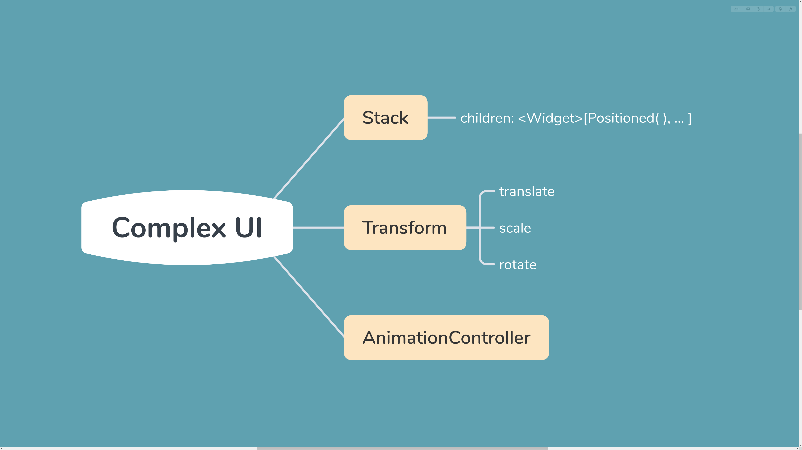
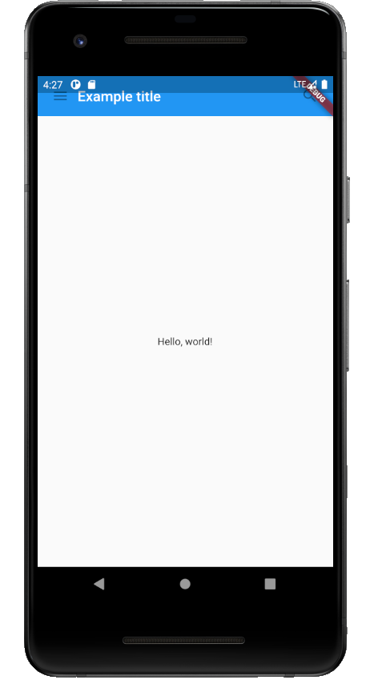
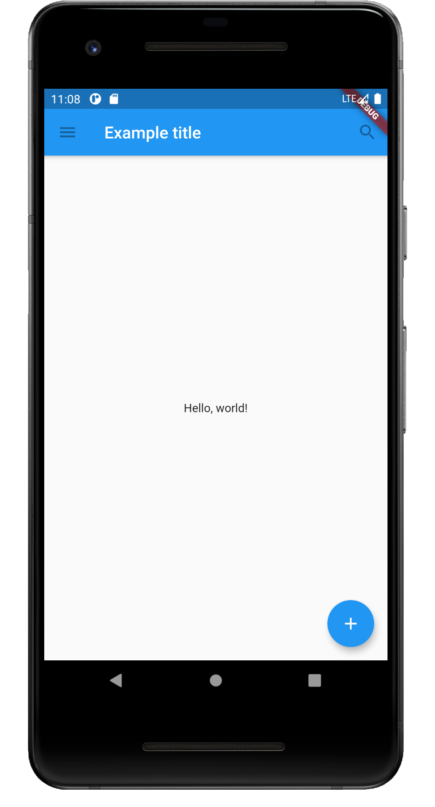
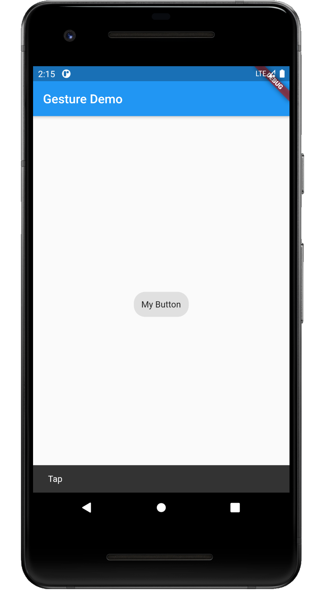

# Flutter 随笔

**Complex UI**


<br/>
**计数器 Demo**

```dart
import 'package:flutter/material.dart';

void main() => runApp(new MyApp());

class MyApp extends StatelessWidget {
  @override
  Widget build(BuildContext context) {
    return new MaterialApp(
      title: 'Flutter Demo',
      theme: new ThemeData(
        primarySwatch: Colors.blue,
      ),
      home: new MyHomePage(title: 'Flutter Demo Home Page'),
      //注意此处title参数要用于构造函数
    );
  }
}

class MyHomePage extends StatefulWidget {
  MyHomePage({Key key, this.title}) : super(key: key);
  final String title;

  @override
  _MyHomePageState createState() => new _MyHomePageState();
}

class _MyHomePageState extends State<MyHomePage> {
  int _counter = 0;

  void _incrementCounter() {
    setState(() {
      _counter++;
    });
  }

  @override
  Widget build(BuildContext context) {
    return new Scaffold(
      appBar: new AppBar(
        title: new Text(widget.title),
      ),
      body: new Center(
        child: new Column(
          mainAxisAlignment: MainAxisAlignment.center,
          children: <Widget>[
            new Text(
              'You have pushed the button this many times:',
            ),
            new Text(
              '$_counter',
              style: Theme.of(context).textTheme.headline4,
            ),
          ],
        ),
      ),
      floatingActionButton: new FloatingActionButton(
        onPressed: _incrementCounter,
        tooltip: 'Increment',
        child: new Icon(Icons.add),
      ), // This trailing comma makes auto-formatting nicer for build methods.
    );
  }
}
```

<br/>

# 组件基础

**Widget 与 Element**

Widget 并不是表示最终绘制在设备屏幕上的显示元素，只是UI元素的配置数据。实际上真正代表屏幕上显示元素的类是 Element ，而 Widget 可以对应多个 Element（同一份配置创建多个实例），Element 是通过 Widget 生成的。

```dart
@immutable
abstract class Widget extends DiagnosticableTree {
//继承自诊断树，提供调试信息
  const Widget({ this.key });
  final Key key;
  //Key：key属性主要作用是在下一次build时复用旧widget

  @protected
  Element createElement();
  //构建UI树时调用，生成对应节点的Element对象，属隐式调用

  @override
  String toStringShort() {
    return ......
  }

  ...

  static bool canUpdate(Widget oldWidget,Widget newWidget) {
    return oldWidget.runtimeType == newWidget.runtimeType 
    && oldWidget.key == newWidget.key;
    //静态方法，是否用新widget去更新旧UI树上对应的Element配置
  }
}
```
注意，为 Widget 显式添加 key 可能会使 UI 在重新构建时变得高效，接下来的例子中，构建列表 UI 时会显式指定 Key 。

**StatelessWidget**

继承自 Widget 类，重写了 createElement() 方法：

```dart
@override
StatelessElement createElement()=>StatelessWidget(this);
```
StatelessElement 间接继承自 Element 类，与 StatelessWidget 相对应（作为其配置数据）。

StatelessWidget 用于不需要维护状态的场景，通常在 build 方法中通过嵌套其他 Widget 来构建 UI，过程中会递归的构建其嵌套的 Widget 。

```dart
//举个栗子
class Echo extends StatelessWidget {
  const Echo({
    Key key,
    @required this.text,
    this.backgroundColor:Colors.grey,
  }):super(key:key);
//命名参数中必要参数要添加@required标注，利于静态代码分析器检查
//在继承Widget时，第一个参数通常为Key
//子Widget child,children参数放在参数列表最后
//Widget属性应尽可能被声明为final防止被意外改变

  final String text;
  final Color backgroundColor;

  @override
  Widget build(BuildContext context) {
    return Center(
      child: Container(
        color: backgroundColor,
        child: Text(text),
      )
    );
  }
}
```

调用时通过如下方式：

```dart
Widget build(BuildContext context) {
  return Echo(text:"hello world");
}
```

**Context**

build 方法有一个 context 参数，它是 BuildContext 类的一个实例，表示当前 widget 在 widget 树中的上下文，每个 widget 都会对应一个 context 对象（作为widget树上的节点），context 提供了从当前 widget 开始向上遍历 widget 树以及按照 widget 类型查找父级 widget 的方法。

```dart
import 'package:flutter/material.dart';

void main() => runApp(MaterialApp(
  title: "Context test",
  home:ContextRoute()));

class ContextRoute extends StatelessWidget {
  @override
  Widget build(BuildContext context) {
    return Scaffold(
      appBar: AppBar(
        title:Text("Context测试"),
      ),
      body: Container(
        child:Builder(builder:(context){
          //在Widget树中向上查找最近的父级Scaffold widget
          Scaffold scaffold = context.findAncestorWidgetOfExactType<Scaffold>();
          //直接返回AppBar的title，此处实际上是Text("Context测试")
          return (scaffold.appBar as AppBar).title;
        })
      )
    );
  }
}
```
**StatefulWidget**

StatefulWidget 也是继承了 Widget 类并重写了 createElement() 方法，但返回的 Element 对象不同；另外 StatefulWidget 类中添加了一个新的接口 createState() 。

```dart
//定义
abstract class StatefulWidget extends Widget {
  const StatefulWidget({Key key}) : super(key:key);

  @override
  StatefulElement createElement() => StatefulElement(this);
  
  @protected
  State createState();
}
```
StatefulElement 可能会多次调用 createState() 来创建(State)对象。

createState() 用于创建和 StatefulWidget 相关的状态，它在 StatefulWidget 的生命周期中可能会被多次调用。例如当一个 StatefulWidget 同时插入到 widget 树的多个位置时，Flutter framework 就会调用该方法为每个位置生成一个独立的 State 实例，本质上就是一个 StatefulElement 对应一个 State 实例。 

**State**

一个 StatefulWidget 类会对应一个 State 类，State 表示与其对应的 StatefulWidget 要维护的状态，State 中的保存的状态信息可以：
1. 在 widget 构建时可以被同步读取。
2. 在 widget 生命周期中可以被改变。当 State 被改变时可以手动调用 setState() 通知 Flutter framework 状态发生改变，framework 收到消息后会重新调用其 build 方法构建 widget 树，从而达到更新 UI 的目的。

State 中有两个常用属性：
1. widget，它表示与该 State 实例关联的 widget 实例，这种关联并非永久的，因为在应用生命周期中，UI 树上某一个节点的 widget 实例在重新构建时可能会变化.
2. context，StatefulWidget 对应的 BuidContext ，作用同 StatelessWidget 的 BuildContext 。

**State 生命周期**

通过实现一个计数器 widget 来理解生命周期：

```dart
import 'package:flutter/material.dart';

void main() => runApp(MaterialApp(title: "State", home: StateRoute()));

class StateRoute extends StatelessWidget {
  Widget build(BuildContext context) {
    return CounterWidget();
  }
}

class CounterWidget extends StatefulWidget {
  const CounterWidget({Key key, this.initValue: 0});
  //接受initValue整形参数并设置默认值
  final int initValue;

  @override
  _CounterWidgetState createState() => _CounterWidgetState();
  //关联（创建）State对象
}

class _CounterWidgetState extends State<CounterWidget> {
  int _counter;

  @override
  void initState() {
    super.initState();
    //初始化状态
    _counter = widget.initValue;
    print("initState");
  }

  @override
  Widget build(BuildContext context) {
    print("build");
    return Scaffold(
        body: Center(
            child: FlatButton(
                child: Text('$_counter'),
                //点击后计数器自增
                onPressed: () => setState(
                      () => ++_counter),
                )));
  }

  @override
  void deactivate() {
    super.deactivate();
    print("deactive");
  }

  @override
  void dispose() {
    super.dispose();
    print("dispose");
  }

  @override
  void reassemble() {
    super.reassemble();
    print("reassemble");
  }

  @override
  void didChangeDependencies() {
    super.didChangeDependencies();
    print("didChangeDependencies");
  }
}

```


>注意：为什么build方法放在 State 中而不是 StatefulWidget 中？

主要为了提高开发的灵活性，如果将 build() 放在 StatefulWidget 中有两个问题：
+ 状态访问不方便。如果 StatefulWidget 有很多状态，每次改变状态都要调用 build 方法，由于状态是保存在 State 中的，如果 build 方法在 StatefulWidget 中，那么 build 方法和状态分别在两个类中，由于构建用户界面需要依赖 State，所以 build 方法必须加一个 State 参数：

```dart
Widget build(BuildContext context, State state) {
  //state.counter
  ...
}
```

这样只能将 State 所有状态声明为公开才能在 State 类外部访问，这也将导致对状态的修改将变得不可控。但如果将 build() 方法放在 State 中，**构建过程不仅可以直接访问状态**，也无需公开私有状态，非常方便。
+ 继承 StatefulWidget 不便：例如 Flutter 中有一个动画 widget 的基类 AnimateWidget ，继承自 StatefulWidget，AnimatedWidget 中引入了一个抽象方法 build(BuildContext context)，继承自 AnimatedWidget 的动画 widget 都要实现这个 build 方法。如果 StatefulWidget 已经有一个 build 方法，此时 **build 方法需要接收一个 state 对象**，意味着 AnimatedWidget 必须将自己的 State 对象提供给其子类，**因为子类需要在其 build 方法中调用父类的 build 方法。**

```dart
class MyAnimationWidget extends AnimatedWidget {
  @override
  Widget build(BuildContext context,State state) {
    //子类要用到AnimatedWidget的状态对象_animatedWidgetState
    //所以AnimatedWidget必须通过某种方式将其状态对象暴露给子类
    super.build(context, _animatedWidgetState)
  }
}
```

这样不合理，因为 AnimatedWidget 的状态对象是 AnimatedWidget 内部实现细节，不应该暴露给外部。而且如果要将父类状态暴露给子类，那么必须得有一种传递机制，而这套机制无意义因为父子类之间状态的传递和子类本身逻辑是无关的。

所以对于 StatefulWidget，将 build 方法放在 State 中可以给开发带来很大的灵活性。

**在 Widget 树中获取 State 对象**

由于 StatefulWidget 具体逻辑都在其 State 中，很多时候需要获取 StatefulWidget 对应的 State 对象来调用一些方法，比如 Scaffold 组件对应的状态类 ScaffoldState 中就定义了打开 SnackBar 的方法。我们有两种方法在子 widget 树中获取父级 State 。

1. **通过 Context 获取**

context 对象有一个 **findAncestorStateOfType()** 方法，可以从当前节点沿着 widget 树向上查找指定类型的 StatefulWidget 对应的 State 对象。

```dart
Scaffold(
  appBar: AppBar(
    title: Text("子树中获取State对象"),
  ),
  body: Center(child: Builder(builder: (context) {
    return RaisedButton(
      onPressed: () {
        //查找父级最近的Scaffold对应的Scaffold对象
        ScaffoldState _state =
            context.findAncestorStateOfType<ScaffoldState>();
        //调用ScaffoldState的showSnackBar来弹出SnackBar
        _state.showSnackBar(SnackBar(
          content: Text("我是SnackBar"),
        ));
      },
      child: Text("显示SnackBar"),
    );
  })));
```

一般来说，如果 StatefulWidget 状态是私有的我们就不应该直接去获取其 State 对象，在 Flutter 开发中默认的约定：如果 StatefulWidget 的状态是希望暴露出的应当提供一个 of 静态方法来获取其 State 对象，如果不希望暴露则不提供。所以上例的 Scaffold 也提供了一个 of 方法，可以直接调用：

```dart
ScaffoldState _state = Scaffold.of(context);
_state.showSnackBar(
  SnackBar(
    content: Text("我是SnackBar"),
  ),
);
```

2. 通过 Globalkey

分成两步：先给目标 StatefulWidget 添加 GlobalKey ：

```dart
//定义一个 globalKey，由于要保持全局唯一性，我们使用静态变量存储
static GlobalKey<ScaffoldState> _globalKey=GlobalKey();
...
Scaffold(
  key: _globalKey,//设置key
  ...
)
```
如果当前 widget 是 StatefulWidget ，则可以通过 globalkey.currentState 来获取该 widget 对应的 state 对象。

<br/>

**练手：cookbook**

```dart
import 'package:flutter/material.dart';

void main() {
  //runApp接受一个Widget参数
  runApp(MaterialApp(
    title: 'My app',
    home: MyScaffold(),
  ));
}

class MyAppBar extends StatelessWidget {
  MyAppBar({this.title});

  final Widget title; //Widget子类中的字段常定义为final

  @override
  Widget build(BuildContext context) {
    return Container(
      height: 56.0,
      padding: const EdgeInsets.symmetric(horizontal: 8.0),
      //padding是简化版Container只能有一个子组件
      decoration: BoxDecoration(color: Colors.blue[500]),
      child: Row(
        //Row是水平线性布局(linear layout)
        children: <Widget>[
          //列表项的类型是<Widget>
          IconButton(
            icon: Icon(Icons.menu),
            tooltip: 'Navigation menu', //提供解释
            onPressed: null, //null会禁用button
          ),
          Expanded(
            //Expanded组件
            child: title,
          ),
          IconButton(
            icon: Icon(Icons.search),
            tooltip: 'Search',
            onPressed: null,
          )
        ],
      ),
    );
  }
}

class MyScaffold extends StatelessWidget {
  @override
  Widget build(BuildContext context) {
    //Material是UI呈现的“一张纸”
    return Material(
        //采用垂直线性布局
        child: Column(
      children: <Widget>[
        //能否不被状态栏挡住？
        MyAppBar(
          title: Text(
            'Example title',
            style: Theme.of(context).primaryTextTheme.headline6,
          ),
        ),
        Expanded(
            child: Center(
          child: Text("Hello, world!"),
        ))
      ],
    ));
  }
}
```


使用 Material 组件：

```dart
import 'package:flutter/material.dart';

void main() {
  runApp(MaterialApp(
    title:'Flutter Tutorial',
    home:TutorialHome(),
  ));
}

class TutorialHome extends StatelessWidget {
  @override
  Widget build(BuildContext context) {
    //Scaffold是Material中的主要布局组件
    return Scaffold(
      appBar: AppBar(
        leading: IconButton(
          icon: Icon(Icons.menu),
          tooltip: 'Navigation menu',
          onPressed: null,
        ),
        title: Text('Example title'),
        actions: <Widget>[
          IconButton(
          icon: Icon(Icons.search),
          tooltip: 'Search',
          onPressed: null,
          ),
        ],
      ),
      //body占屏幕的大部分
      body: Center(
        child: Text("Hello, world!"),
      ),
      floatingActionButton: FloatingActionButton(
        tooltip: 'Add',
        child: Icon(Icons.add),
        onPressed: null,
      ),
    );
  }
}
```


此时即 Material，应用栏有阴影，标题自动继承正确样式，还添加了一个浮动操作按钮。

**处理手势**

创建一个简单的按钮来了解检测输入手势的工作原理：

```dart
class MyButton extends StatelessWidget {
  @override
  Widget build(BuildContext context) {
    return GestureDetector(
      onTap:(){
        print('MyButton was tapped!');
      },
      child: Container(
        height: 36.0,
        padding: const EdgeInsets.all(8.0),
        margin: const EdgeInsets.symmetric(horizontal:8.0),
        decoration: BoxDecoration(
          borderRadius: BorderRadius.circular(5.0),
          color: Colors.lightGreen[500],
        ),
        child: Center(
          child: Text('Engage'),
        ),
      ),
    );
  }
}
```

GestureDetector 组件检测用户做出的手势，当用户点击 Container 时会调用它的 onTap 回调。IconButton, RaisedButton, FloatingActionButton 都有一个 onPressed 回调可以在用户点击 widget 时被触发。

目前为止我们只使用了无状态 widget，它们从父 widget 接受参数并存储在 final 型成员变量中。当一个 widget 被要求构建时，它使用这些存储的值作为参数来构建 widget。

StatefulWidgets 是特殊的 widget，它知道如何生成 State 对象以保持状态，下面来看一下 RaisedButton：

```dart
class Counter extends StatefulWidget {
  @override
  _CounterState createState() => _CounterState();
}

class _CounterState extends State<Counter> {
  int _counter = 0;

  void _increment() {
    setState(() {
      _counter++;
    });
  }
  
  //在 _CounterState 的 build 方法中使用 _counter
  @override
  Widget build(BuildContext context) {
    return Row(
      children:<Widget>[
        RaisedButton(
          onPressed: _increment,
          child: Text('Increment'),
        ),
        Text('Count: $_counter'),
      ],
    );
  }
}
```

StatefulWidget 和 State 是单独的对象，具有不同的生命周期：Widget 是临时对象，用于构建当前状态下的应用程序，而 State 对象在多次调用 build() 之间保持不变，允许它们记住状态信息。

在更复杂的应用程序中，widget 结构层次的不同部分会有不同的职责，例如一个 widget 呈现复杂用户界面，其目的是收集特定信息，另一个 widget 会使用该信息来更改整体的显示。

在 Flutter 中，子 widget 到父 widget 是通过事件通信的，而父 widget 到子 widget 是通过状态，重定向这一流程的共同父元素是 State 。

```dart
class CounterDisplay extends StatelessWidget {
  CounterDisplay({this.count}); //显示器组件

  final int count; //定义final整形属性

  @override
  Widget build(BuildContext context) {
    return Text('Count: $count'); //调用该属性构建widget
  }
}

class CounterIncrementor extends StatelessWidget {
  CounterIncrementor({this.onPressed}); //计数组件

  final VoidCallback onPressed; //定义回调参数onPressed

  @override
  Widget build(BuildContext context) {
    return RaisedButton(
      onPressed: onPressed, //调用该属性构建widget
      child: Text('Increment'),
    );
  }
}

class Counter extends StatefulWidget {
  //创建StatefulWidget子类
  @override
  _CounterState createState() => _CounterState();
  //重写createState()来创建状态对象，构建widget时会用到
}

class _CounterState extends State<Counter> {
  //创建State子类
  int _counter = 0;

  void _increment() {
    setState(() { //widget状态改变，状态对象调用setState()重绘widget
      ++_counter;
    });
  }

  @override
  Widget build(BuildContext context) {
    //定义build方法
    return Row(children: <Widget>[
      CounterIncrementor(onPressed: _increment),
      CounterDisplay(count: _counter),
    ]);
  }
}
```

注意我们创建了两个新的无状态 widget 清晰地分离了显示计数器 CounterDisplay 和更改计数器 CounterIncrementor 的逻辑，在前一示例的基础上实现责任分离，将复杂性逻辑封装在各 widget 中的同时保持父项的简单性。

**整合**：一个购物应用程序，显示出售各种产品并维护购物车，先来定义 ShoppingListItem：

```dart
class Product {
  const Product({this.name});
  final String name;
}

typedef void CartChangedCallback(Product product, bool inCart);

class ShoppingListItem extends StatelessWidget {
  ShoppingListItem({Product product,this.inCart,this.onCartChanged}):
  product=product,
  super(key: new ObjectKey(product));
  
  //将构造函数中接收到的值存储在final成员变量中，供build使用
  final Product product;
  final bool inCart;
  final CartChangedCallback onCartChanged;

  Color _getColor(BuildContext context) {
    return inCart ? Colors.black54:Theme.of(context).primaryColor;
  }

  TextStyle _getTextStyle(BuildContext context) {
    if (!inCart) return null;

    return TextStyle(
      color: Colors.black54,
      decoration: TextDecoration.lineThrough,
    );
  }

  @override
  Widget build(BuildContext context) {
    return ListTile(
      onTap: (){
        onCartChanged(product, !inCart);
        //不直接修改inCart而是调用回调函数
      },
      leading: CircleAvatar(
        backgroundColor: _getColor(context),
        child: Text(product.name[0]),
      ),
      title:Text(product.name,style:_getTextStyle(context)),
    );
  }
}
```

接下来是父 widget 存储可变状态示例：

```dart
class ShoppingList extends StatefulWidget {
  ShoppingList({Key key,this.product}) : super(key: key);

  final List<Product> product;

  @override
  _ShoppingListState createState() => _ShoppingListState();
}

class _ShoppingListState extends State<ShoppingList> {
  Set<Product> _shoppingCart = Set<Product>();

  void _handleCartChanged(Product product,bool inCart) {
    setState((){
      if (inCart){
        _shoppingCart.add(product);
      }else {
        _shoppingCart.remove(product);
      }
    });
  }

  @override
  Widget build(BuildContext context) {
    return Scaffold(
      appBar: AppBar(
        title: Text('Shopping List'),
      ),
      body: ListView(
        padding: EdgeInsets.symmetric(vertical:8.0),
        children: widget.product.map((Product product) {
          return ShoppingListItem(
            product: product,
            inCart: _shoppingCart.contains(product),
            onCartChanged: _handleCartChanged,
          );
        }).toList(),
      ),
    );
  }
}

void main() {
  runApp(MaterialApp(
    title:'Shopping App',
    home: ShoppingList(
      product:<Product>[
        Product(name:'Eggs'),
        Product(name:'Flour'),
        Product(name:'Chocolate chips'),
      ],
    ),
  ));
}
```

**cookbook**

```dart
import 'package:flutter/foundation.dart';
import 'package:flutter/material.dart';

void main() {
  runApp(MyApp());
}

class MyApp extends StatelessWidget {
  @override
  Widget build(BuildContext context) {
    final appName = 'Custom Themes';

    return MaterialApp(
      title: appName,
      theme: ThemeData(
        brightness: Brightness.dark,
        primaryColor: Colors.cyan[300],
        accentColor: Colors.cyan[600],
      ),
      home: MyHomePage(
        title: appName,
      ),
    );
  }
}

class MyHomePage extends StatelessWidget {
  final String title; //为什么要定义这个title？
  final x = '                                 ';

  MyHomePage({Key key, @required this.title}) : super(key: key);
  //这个不能理解?是继承吗？

  @override
  Widget build(BuildContext context) {
    return Scaffold(
      appBar: AppBar(
        title: Text(title),
      ),
      body: Column(children: <Widget>[
          Container(
            alignment: Alignment.center,
            margin: EdgeInsets.fromLTRB(100, 220, 100, 15),
            padding: EdgeInsets.all(10),
            decoration: BoxDecoration(
              color: Theme.of(context).accentColor,
              borderRadius: BorderRadius.all(Radius.circular(20))),
            child: Text(
            'Text with \na background color.',
            style: Theme.of(context).textTheme.headline6,
          ),
        ),
        Text(x +'One More thing,\n\n'+ x+'I love dolphin.'),
        ],
        crossAxisAlignment: CrossAxisAlignment.start,
        ),
      floatingActionButton: Theme(
        data: Theme.of(context),
        child: FloatingActionButton(
          onPressed: null,
          child: Icon(Icons.add),
        ),
      ),
    );
  }
}
```


**图片载入**

```dart
import 'package:flutter/material.dart';

void main() => runApp(MyApp());

class MyApp extends StatelessWidget {
  @override
  Widget build(BuildContext context) {
    var title = 'Cyberpunk 2077';

    return MaterialApp(
      title: title,
      theme: ThemeData(
        brightness: Brightness.dark
      ),
      home: Scaffold(
        appBar: AppBar(
          title: Text(title),
          backgroundColor: Colors.purple,
        ),
        body: Container(
          child:Column(
            children:<Widget>[
        Container(
        decoration: ShapeDecoration(
          image: DecorationImage(
            image: NetworkImage('https://image.gcores.com/3a216a61-c423-4379-84e4-64c1aaf6da15.jpg?'
          'x-oss-process=image/resize,limit_1,m_lfit,w_1067/quality,q_90'),
          fit: BoxFit.fitWidth),
          shape: RoundedRectangleBorder(borderRadius: BorderRadius.only(bottomRight: Radius.circular(40),)),
        ),
        width: double.maxFinite,
        height: 200,
        alignment: Alignment.bottomCenter,
        ),
        Expanded(
          child: Container(
            color: Colors.grey[600],
            transform: Matrix4.translationValues(-150,0,0),
            height: 100,
          ),
          flex: 1,
        ),
        Expanded(
          child: Container(
            child: Text('\n\t\tNightCity Story',style: TextStyle(color: Colors.purple[300],
            fontWeight: FontWeight.bold,fontSize: 30,),),
          ),
          flex: 6,
        ),
          Expanded(
          child: Container(
            child: Text('\n\n\n\n\n\t\t\t\t\tby Sliver Hand'),
            transform: Matrix4.translationValues(150,-50,0),
            width: 300,
            decoration: BoxDecoration(
              color: Colors.grey[600],
              borderRadius: BorderRadius.all(Radius.circular(20)),
            ),
            ),
          flex: 4,)
        ],
        crossAxisAlignment: CrossAxisAlignment.start,
      ),),
      backgroundColor: Colors.yellow,
      primary: true,)
    );
  }
}
```


接下来用占位符实现图片淡入效果：

```dart
import 'package:transparent_image/transparent_image.dart';
//在yaml中添加依赖再flutter package get

Stack( //替代Container，如何实现圆角？
      children: <Widget>[
        Center(child: CircularProgressIndicator(),),
        //一直显示是否影响性能？
        //组件在实际显示上不居中？设置Size又面临适配问题
        Center(
          child: FadeInImage.memoryNetwork(placeholder: kTransparentImage, 
          image: 'https://image.gcores.com/3a216a61-c423-4379-84e4-64c1aaf6da15.jpg?'
      'x-oss-process=image/resize,limit_1,m_lfit,w_1067/quality,q_90'),
        )
      ],
    )
```

设置缓存图片

```dart
import 'package:cached_network_image/cached_network_image.dart';
...
    String url =
        'https://image.gcores.com/3a216a61-c423-4379-84e4-64c1aaf6da15.jpg?'
        'x-oss-process=image/resize,limit_1,m_lfit,w_1067/quality,q_90';
        ...
        Center(
                  child: CachedNetworkImage(
                      placeholder: (context, url) =>
                          CircularProgressIndicator(),
                      //注意与flutter中文有区别,CachedNetworkImage的placeholder有变化
                      //这种方法比在stack中一直搞个圈圈更好
                      imageUrl:url),
                ),
```

**基本 List**

标准 ListView 构造函数适合仅包含少量条目的列表，使用内置 ListTile 来作为列表项：

```dart
import 'package:flutter/material.dart';

void main() => runApp(MyApp());

class MyApp extends StatelessWidget {
  @override
  Widget build(BuildContext context) {
    final title = 'Basic List';

    return MaterialApp(
        title: title,
        home: Scaffold(
          appBar: AppBar(
            title: Text(title),
          ),
          body: ListView(
            children: <Widget>[
              ListTile(
                leading: Icon(Icons.map),
                title: Text('Map'),
              ),
              ListTile(
                leading: Icon(Icons.photo),
                title: Text('Album'),
              ),
              ListTile(
                leading: Icon(Icons.phone),
                title: Text('Phone'),
              ),
            ],
          ),
        ),
      );
  }
}
```

以上代码如何减少缩进？

```dart
void main() {
  runApp(MaterialApp(title: title, home: BasicListHome()));
}

final title = 'BasicList';

class BasicListHome extends StatelessWidget {
  @override
  Widget build(BuildContext context) {
    return Scaffold(
      appBar: AppBar(
        title: Text(title),
      ),
      body: ListView(
        children: <Widget>[
          ListTile(
            leading: Icon(Icons.map),
            title: Text('Map'),
          ),
          ListTile(
            leading: Icon(Icons.photo),
            title: Text('Album'),
          ),
          ListTile(
            leading: Icon(Icons.phone),
            title: Text('Phone'),
          ),
        ],
      ),
    );
  }
}
```


设置 scrollDirection 创建水平滚动的 List

```dart
import 'package:flutter/material.dart';

void main() {
  runApp(MaterialApp(title: title, home: BasicListHome()));
}

final title = 'HorizontalList';

class BasicListHome extends StatelessWidget {
  @override
  Widget build(BuildContext context) {
    return Scaffold(
        appBar: AppBar(
          title: Text(title),
        ),
        body: Container(
          margin: EdgeInsets.symmetric(vertical: 20.0),
          height: 200.0,
          child: ListView(
            scrollDirection: Axis.horizontal,
            children: <Widget>[
              Container(
                width: 160,
                color: Colors.red,
              ),
              Container(
                width: 160,
                color: Colors.blue,
              ),
              Container(
                width: 160,
                color: Colors.green,
              ),
              Container(
                width: 160,
                color: Colors.yellow,
              ),
              Container(
                width: 160,
                color: Colors.orange,
              )
            ],
          ),
        )
      );
  }
}
```

**Demo**

```dart
//小象按摩师
import 'package:flutter/material.dart';
import 'package:url_launcher/url_launcher.dart';

void main() {
  runApp(MaterialApp(title: title, home: BasicListHome()));
}

final title = 'HorizontalList';

class BasicListHome extends StatelessWidget {
  @override
  Widget build(BuildContext context) {
    return Scaffold(
        backgroundColor: Colors.grey[800],
        body: Column(
          children: <Widget>[
            Text('\n\t小象按摩室',
                style: TextStyle(fontSize: 40, color: Colors.grey[300])),
            Container(
              margin: EdgeInsets.symmetric(vertical: 20.0),
              height: 150.0,
              child: ListView(
                scrollDirection: Axis.horizontal,
                children: <Widget>[
                  Container(
                    child: CustomButton(
                      btnTitle: '捏脚\t\t\t\t\t',
                      bcolor: Colors.yellow,
                      onPressed: () =>
                          launch("https://www.sohu.com/a/205548701_99960734"),
                    ),
                    margin: EdgeInsets.all(5),
                  ),
                  Container(
                    child: CustomButton(
                      btnTitle: '捏小腿\t\t\t\t\t',
                      bcolor: Colors.blue,
                      onPressed: () =>
                          launch("https://m.sohu.com/a/137934555_734922"),
                    ),
                    margin: EdgeInsets.all(5),
                  ),
                  Container(
                    child: CustomButton(
                      btnTitle: '捏大腿\t\t\t\t\t',
                      bcolor: Colors.green,
                      onPressed: () => launch(
                          "http://www.5201000.com/Memorial/ArticleList/925304041.html"),
                    ),
                    margin: EdgeInsets.all(5),
                  ),
                  Container(
                    child: CustomButton(
                      btnTitle: '敲背\t\t\t\t\t',
                      bcolor: Colors.red,
                      onPressed: () =>
                        launch("https://www.sohu.com/a/31104123_162676"),
                    ),
                    margin: EdgeInsets.all(5),
                  ),
                  Container(
                    child: CustomButton(
                      btnTitle: '脚趾头\t\t\t\t\t',
                      bcolor: Colors.orange,
                      onPressed: () =>
                          launch("https://www.sohu.com/a/140637863_756450"),
                    ),
                    margin: EdgeInsets.all(5),
                  ),
                ],
              ),
            )
          ],
          crossAxisAlignment: CrossAxisAlignment.start,
        )
      );
  }
}

class CustomButton extends StatelessWidget {
  const CustomButton(
      {Key key,
      this.btnTitle = "",
      this.onPressed,
      this.width = 160,
      this.bcolor = Colors.grey,
      this.height = 130})
      : super(key: key);

  final String btnTitle; //按钮标题
  final onPressed; //按钮点击回调
  final double width; //按钮的宽度
  final double height; //按钮的高度
  final bcolor;

  @override
  Widget build(BuildContext context) {
    return Container(
      height: height,
      width: width,
      child: FlatButton(
        child: Text(
          btnTitle,
          style: TextStyle(
            color: Colors.white,
            fontSize: 30,
          ),
        ),
        onPressed: onPressed,
      ),
      decoration: BoxDecoration(
          color: bcolor, borderRadius: BorderRadius.all(Radius.circular(20))),
    );
  }
}

```

**长列表**

使用 ListView.builder 构造函数，它将在列表项滚动到屏幕上时创建该列表项。

```dart
import 'package:flutter/foundation.dart';
import 'package:flutter/material.dart';

void main() {
  runApp(MyApp(
    items: List<String>.generate(10000, (index) => "Item $index"),
    //使用List.generate构造函数生成10000个字符串的列表
  ));
}

class MyApp extends StatelessWidget {
  final List<String> items;

  MyApp({Key key, @required this.items}) : super(key: key);
  //构造函数？ Key key? @required? super的是什么？

  @override
  Widget build(BuildContext context) {
    final title = 'Long list';

    return MaterialApp(
      title: title,
      home: Scaffold(
        appBar: AppBar(
          title: Text(title),
        ),
        body: ListView.builder(
            itemCount: items.length,
            itemBuilder: (context, index) {
              return ListTile(
                title: Text('${items[index]}'),
                //每行显示一个字符串
              );
            }),
      ),
    );
  }
}
```

**使用不同类型的子项创建列表**

例如，列表中显示一个标题，后面跟着与该标题相关的几个子项，再后面是另一个标题。步骤依然是：

1. 使用不同类型的数据创建数据源
2. 将数据源转换为 Widget 列表

```dart
//对不起学到这里有点迷...暂时跳过
```

**创建 Grid List**

```dart
import 'package:flutter/material.dart';
//创建一个包含100个widget的list

void main() => runApp(MyApp());

class MyApp extends StatelessWidget {
  @override
  Widget build(BuildContext context) {
    return MaterialApp(
      home: GridListHome(),
    );
  }
}

class GridListHome extends StatelessWidget {
  final title = 'final Grid';
  @override
  Widget build(BuildContext context) {
    return Scaffold(
      appBar: AppBar(
        title: Text(title),
      ),
      body: GridView.count(
        crossAxisCount: 2,
        children: List.generate(100, (index) {
          return Center(
            child: Text(
              'Item $index',
              style: Theme.of(context).textTheme.headline3,
            ),
          );
        }),
      ),
    );
  }
}
```

<br/>

<br/>

### 状态管理

响应式编程永恒的主题——“状态管理”，即 StatefulWidget 的状态应该被谁管理：

+ 如果状态是用户数据，如复选框的选中状态、滑块位置，则状态最好由父 Widget 管理。
+ 如果状态是有关界面外观效果的，例如颜色、动画，那么状态最好由 Widget 本身管理。
+ 如果某一状态是不同 Widget 共享的则最好由他们共同点父 Widget 管理。

在 Widget 内部管理封装状态会好一些，而父 Widget 管理会比较灵活。如果不确定如何管理优先选择灵活一点的父 Widget 管理。

**Widget 管理自身状态**

_TapboxAState 类：

+ 管理 TapboxA 的状态。
+ 定义 _active：确定盒子的当前颜色的布尔值。
+ 定义 _handleTap() 函数，该函数在点击该盒子时更新 _active，并调用 setState() 更新 UI 。
+ 实现 widget 的所有交互式行为。

```dart
//Widget管理自身状态
class TapboxA extends StatefulWidget {
  TapboxA({Key key}) : super(key:key);

  @override
  _TapboxAState createState() => _TapboxAState();
}

class _TapboxAState extends State<TapboxA> {
  bool _active = false;
  //与State绑定的属性变量，true时为绿，false为灰

  void _handleTap(){
    //定义方法调用setState()以更新State
    setState((){
      _active = !_active;
    });
  }

  Widget build(BuildContext context) {
    return GestureDetector(
      onTap: _handleTap,
      //注意不是_handletap()因为void，这里只要调用方法不需要返回值
      child: Container(
        child: Center(
          child: Text(
            _active ? 'Active' : 'Inactive',
            style: TextStyle(fontSize:32.0, color:Colors.white),
          )
        ),
        width:200.0,
        height:200.0,
        decoration: BoxDecoration(
          color: _active ? Colors.lightGreen[700] : Colors.grey[600],
        )
      )
    );
  }
}
```

**父 Widget 管理子 Widget 状态**

对于父 Widget 来说，管理状态并告诉其子 Widget 何时更新是比较好的方式。下面，TapboxB 通过回调将其状态导出到其父组件，状态由父组件管理，而自身为 StatelessWidget 。

ParentWidgetState 类：

+ 为 TapboxB 管理 _active 状态
+ 实现 _handleTapboxChanged() ，点击盒子时调用
+ 状态改变时，调用 setState() 更新 UI

TapboxB 类：

+ 继承 StatelessWidget 类，因为所有状态都由其父组件处理。
+ 检测到点击时，会通知父组件。

```dart
import 'package:flutter/material.dart';

void main() => runApp(MaterialApp(title: "State", home: Center(child:ParentWidget())));
//注意是调用父widget

//------------ParentWidget-------------

class ParentWidget extends StatefulWidget {
  @override
  _ParentWidgetState createState() => _ParentWidgetState();
}

class _ParentWidgetState extends State<ParentWidget> {
  bool _active = false;

  void _handleTapboxChanged(bool newValue) {
    setState(() {
      _active = newValue;
    });
  }

  @override
  Widget build(BuildContext context) {
    return Container(
      child: TapboxB(
        active: _active,
        onChanged: _handleTapboxChanged,
      ),
    );
  }
}

//-------------TapboxB-----------------

class TapboxB extends StatelessWidget {
  TapboxB({Key key, this.active: false, @required this.onChanged})
      : super(key: key);

  final bool active;
  final ValueChanged<bool> onChanged;

  void _handleTap() {
    onChanged(!active);
  }

  Widget build(BuildContext context) {
    return GestureDetector(
      onTap: _handleTap,
      child: Container(
        child: Center(
          child: Text(
            active ? 'Active' : 'Inactive',
            style: TextStyle(fontSize: 32.0, color: Colors.white),
          ),
        ),
        width: 200.0,
        height: 200.0,
        decoration: BoxDecoration(
            color: active ? Colors.lightGreen[700] : Colors.grey[600]),
      ),
    );
  }
}
```

**混合状态管理**

组件自身管理一些内部状态，而父组件管理一些外部（通用）状态，即混合状态管理。

在 TapboxC 中，手指按下时盒子周围会出现深绿色边框（内部状态），抬起时消失。点击完成后盒子颜色改变。TapboxC 将 _active 状态导出到父组件中，但在内部管理 _highlight 状态。此例有两个状态对象 _ParentWidgetState 和 _TapboxCState 。

_ParentWidgetStateC 类：

+ 管理 _active 状态。
+ 实现 _handleTapboxChanged() ，当盒子被点击时调用。
+ 当点击盒子并且 _active 状态改变时调用 setState() 更新 UI 。

_TapboxCState 对象：

+ 管理 _highlight 状态
+ GestureDetector 监听所有 tap 事件。点下时添加深绿色边框高亮，释放时移除。
+ 当按下、抬起、或取消点击时更新 _highlight 状态，调用 setState() 更新 UI 。
+ 点击时将状态改变传递给父组件。

```dart
import 'package:flutter/material.dart';

void main() => runApp(MaterialApp(title: "State", home: Center(child:ParentWidgetC())));

//------------ParentWidgetC-----------

class ParentWidgetC extends StatefulWidget {
  @override
  _ParentWidgetCState createState() => _ParentWidgetCState();
}

class _ParentWidgetCState extends State<ParentWidgetC> {
  bool _active = false;
  //定义并赋值State的参数_active

  void _handleTapboxChanged(bool newValue) {
    //定义更新State的方法
    setState(() {
      _active = newValue;
    });
  }

  @override
  Widget build(BuildContext context) {
    //重写build方法，返回子类
    return Container(
      child: TapboxC(
        active: _active,
        onChanged: _handleTapboxChanged,
      ),
    );
  }
}

//------------TapboxC------------------

class TapboxC extends StatefulWidget {
  TapboxC({Key key, this.active: false, @required this.onChanged})
      : super(key: key);
  //构造函数，继承wigket时第一个参数通常为key,required为必要参数

  final bool active;
  final ValueChanged<bool> onChanged;

  @override
  _TapboxCState createState() => _TapboxCState();
}

class _TapboxCState extends State<TapboxC> {
  bool _highlight = false;
  //定义State参数_highlight

  void _handleTapDown(TapDownDetails details) {
    //定义更新State的方法I,但details是什么？
    setState(() {
      _highlight = true;
    });
  }

  void _handleTapUp(TapUpDetails details) {
    //更新State的方法II，疑惑detail参数
    setState(() {
      _highlight = false;
    });
  }

  void _handleTapCancel() {
    //更新State的方法III，不需要参数？
    setState(() {
      _highlight = false;
    });
  }

  void _handleTap() {
    widget.onChanged(!widget.active);
    //更新父类State
  }

  @override
  Widget build(BuildContext context) {
    //按下时添加绿色边框，抬起时取消高亮
    return GestureDetector(
      //处理按钮事件
      onTapDown: _handleTapDown,
      onTapUp: _handleTapUp,
      onTap: _handleTap,
      onTapCancel: _handleTapCancel,
      child: Container(
        child: Center(
          child: Text(widget.active ? 'Active':'Inactive',
            style: TextStyle(fontSize: 32.0,color: Colors.white),),
        ),
        width: 200.0,
        height: 200.0,
        decoration: BoxDecoration(
          color: widget.active ? Colors.lightGreen[700]:Colors.grey[600],
          border: _highlight ? Border.all(color: Colors.teal[700],
          width: 10.0):null,
        ),
      ),
    );
  }
}
```

实现的时候都存在问题：子类无法调用父类的setState()


**单选开关和复选框**

```dart
class SwitchAndCheckBoxTestRoute extends StatefulWidget {
  @override
  _SwitchAndCheckBoxTestRouteState createState() => _SwitchAndCheckBoxTestRouteState();
}

class _SwitchAndCheckBoxTestRouteState extends State<SwitchAndCheckBoxTestRoute> {
  bool _switchSelected = true;//维护单选开关状态
  bool _checkboxSelected = true;//维护复选框状态
  @override
  Widget build(BuildContext context) {
    return Column(
      children: <Widget>[
        Switch(
          value: _switchSelected,//当前状态
          onChanged:(value){
            //重新构建页面
            setState((){
              _switchSelected=value;
            });
          }
        ),
        Checkbox(
          value: _checkboxSelected,
          activeColor: Colors.red,//选中的颜色
          onChanged:(value){
            setState((){
              _checkboxSelected=value;
            });
          }
        )
      ]
    );
  }
}
```

通过 Switch 和 Checkbox 看到，它们本身是与状态（是否选中）关联的，但却不是自己来维护状态，而是需要父组件来管理，当用户点击时通过事件通知给父组件。这样是合理的，因为 Switch 和 Checkbox 是否选中本就和用户数据关联，而这些数据也不可能是它们的私有状态。在定义组件时应该思考哪种状态管理方式最合理。

##### cookbook : TextField

```dart
//布局
import 'package:flutter/material.dart';

void main() => runApp(MaterialApp(title: "State", home: Homepage()));

class Homepage extends StatelessWidget {
  @override
  Widget build(BuildContext context) {
    return Scaffold(appBar: AppBar(
      title: Text('HomePage'),
    ),
    body:Center(child:Column(
      children: <Widget>[
        TextField(
          decoration: InputDecoration(
            labelText: "用户名",
            hintText: "用户名或邮箱",
            prefixIcon: Icon(Icons.person)
          ),
        ),
        TextField(
          decoration: InputDecoration(
            labelText: "密码",
            hintText: "您的登录密码",
            prefixIcon: Icon(Icons.lock)
          ),
        )
      ],
    )));
  }
}
```

获取输入内容有两种方式：

1. 定义两个变量，用于保存用户名和密码，在 onChanged 触发时各自保存一下输入内容。
2. 通过 controller 直接获取。

监听文本变化也有两种方式：

1. 设置 onChange 回调：

```dart
TextField(
  autofocus: true,
  onChanged:(v){
    print("onChanged: $v")
  }
)
```

2. 通过 controller 监听:

```dart
@override
void initState(){
  //监听输入改变
  _unameController.addListener((){
    print(_unameController.text);
  });
}
```

onChanged 是专门用于监听文本变化的，而 controller 功能多一些，还可以设置默认值、选择文本：

```dart
//创建一个controller
TextEditingController _selectionController = TextEditingController();
//设置默认值，并从第三个字符开始选中
_selectionController.text = "hello world!";
_selectionController.selection = TextSelection(
  baseOffset: 2,
  extentOffset: _selectionController.text.length
);
//设置controller
TextField(
  controller: _selectionController,
)
```

控制焦点：

```dart
class FocusTestRoute extends StatefulWidget {
  @override
  _FocusTestRouteState createState() => _FocusTestRouteState();
}

class _FocusTestRouteState extends State<FocusTestRoute> {
  FocusNode focusNode1 = FocusNode();
  FocusNode focusNode2 = FocusNode();
  FocusScopeNode focusScopeNode;

  @override
  Widget build(BuildContext context) {
    return Padding(
        padding: EdgeInsets.all(16.0),
        child: Column(children: <Widget>[
          TextField(
            autofocus: true,
            focusNode: focusNode1,
            decoration: InputDecoration(labelText: "input1"),
          ),
          TextField(
              focusNode: focusNode2,
              decoration: InputDecoration(labelText: "input2")),
          Builder(builder: (ctx) {
            return Column(children: <Widget>[
              RaisedButton(
                child: Text("移动焦点"),
                onPressed: () {
                  //将焦点从第一个TextField移到第二个
                  //FocusScope.of(context).requestFocus(focusNode2);
                  if (null == focusScopeNode) {
                    focusScopeNode = FocusScope.of(context);
                  }
                  focusScopeNode.requestFocus(focusNode2);
                },
              ),
              RaisedButton(
                  child: Text("隐藏键盘"),
                  onPressed: () {
                    //当所有编辑框都是去焦点时键盘会收起
                    focusNode1.unfocus();
                    focusNode2.unfocus();
                  })
            ]);
          })
        ]));
  }
}
```

##### cookbook : Form

Form 继承自 StatefulWidget 对象，对应的状态类为 FormState 。

Form 的子孙元素为 FormField 类型，是一个抽象类，FormState内部通过它们来完成操作，FormField 几个属性的定义如下：

```dart
const FormField({
  ...
  FormFieldSetter<T> onSaved,//保存回调
  FormFieldValidator<T> validator,//验证回调
  T initialValue,//初始值
  bool autovalidate = false,//是否自动校验
})
```

**FormState**

FormState 为 Form 的 State 类，可以通过 Form.of() 或 GlobalKey 获得，可以通过它来对 Form 的子孙 FormField 进行统一操作。

+ FormState.validate()：此方法会调用 Form 子孙 FormField 的 validate 回调，如果有一个校验失败则返回 false 。
+ FormState.save()：此方法会调用 Form 子孙 FormField 的 save 回调，用于保存表单内容。
+ FormState.reset()：此方法会将 FormField的内容清空。

示例，登录界面提交前校验，用户名不能为空且密码不能小于6位：

```dart
class FormTestRoute extends StatefulWidget {
  @override
  _FormTestRouteState createState() => _FormTestRouteState();
}

class _FormTestRouteState extends State<FormTestRoute> {
  TextEditingController _unameController = TextEditingController();
  TextEditingController _pwdController = TextEditingController();
  GlobalKey _formKey = GlobalKey<FormState>();

  @override
  Widget build(BuildContext context) {
    return Scaffold(
      appBar: AppBar(
        title:Text("Form Test"),
      ),
      body: Padding(
        padding: const EdgeInsets.symmetric(vertical:16.0,horizontal:24.0),
        child:Form(
          key:_formKey,//设置globalKey用于后面获取FormState
          autovalidate:true,//开启自动校验
          child:Column(
            children:<Widget>[
              TextFormField(
                autofocus: true,
                controller: _unameController,
                decoration: InputDecoration(
                  labelText:"用户名",
                  hintText:"用户名或邮箱",
                  icon: Icon(Icons.person)
                ),
                //校验用户名
                validator:(v){
                  return v.trim().length > 0?
                  null:"用户名不为空";
                }
              ),
              TextFormField(
                controller: _pwdController,
                decoration: InputDecoration(
                  labelText:"密码",
                  hintText:"您的登录密码",
                  icon:Icon(Icons.lock)
                ),
                obscureText: true,
                //校验密码
                validator:(v){
                  return v.trim().length>5?null:"密码不能小于6位";
                }
              ),
              //登录按钮
              Padding(
                padding:const EdgeInsets.only(top:28.0),
                child:Row(
                  children:<Widget>[
                    Expanded(
                      child:RaisedButton(
                        padding:EdgeInsets.all(15.0),
                        child:Text("登录"),
                        color:Theme.of(context).primaryColor,
                        textColor:Colors.white,
                        onPressed:(){
                        //不能Form.of(context)因为context不对
                        //通过_formKey.currentState获取FormState后调用validate()校验
                          if((_formKey.currentState as FormState).validate()){
                            //验证通过
                          }
                        }
                      )
                    )
                  ]
                )
              )
            ]
          )
        )
      )
    );
  }
}
```

注意，登录按钮的 onPressed 方法不能通过 Form.of(context) 获取，因为此处的 context 为 FormTestRoute 的 context，而Form.of(context) 是根据指定 context 向根去查找，而 FormState 在 FormTestRoute 的子树中。正确的做法是通过 Builder 来构建登录按钮，Builder 会将 widget 节点的 context 作为回调参数。

```dart
Expanded(
  //通过Builder来获取RaisedButton所在widget树的真正context(Element)
  child:Builder(builder:(context){
    return RaisedButton(
      ...
      onPressed:(){
        //由于本widget也是Form的子代widget，所以通过以下方式获取FormState
        if(Form.of(context).validate()){
          //验证通过提交数据
        }
      }
    );
  })
)
```

其实 context 是操作 Widget 所对应的 Element 的一个接口，由于 Widget 树对应的 Element 都是不同的，所有 context 也不同，在使用时需要注意 of(context) 的 context 是否正确。

<br/>

### 路由管理

路由 Route 在移动开发中通常指页面 Page，Route 在 Android 中页面对应的是 Activity ，在 iOS 中则对应 ViewController 。路由管理通过路由栈的 push 和 pop 进行操作。接下来基于“计数器”修改：

```dart
import 'package:flutter/material.dart';

void main() => runApp(new MyApp());

class MyApp extends StatelessWidget {
  @override
  Widget build(BuildContext context) {
    return new MaterialApp(
      title: 'Flutter Demo',
      theme: new ThemeData(
        primarySwatch: Colors.blue,
      ),
      home: new MyHomePage(title: 'Flutter Demo Home Page'),
    );
  }
}

class MyHomePage extends StatefulWidget {
  MyHomePage({Key key, this.title}) : super(key: key);
  final String title;

  @override
  _MyHomePageState createState() => new _MyHomePageState();
}

class _MyHomePageState extends State<MyHomePage> {
  int _counter = 0;

  void _incrementCounter() {
    setState(() {
      _counter++;
    });
  }

  @override
  Widget build(BuildContext context) {
    return new Scaffold(
      appBar: new AppBar(
        title: new Text(widget.title),
      ),
      body: new Center(
        child: new Column(
          mainAxisAlignment: MainAxisAlignment.center,
          children: <Widget>[
            new Text(
              'You have pushed the button this many times:',
            ),
            new Text(
              '$_counter',
              style: Theme.of(context).textTheme.headline4,
            ),
            //添加一个按钮
            FlatButton(
              child: Text("open new route"),
              textColor: Colors.blue,
              onPressed: () {
                Navigator.push(context, MaterialPageRoute(builder: (context) {
                  return NewRoute();
                }));
              },
            )
          ],
        ),
      ),
      floatingActionButton: new FloatingActionButton(
        onPressed: _incrementCounter,
        tooltip: 'Increment',
        child: new Icon(Icons.add),
      ), // This trailing comma makes auto-formatting nicer for build methods.
    );
  }
}

//创建新界面
class NewRoute extends StatelessWidget {
  @override
  Widget build(BuildContext context) {
    return Scaffold(
        appBar: AppBar(
          title: Text("New route"),
        ),
        body: Center(
          child: Text("This is new route"),
        ));
  }
}
```

**MaterialPageRoute**：继承自 PageRoute 类，定义了路由构建，还可以针对不同平台实现不同的页面切换动画。通过 builder 参数进行回调，返回新路由实例。

**Navigator**：路由管理组件，提供了打开和退出路由页的方法，通过一个栈来管理活动路由集合，通常当前页面作为栈顶路由。两种最常用的方法：
1. Future push(BuildContext,Route route)
将给定的路由入栈，即打开新页面，返回值是一个 Future 对象，用以接收新路由出栈时返回数据。
2. bool pop(BuildContext,[result])
将栈顶路由出栈，result 为页面关闭时返回上一个页面的数据。

```dart
//Navigator类中第一个参数为context的静态方法都对应一个Navigator的实例方法（以下两种等价）
Navigator.push(BuildContext context, Route route)
Navigator.of(context).push(Route route)
```

**路由传值**

很多时候路由跳转时需要带一些参数，比如商品id，将地址返回到订单页等等。我们创建一个 TipRoute 路由，接受一个提示文本参数负责将传入它的文本显示在页面上，另外 TipRoute 中添加一个“返回”按钮以在返回上一个路由的同时带上返回参数：

```dart
import 'package:flutter/material.dart';

void main() => runApp(MyApp());

class MyApp extends StatelessWidget {
  @override
  Widget build(BuildContext context) {
    return new MaterialApp(
      title: 'Flutter Demo',
      theme: new ThemeData(
        primarySwatch: Colors.blue,
      ),
      home: RouterTestRoute(),
    );
  }
}

class RouterTestRoute extends StatelessWidget {
  @override
  Widget build(BuildContext context) {
    return Scaffold(
        appBar: AppBar(title: Text('首页')),
        body: Center(
          child: RaisedButton(
            onPressed: () async {
              //打开TipRoute并等待结果
              var result = await Navigator.push(context,
                  MaterialPageRoute(builder: (context) {
                return TipRoute(
                  text: "提示字符串",
                );
              }));
              print('路由返回值:$result');
            },
            child: Text("打开提示页"),
          ),
        ));
  }
}

class TipRoute extends StatelessWidget {
  TipRoute({
    Key key,
    @required this.text,
  }) : super(key: key);
  final String text;

  @override
  Widget build(BuildContext context) {
    return Scaffold(
        appBar: AppBar(
          title: Text("提示"),
        ),
        body: Padding(
            padding: EdgeInsets.all(18),
            child: Center(
              child: Column(
                children: <Widget>[
                  Text(text),
                  RaisedButton(
                    onPressed: () => Navigator.pop(context, "我是返回值"),
                    child: Text("返回"),
                  )
                ],
              ),
            )));
  }
}
```

点击返回按钮会有返回值而返回则没有。

```
I/flutter ( 5913): 路由返回值:null
I/flutter ( 5913): 路由返回值:我是返回值
```

**路由表 routing table**

要使用命名路由，必须先注册一个路由表，将名字与路由组件对应，定义如下：

```dart
Map<String, WidgetBuilder> routes;
```

它是一个 Map , Key 为路由的名字（字符串），value 是个 builder 回调函数，用于生成相应的路由 widget 。我们在通过路由名字打开新路由时，应用会根据路由名字在路由表中查找到对应的 WidgetBuilder 回调函数，然后调用该回调函数生成路由 widget 并返回。在对应的 onPressed 中只需调用 `Navigator.pushNamed(context, "widget_name");`

```dart
import 'package:flutter/material.dart';

void main() => runApp(new MyApp());

class MyApp extends StatelessWidget {
  @override
  Widget build(BuildContext context) {
    return new MaterialApp(
      title: 'Flutter Demo',
      initialRoute: "/",
      //名为"/"的路由作为应用的home(initialRoute即home)
      theme: new ThemeData(
        primarySwatch: Colors.blue,
      ),
      routes: {
        //路由表，首页路由
        "/": (context) => MyHomePage(title: 'Flutter Demo'), 
        "new_page": (context) => NewRoute()
      },
    );
  }
}

class MyHomePage extends StatefulWidget {
  MyHomePage({Key key, this.title}) : super(key: key);
  final String title;

  @override
  _MyHomePageState createState() => new _MyHomePageState();
}

class _MyHomePageState extends State<MyHomePage> {
  int _counter = 0;

  void _incrementCounter() {
    setState(() {
      _counter++;
    });
  }

  @override
  Widget build(BuildContext context) {
    return new Scaffold(
      appBar: new AppBar(
        title: new Text(widget.title),
      ),
      body: new Center(
        child: new Column(
          mainAxisAlignment: MainAxisAlignment.center,
          children: <Widget>[
            Text(
              'You have pushed the button this many times:',
            ),
            Text(
              '$_counter',
              style: Theme.of(context).textTheme.headline4,
            ),
            FlatButton(
                child: Text("open new route"),
                textColor: Colors.blue,
                onPressed: () {
                  Navigator.pushNamed(context, "new_page");
                  //使用Navigator的pushNamed方法通过路由名打开路由页
                })
          ],
        ),
      ),
      floatingActionButton: new FloatingActionButton(
        onPressed: _incrementCounter,
        tooltip: 'Increment',
        child: new Icon(Icons.add),
      ), 
    );
  }
}

class NewRoute extends StatelessWidget {
  @override
  Widget build(BuildContext context) {
    return Scaffold(
        appBar: AppBar(
          title: Text("New route"),
        ),
        body: Center(
          child: Text("This is new route"),
        ));
  }
}
```

**命名路由参数传递**

先注册路由：

```dart
routes:{
  "new_page":(context) => EchoRoute(),
},
```
在路由页通过 RouteSetting 对象获取路由参数：

```dart
class EchoRoute extends StatelessWidget {
  @override
  Widget build(BuildContext context) {
    var args = ModalRoute.of(context).settings.arguments
  }
}
```
打开路由时传递参数

```dart
Navigator.of(context).pushNamed("new_page",arguments:"hi");
//Navigator.pushNamed(context,"new_page",arguments:"hi");
```
**适配**

将上面的 TipRoute 路由页注册到路由表中，以通过路由名打开它，由于 TipRoute 接受一个 text 参数，在不改变 TipRoute 源码的前提下进行适配：

```dart
MaterialApp(
  ...
  routes:(context){
    return TipRoute(text: ModalRoute.of(context).settings.arguments);
  }
)
```

**路由生成钩子**

实现打开每个路由页前判断用户的登录状态，需要用到 MaterilaApp 的 onGenerateRoute 属性，当调用 Navigator.pushNamed() 打开命名路由时，如果指定路由名在路由表中已注册，则会调用路由表中的 builder 函数来生成路由组件；如果没注册则调用 onGenerate 生成路由：

```dart
MaterilaApp(
  ...
  onGenerateRoute:(RouteSettings settings){
    return MaterialPageRoute(builder:(context){
      String routeName = settings.name;
    });
  }
);
//onGenerateRoute只会对命名路由生效
```

最好统一使用命名路由的管理方式，这将会带来如下好处：
1. 语义化更明确。
2. 代码更好维护（匿名路由必须在调用 Navigator.push 的地方创建新路由页）
3. 可以通过 onGenerateRoute 做全局路由跳转的前置处理逻辑。

<br/>

##### cookbook : Navigator

1. 创建两个页面。
2. 调用 Navigator.push 导航到第二个页面。
3. 调用 Navigator.pop 返回第一个页面。

```dart
import 'package:flutter/material.dart';

void main() {
  runApp(MaterialApp(
    title: 'Navigation Basics',
    home: FirstScreen(),
  ));
}

class FirstScreen extends StatelessWidget {
  @override
  Widget build(BuildContext context) {
    return Scaffold(
      appBar: AppBar(
        title: Text('First Screen'),
      ),
      body: Center(
        child: RaisedButton(
          child: Text('Launch'),
          onPressed: () {
            Navigator.push(context,
                MaterialPageRoute(builder: (context) => SecondScreen()));
          },
        ),
      ),
    );
  }
}

class SecondScreen extends StatelessWidget {
  @override
  Widget build(BuildContext context) {
    return Scaffold(
      appBar: AppBar(
        title: Text('Second Screen'),
      ),
      body: Center(
        child: RaisedButton(
          onPressed: () {
            Navigator.pop(context);
          },
          child: Text('Go back!'),
        ),
      ),
    );
  }
}
```

**给新页面传值**

将点击的条目信息传递给新页面，这里我们创建一个 Todo List ，当点击一个 todo 时将导航至待办事项信息的新页面：

1. 定义一个 Todo 类
2. 显示 Todo List
3. 创建一个显示待办事项详细的页面
4. 导航并将数据传递到详情页

```dart
import 'package:flutter/foundation.dart';
import 'package:flutter/material.dart';

class Todo {
  final String title;
  final String description;

  Todo(this.title, this.description);
}

void main() {
  runApp(MaterialApp(
    title: 'Passing Data',
    home: TodoScreen(
        todolist: List.generate(
            20,
            (index) => Todo(
                  'Todo $index',
                  'A description of what needs to be done for Todo $index',
                ))),
  ));
}

class TodoScreen extends StatelessWidget {
  final List<Todo> todolist;

  TodoScreen({Key key, @required this.todolist}) : super(key: key);

  @override
  Widget build(BuildContext context) {
    return Scaffold(
        appBar: AppBar(title: Text('TodoList')),
        body: ListView.builder(
          itemCount: todolist.length,
          itemBuilder: (context, index) {
            return ListTile(
                title: Text(todolist[index].title),
                onTap: () {
                  Navigator.push(
                      context,
                      MaterialPageRoute(
                          builder: (context) =>
                              DetailScreen(todo: todolist[index])));
                });
          },
        ));
  }
}

class DetailScreen extends StatelessWidget {
  final Todo todo;

  DetailScreen({Key key, @required this.todo}) : super(key: key);

  @override
  Widget build(BuildContext context) {
    return Scaffold(
        appBar: AppBar(
          title: Text('${todo.title}'),
        ),
        body: Padding(
          padding: EdgeInsets.all(16.0),
          child: Text('${todo.description}'),
        ));
  }
}
```

**从新页面返回数据**

使用 Navigator.pop :

1. 定义主页
2. 添加打开选择页面的按钮
3. 在选择页面上显示两个按钮
4. 点击一个按钮时，关闭选择的页面
5. 弹出 snackbar 以显示用户的选择

```dart
import 'package:flutter/material.dart';

void main() {
  runApp(MaterialApp(
    title: 'Returning Data',
    home: HomeScreen(),
  ));
}

class HomeScreen extends StatelessWidget {
  @override
  Widget build(BuildContext context) {
    return Scaffold(
      appBar: AppBar(
        title: Text('Returning Data Demo'),
      ),
      body: Center(
        child: SelectionButton(),
      ),
    );
  }
}

class SelectionButton extends StatelessWidget {
  @override
  Widget build(BuildContext context) {
    return RaisedButton(
      onPressed: () {
        _navigateAndDisplaySelection(context);
      },
      child: Text('Pick an option.'),
    );
  }

  _navigateAndDisplaySelection(BuildContext context) async {
    final result = await Navigator.push(
        context, MaterialPageRoute(builder: (context) => SelectionScreen()));
    Scaffold.of(context).showSnackBar(SnackBar(
      content: Text('$result'),
    ));
  }
}

class SelectionScreen extends StatelessWidget {
  @override
  Widget build(BuildContext context) {
    return Scaffold(
      appBar: AppBar(
        title: Text('Pick an option'),
      ),
      body: Center(
        child: Column(
          mainAxisAlignment: MainAxisAlignment.center,
          children: <Widget>[
            Padding(
              padding: const EdgeInsets.all(8.0),
              child: RaisedButton(
                onPressed: () {
                  Navigator.pop(context, 'Yep!');
                },
                child: Text('Yep!'),
              ),
            ),
            Padding(
              padding: const EdgeInsets.all(8.0),
              child: RaisedButton(
                onPressed: () {
                  Navigator.pop(context, 'Nope!');
                },
                child: Text('Nope!'),
              ),
            )
          ],
        ),
      ),
    );
  }
}
```

<br/>

### 异常捕获

Java 和 OC 都是多线程模型的编程语言，任意一个线程触发异常且未被捕获时会导致整个进程退出。而 Dart 是单线程模型，以消息循环机制来运行，其中包含两个任务队列，一个是“微任务队列” microtask queue，另一个是“事件队列” event queue ，微任务队列的执行优先级高于事件队列。


入口 main() 函数执行后，消息循环机制启动。首先会按照先进先出顺序逐个执行微任务队列中的任务，再执行事件任务，完毕后程序退出。在事件任务执行过程中也可以插入新的微任务和事件任务。

在 Dart 中所有外部事件任务都在事件任务队列中，如IO、计时器、点击、以及绘制事件，而微任务通常来自 Dart 内部且非常之少。如果微任务太多，执行时间总和就越久，事件任务延迟也就越久（对 GUI 应用来说就会变卡）。可以通过 Future.microtask() 方法向微任务队列插入一个任务。

在事件循环中当某个任务发生异常并没有被捕获时，程序并不会退出，当前任务的后续代码不会被执行，不会影响其他任务的执行。

当布局发生越界或不合规错误时，Flutter 会弹出一个 ErrorWidget ，通过 FlutterError.reportError 方法上报，其中调用了 onError 回调，即 FlutterError 的一个静态属性，默认处理方法 dumpErrorToConsole 。我们也可以自己上报异常，只需提供一个自定义的错误处理回调即可：

```dart
void main(){
  FlutterError.onError = (FlutterErrorDetails details){
    reportError(details);
  };
  ...
}
```

Flutter 中还有一些没有为我们捕获的异常，如调用空对象方法异常、Future 中的异常。在 Dart 中异常分为同步异常和异步异常，同步可以通过 trt/catch 捕获，而异步异常比较麻烦，需通过 runZoned() 方法，给执行对象指定一个 Zone (可用于捕获日志输出、Timer创建、微任务调度、未处理异常等等)。

如果开发者提供了 onError 回调或指定了错误回调处理，就可以捕获 Flutter 中全部的错误：

```dart
void collecting(String line) {
  ...//收集日志
}

void reportErrorAndlog(FlutterErrorDetails details) {
  ...//上报错误和日志逻辑
}

FlutterErrorDetails makeDetails(Object obj, StackTrace stack) {
  ...//构建错误信息
}

void main() {
  FlutterError.onError=(FlutterErrorDetails details) {
    reportErrorAndLog(details);
  };
  runZoned(
    ()=>runApp(MyApp()),
    zoneSpecification: ZoneSpecification(
      print:(Zone self,ZoneDelegate parent,Zone zone,String line) {
        collectLog(line);
      },
    ),
    onError:(Object obj,StackTrace) {
      var details = makeDetails(obj, stack);
      reportErrorAndLog(details);
    }
  );
}
```

<br/>

# 组件分类

### 布局类组件

Flutter 没有对 Widget 进行分类，这里进行功能区分以方便讨论与记忆。不同的布局类组件对子组件排版(layout)方式不同，Element 是最终的绘制树，是通过 Widget.createElement() 创建的，Widget 其实就是 Element 的配置数据。

布局类 Widget 可以分为三类，没有子节点的 LeafRenderObjectWidget (比如 Image)，包含一个子节点的SingleChildRenderObjectWidget （比如 ConstrainedBox)，包含多个子节点的 MultiChildRenderObjectWidget (一般都有 children 参数如 Row, Column 和 Stack)。

> 注意，Flutter中的很多Widget是直接继承自StatelessWidget或StatefulWidget，然后在`build()`方法中构建真正的RenderObjectWidget，如Text，它其实是继承自StatelessWidget，然后在`build()`方法中通过RichText来构建其子树，而RichText才是继承自MultiChildRenderObjectWidget。所以为了方便叙述，我们也可以直接说Text属于MultiChildRenderObjectWidget（其它widget也可以这么描述），这才是本质。读到这里我们也会发现，其实**StatelessWidget和StatefulWidget就是两个用于组合Widget的基类，它们本身并不关联最终的渲染对象（RenderObjectWidget）**。

RenderObjectWidget 的类中定义了创建、更新 RenderObject 的方法，子类必须实现他们。对于布局类组件来说，布局算法都是通过对应的 RenderObject 对象来实现的，比如 Stack (层叠布局) 对应的 RenderObject 就是 RenderStack ，而层叠布局的实现在 RenderStack 中。

<br/>

##### Row & Column

线性布局组件，继承自弹性布局组件 Flex ，有两个定义对齐方式的枚举类`MainAxisAlignment`和`CrossAxisAlignment`，分别代表主轴对齐和纵轴对齐。

```dart
//Row定义如下
Row({
  ...  
  TextDirection textDirection,
  //布局顺序:ltr,rtl
  MainAxisSize mainAxisSize = MainAxisSize.max,
  //主轴(水平)占用空间，默认最大无视子组件宽度
  MainAxisAlignment mainAxisAlignment = MainAxisAlignment.start,
  //子组件对其方式:start,end,center
  VerticalDirection verticalDirection = VerticalDirection.down,
  //纵轴对齐方向，垂直
  CrossAxisAlignment crossAxisAlignment = CrossAxisAlignment.center,
  //子组件纵方向对齐方式
  List<Widget> children = const <Widget>[],
})
```

示例：

```dart
Column(
  crossAxisAlignment: CrossAxisAlignment.start,
  //水平方向左对齐，排除Column默认居中对齐的干扰
  children:<Widget>[
    Row(
      mainAxisAlignment: MainAxisAlignment.center,
      children:<Widget>[
        Text("hello world"),
        Text("I am Jack "),
      ],
    ),
    Row(
      mainAxisSize:MainAxisSize.min,
      //此时Row宽度为两个Text宽度和，下面的对齐无意义
      mainAxisAlignment:MainAxisAlignment.center,
      children:<Widget>[
        Text("hello world"),
        Text("I am Jack "),
      ],
    ),
    Row(
      mainAxisAlignment:MainAxisAlignment.end,
      textDirection:TextDirection.rtl,
      //子组件从右往左，此时end表示左对齐
      children:<Widget>[
        Text("hello world"),
        Text("I am Jack"),
      ],
    ),
    Row(
      crossAxisAlignment:CrossAxisAlignment.start,
      verticalDirection:VerticalDirection.up,
      //纵轴即垂直方向低向高，此时start即底对齐
      children:<Widget>[
        Text("hello world",style:TextStyle(fontSize:30.0),),
        //字体不一样高度不一样
        Text("I am back "),
      ],
    ),
  ],
),
```

Column 与 Row 类似只是变换了主轴的方向。

```dart
Column(
  //没有指定mainAxisSize默认max即垂直方向为屏幕高度
  crossAxisAlignment: CrossAxisAlignment.center,
  //子项会在Column的水平方向居中对齐，Column宽度由最宽子项决定
  children:<Widget>[
    Text("hi"),
    Text("world"),
  ],
)
```

实际上，Row 和 Column 都只会在主轴方向占用尽可能大的空间，而纵轴的长度则取决于它们最大子元素的长度。如果想让本例中的文本控件在整个手机屏幕中间对齐，有两种方法：

+ 通过 ConstrainedBox 或 SizedBox 将 Column 的宽度指定为屏幕宽度。

```dart
ConstrainedBox(
  constraints: BoxConstraints(minWidth: double.infinity),
  //将minWidth设为double.infinity使宽度占用尽可能多空间
  child:Column(
    crossAxisAlignment: CrossAxisAlignment.center,
    children:<Widget>[
      Text("hi"),
      Text("World"),
    ],
  ),
);
```
+ 使用 Center Widget，后面会介绍。

> 特殊情况：如果 Row 里面嵌套 Row 或者 Column 里嵌套 Column，那么外层组件会占用尽可能大的空间而内层组件占用空间为实际（需要）大小。

<br/>

##### Flex & Expanded

弹性布局允许子组件按照一定比例来分配父容器空间，类似 Android 中的 FlexboxLayout 等。Flutter 中的弹性布局主要通过 Flex 和 Expanded 来配合实现。

```dart
Flex({
  ...
  @required this.direction,
  //弹性布局方向，Row默认水平，Column为垂直
  List<Widget> children = const <Widget>[],
})
```
Flex 继承自 MultiChildRenderObjectWidget，对应的 RenderObject 为 RenderFlex ，RenderFlex 中实现了其布局算法。

```dart
//Expanded
const Expanded({
  int flex = 1,
  @required Widget child,
})
```

flex 参数为弹性参数，如果为0或null，则 child 无弹性，不会被扩伸占用的空间。如果大于0，所有的 Expanded 按照其 flex 的比例来分割主轴的全部空闲空间。

```dart
class FlexLayoutTestRoute extends StatelessWidget {
  @override
  Widget build(BuildContext context) {
    return Column(children: <Widget>[
      //Flex的两个子widget按1：2来占据水平空间
      Flex(
        direction: Axis.horizontal,
        children: <Widget>[
          Expanded(
            flex: 1,
            child: Container(
              height: 30.0,
              color: Colors.red,
            ),
          ),
          Expanded(
            flex: 2,
            child: Container(
              height: 30.0,
              color: Colors.green,
            ),
          ),
        ],
      ),
      Padding(
          padding: const EdgeInsets.only(top: 20.0),
          child: SizedBox(
              height: 100.0,
              //Flex的三个子widget垂直方向按2:1:1占用100像素的空间
              child: Flex(direction: Axis.vertical, children: <Widget>[
                Expanded(
                  flex: 2,
                  child: Container(
                    height: 30.0,
                    color: Colors.red,
                  ),
                ),
                Spacer(
                  flex: 1
                ),
                Expanded(
                    flex: 1,
                    child: Container(
                      height: 30.0,
                      color: Colors.green,
                    ))
              ])))
    ]);
  }
}
```

其中 Spacer 的功能是占用指定比例的空间，实际上它只是 Expanded 的一个包装类，Spacer 的源码如下：

```dart
class Spacer extends StatelessWidget {
  const Spacer({Key key,this.flex = 1})
    :assert(flex != null),
     assert(flex > 0),
     super(key: key);

     @override
     Widget build(BuildContext context) {
       return Expanded(
         flex: flex,
         child:const SizedBox.shrink(),
       );
     }
}
```

<br/>

##### Wrap & Flow

在使用 Row 和 Column 时如果子 widget 超出屏幕则会报溢出错误，我们把屏幕显示范围会自动折行的布局称为流式布局，Flutter 中通过 Wrap 和 Flow 来支持该布局

```dart
//Wrap定义
Wrap({
  ...
  this.direction = Axis.horizontal,
  this.alignment = WrapAlignment.start,
  this.spacing = 0.0,
  //主轴方向子widget间距
  this.runAlignment = WrapAlignment.start,
  //纵轴方向对齐方式
  this.runSpacing = 0.0,
  //纵轴方向间距
  this.crossAxisAlignment = WrapCrossAlignment.start,
  this.textDirection,
  this.verticalDirection = VerticalDirection.down,
  List<Widget> children = const <Widget>[],
})
```
示例：

```dart
class WrapTestRoute extends StatelessWidget {
  @override
  Widget build(BuildContext context) {
    return Wrap(
      spacing:8.0,//主轴（水平）方向间距
      runSpacing:4.0,//纵轴（垂直）方向间距
      alignment: WrapAlignment.start,//沿主轴左侧
      children: <Widget>[
        Chip(
          avatar: CircleAvatar(backgroundColor: Colors.blue,child: Text('A'),),
          label: Text('Hamilton'),
        ),
        Chip(
          avatar: CircleAvatar(backgroundColor: Colors.blue,child: Text('M'),),
          label: Text('Lafayette'),
        ),
        Chip(
          avatar: CircleAvatar(backgroundColor: Colors.blue,child: Text('H'),),
          label: Text('Mulligan'),
        ),
        Chip(
          avatar: CircleAvatar(backgroundColor: Colors.blue,child: Text('J'),),
          label: Text('Laurens'),
        ),
      ],
    );
  }
}
```

Flow 平时很少会使用，一般优先考虑 Wrap。Flow 主要用于需要自定义布局策略或性能要求较高的场景。

优点：

+ 性能好，Flow 是一个对子组件尺寸以及位置调整非常高效的控件，Flow 用转换矩阵在对子组件进行位置调整的时候进行了优化。在 Flow 定位过后，如果子组件的尺寸或位置发生了变化，在 FlowDelegate 中的 paintChildren() 方法中调用 context.paintChild 进行重绘，这个过程中使用了转换矩阵并没有实际调整组件位置。

+ 灵活，由于需要自己实现 FlowDelegate 的 paintChildren() 方法，所以需要自己计算每一个组件的位置。

缺点即比较复杂，不能自适应子组件大小，必须通过父容器大小或实现 TestFlowDelegate 的 getSize 返回固定大小。

示例：

```dart
Flow(
  delegate:TestFlowDelegat(margin:EdgeInsets.all(10.0)),
  children:<Widget>[
    Container(width:80, height:80, color:Colors.red),
    Container(width:80, height:80, color:Colors.green),
    Container(width:80, height:80, color:Colors.blue),
    Container(width:80, height:80, color:Colors.yellow),
    Container(width:80, height:80, color:Colors.brown),
    Container(width:80, height:80, color:Colors.purple),
  ],
)

class TestFlowDelegate extends FlowDelegate {
  EdgeInsets margin = EdgeInsets.zero;
  TestFlowDelegate({this.margin});
  @override
  void paintChildren(FlowPaintingContext context) {
    var x = margin.left;
    var y = margin.top;
    //计算每一个子widget的位置
    for(int i=0;i<context.childCount;i++){
      var w = context.getChildSize(i).width + x + margin.right;
      if (w < context.size.width) {
        context.paintChild(i,transform:Matrix4.translationValues(x,y,0.0));
        x += context.getChildSize(i).width + margin.left + magin.right;
      }
    }
  }

  @override
  getSize(BoxConstraints constraints){
    //指定Flow的大小
    return Size(double.infinity,200.0);
  }

  @override
  bool shouldRepaint(FlowDelegate oldDelegate){
    return oldDelegate != this;
  }
}
```

##### Stack & Positioned

层叠布局和 Android 中的 Frame 布局是相似的，子组件可以根据父容器四个角度位置来确定自身的位置。绝对定位允许子组件堆叠起来（按代码中的声明顺序），Flutter 中使用 Stack 和 Positioned 这两个组件来配合实现绝对定位。Stack 允许子组件堆叠，而 Positioned 用于根据 Stack 四个角来确定子组件的位置。

**Stack**

```dart
Stack({
  this.alignment = AlignmentDirectional.topStart,
  //对齐没有Positioned(left,right,top,bottom)的子组件
  this.textDirection,//ltr,rtl
  this.fit = StackFit.loose,
  //没有定位的子组件如何适应Stack大小，loose子组件大小expand则扩至Stack
  this.overflow = Overflow.clip,
  //用决定如何显示超出Stack空间的子组件，clip为隐藏，visible则不会
  List<Widget> children = const <Widget>[],
})
```
**Positioned**

```dart
const Positioned({
  Key key,
  this.left,
  this.top,
  this.right,
  this.bottom,
  //离Stack上下左右四边的距离
  this.width,
  this.height,
  //元素的宽度和高度
  @required Widget child,
})
```
当指定 left 和 width 时，right 就能自动得出，同时指定三个属性则会报错。

示例：

```dart
class MyHomePage extends StatelessWidget {
  @override
  Widget build(BuildContext context) {
    return Scaffold(appBar:AppBar(title:Text('Stack')),
    body:ConstrainedBox(
        constraints: BoxConstraints.expand(),
        child: Stack(alignment: Alignment.center, //指定未完全定位的widget对齐方式
            children: <Widget>[
              Container(
                child:
                    Text("Hello world", style: TextStyle(color: Colors.white)),
                color: Colors.red,
              ),
              Positioned(
                left: 18.0,
                child: Text("I am Jack"),
              ),
              Positioned(
                top: 18.0,
                child: Text("Your friend"),
              )
            ])));
  }
}
```

未定位的方向会按 Stack alignment 指定的方式对齐。我们给上例 Stack 指定一个 fit 值，将三个子文本顺序调整一下：

```dart
Stack(
  alignment:Alignment.center,
  fit:StackFit.expand,//未定位widget占满整个空间
  children:<Widget>[
    Positioned(
      left:18.0,
      child:Text("I am Jack"),
    ),
    Container(
      child:Text("Hello world",style:TextStyle(color:Colors.white)),
      color:Colors.red,
    ),
    Positioned(
      top:18.0,
      child:Text("Your friend"),
    )
  ]
)
```
此时第二个子文本组件没有定位，fit 属性会对其作用占满 Stack ，由于 Stack 子元素是堆叠的，所以第一个子组件被第二个遮住了，而第三个在最上面可以正常显示。

##### Align & Center

通过 Stack 和 Positioned ，可以指定一个或多个子元素相对于父元素各边的精准偏移，并且可以重叠。但如果我们只想简单地调整一个子元素在父元素中的位置，使用 Align 组件会更简单。 Align 组件可以调整子组件的位置，根据子组件宽高来确定自身宽高，定义如下：

```dart
Align({
  Key key,
  this.alignment = Alignment center,
  //需要一个 AlignmentGeometry 类型的值，表示子组件在父组件中的起始位置
  this.widthFactor,
  this.heightFactor,
  //组件本身宽高的缩放因子，若为null会占用尽可能多的空间
  Widget child,
})
```
来看一个简单的例子：

```dart
Container(
  height:120.0,
  width:120.0,
  color:Colors.blue[50],
  child:Align(
    alignment:Alignment.topRight,
    child:FlutterLogo(
      size:60,
    )
  )
)
```

上例我们显式地指定了 Container 的宽高为120，直接指定 widthFactor 和 heightFactor 为 2 也可以达到一样的效果(因为 FlutterLogo 的宽高为60)。

```dart
Align(
  widthFactor:2,
  heightFactor:2,
  alignment:Alignment.topRight,
  child:FlutterLogo(
    size:60,
  )
)
//背景色不同
```

这里的 Alignment.topRight 定义 `static const Alignment topRight = Alignment(1.0, -1.0)` ，即 Alignment 的一个实例，下面来看一下 Alignment :

```dart
Alignment(this.x, this.y)
```

Alignment 继承自 AlignmentGeometry，表示矩形内的一个点，原点为矩阵中心，x、y 两个属性分别表示在水平和垂直方向的偏移，(-1.0,-1.0)为左侧顶点，(1.0,1.0)为右侧底部。**FractionalOffset** 继承自 Alignment ，但坐标原点不同为矩形左侧顶点，FractionOffset(0.2,0.6) 即在矩形内距左侧 0.2，上侧 0.6 。 `Align(alignment:FractionalOffset(0.2,0.6))` 这种的坐标系统更精确且与布局系统一致，在开发中应该优先使用。

Align 与 Stack 的不同：都能用于指定子元素相对父元素的偏移，但 Stack 参考系是矩阵四条边而 Align 先通过 alignment 参数确定坐标原点。Stack 可以有多个元素并且子元素可以堆叠，而 Align 只能有一个子元素不存在堆叠。

**Center**

```dart
//Center定义
class Center extends Align {
  const Center({Key key, double widthFactor, double heightFactor, Widget child})
    : super(key: key, widthFactor:widthFactor, heightFactor: heightFactor, child: child);
}
```
Center 继承自 Align 只是少了一个 alignment 参数（由于 Align 构造函数中 alignment 值为 center)，可以认为 Center 组件为对齐方式确定了的 Align 。上面说过 widthFactor 和 heightFactor 为 null 时组件宽高会尽可能多占用空间，Center 也是这样。

<br/>

### 容器类组件

容器类 Widget 和 布局类 Widget 都作用于其子 Widget ，不同的是：
+ 布局类通常接收一个 Widget 数组，直接或间接继承自 MultiChildRenderObjectWidget；而容器类 Widget 一般只需要接收一个子 Widget (直接间接继承或包含 SingleChildRenderObjectWidget)
+ 布局类 Widget 是按照一定排列方式来对其子 Widget 进行排列，而容器类 Widget 一般只包含子 Widget 并对其添加一些修饰、变换或限制。 

##### Padding

Padding 可以给子节点添加填充，效果和边距类似，来看一下定义：

```dart
Padding({
  ...
  EdgeInsetsGeometry padding,
  //抽象类，开发中一般使用其子类EdgeInsets，定义了填充方法
  Widget child,
})
```
**EdgeInsets**

+ fromLTRB(double left, double top, double right, double bottom)
+ all(double value)：所有方向以相同数值填充
+ only({left, top, right, bottom})：设置某个/多个方向的填充
+ symmetric({vertical, horizontal})：设置对称方向的填充

示例：

```dart
class PaddingTestRoute extends StatelessWidget {
  @override
  Widget build(BuildContext context) {
    return Padding(
      //上下左右各添加16像素空白
      padding:EdgeInsets.all(16.0),
      child:Column(
        //显式指定对齐方式为左对齐，排除对齐干扰
        crossAxisAlignment: CrossAxisAlignment.start,
        children:<Widget>[
          Padding(
            //上下各添加8像素补白
            padding: const EdgeInsets.symmetric(vertical:8.0),
            child:Text("I am Jack"),
          ),
          Padding(
            //分别指定四个方向的补白
            padding: const EdgeInsets.fromLTRB(20.0,.0,20.0,20.0),
            child:Text("Your friend")
          )
        ]
      )
    );
  }
}
```

##### ConstrainedBox

限制类容器 ConstrainedBox 用于对子组件添加额外约束，比如想让子组件最小高度为 80 像素，可以使用 `const BoxConstraints(minHeight: 80.0)` 作为子组件的约束。

示例：

```dart
//先定义一个redBox，不指定宽度和高度
Widget redBox = DecoratedBox(
  decoration: BoxDecoration(color:Colors.red)
);
```

实现一个最小高度为50，宽度尽可能大的红色容器：

```dart
ConstrainedBox(
  constraints: BoxConstraints(
    minWidth: double.infinity,//宽度尽可能大
    minHeight:50.0
  ),
  child:Container(
    height:5.0,
    child:redBox
  ),
)
```
虽然我们将 Container 高度设为 5 ，但最终却是 50 像素，正是因为 ConstrainedBox 中 constraints 参数 BoxConstraints 设置的最小高度限制生效了。

BoxConstraints 用于设置限制条件，定义如下：

```dart
const BoxConstraints({
  this.minWidth = 0.0,
  this.maxWidth = double.infinity,
  this.minHeight = 0.0,
  this.maxHeight = double.infinity
})
```

**SizedBox** 用于给子元素指定固定的宽高，如：

```dart
SizedBox(
  width: 80.0,
  height: 80.0,
  child: redBox
)
```
实际上 SizedBox 只是 ConstrainedBox 的一个定制，以上代码等价于：

```dart
ConstrainedBox(
  constraints : BoxConstraints.tightFor(width:80.0,height:80),
  child:redBox,
)
```
其中 `BoxConstraints.tightFor(width:80.0,height:80.0)` 等价于 `BoxConstraints(minHeight:80.0, maxHeight:80.0, minWidth:80.0, maxWidth:80.0)` ，而实际上 ConstrainedBox 和 SizedBox 都是通过 RenderConstrainedBox 渲染的，两者的 createRenderObject() 方法都是返回一个 RenderConstrainedBox 对象：

```dart
@override
RenderConstrainedBox createRenderObject(BuildContext context){
  return RenderConstrainedBox(
    additionalConstraints:...,
  );
}
```
**多重限制**：如果某个组件有多个父级 ConstrainedBox 限制，那么最终会是哪个生效？

```dart
ConstrainedBox(
  constraints:BoxConstraints(minWidth:60.0,minHeight:60.0),
  child:ConstrainedBox(constraints:BoxConstraints(minWidth:90.0,minHeight:20.0),
    child:redBox)
)
```
显示宽 90 高 60 的方块，即对于 minWidth 和 minHeight 来说，取父子相应数值较大的。

##### DecoratedBox

装饰容器 DecoratedBox 可以在其子组件绘制前后绘制一些装饰 Decoration ，如背景、边框、渐变等等。DecoratedBox 定义如下：

```dart
const DecoratedBox({
  Decoration decoration,
  //代表将要绘制的装饰，类型为 Decoration 抽象类，定义了接口 createBoxPainter() 用于绘制装饰
  DecorationPosition position = DecorationPosition.background,
  //决定了在哪里绘制 Decoration，接受 DecorationPosition 枚举类型
  //background 在子组件后绘制背景，foreground 在子组件上绘制前景
  Widget child
})
```

我们会直接使用 **BoxDecoration** 类，它是 Decoration 的子类，实现了常用的装饰元素的绘制：

```dart
BoxDecoration({
  Color color,//颜色
  DecorationImage image,//图片
  BoxBorder border,//边框
  BorderRadiusGeometry borderRadius,//圆角
  List<BoxShadow> boxShadow,//阴影，可以指定多个
  Gradient gradient,//渐变
  BlendMode backgroundBlendMode,//背景混合模式
  BoxShape shape = BoxShape.rectangle,//形状
})
```

实现一个背景色渐变的按钮：

```dart
DecoratedBox(
  decoration: BoxDecoration(
    gradient:LinearGradient(colors:[Colors.red, Colors.orange[700]]),//背景渐变
    borderRadius: BorderRadius.circular(15.0),//15像素圆角
    boxShadow: [
      BoxShadow(
        color:Colors.black54,
        offset:Offset(2.0,2.0),
        blurRadius:4.0,
      )
    ]
  ),
  child: Padding(padding: EdgeInsets.symmetric(horizontal:80, vertical:18.0),
    child:Text("Login",style:TextStyle(color:Colors.white),),
  )
)
```
该按钮还不能响应点击事件，后面将会尝试实现标准 GradientButton 。

##### Transform

Transform 可以在其子组件绘制时对其应用一些矩阵变换来实现一些特效。Matrix4 是一个 4D 矩阵，通过它可以实现各种矩阵操作，来看下例：

```dart
Container(
  color: Colors.black,
  child: Transform(
    alignment:Alignment.topRight,//相对于坐标原点的对齐方式
    transform:Matrix4.skewY(0.3),//沿y轴倾斜0.3弧度
    child:Container(
      padding:const EdgeInsets.all(8.0),
      color:Colors.deepOrange,
      child:const Text('Apartment for rent!'),
    )
  )
)
```
矩阵变化时发生在绘制时。无需重新布局和构建，所有性能很好。接下来看一下平移吗，Transform.translate 接收一个 offset 参数，可以在绘制时沿 x , y 轴对子组件平移指定的距离。

```dart
DecorationBox(
  decoration:BoxDecoration(color:Colors.red),
  //默认原点为左上角，左移20像素，向上平移5像素
  child:Transform.translate(
    offset:Offset(-20.0,-5.0),
    child:Text("Hello world"),
  ),
)
```

**旋转**

Transform.rotate 可以对子组件进行旋转变换，如：

```dart
DecoratedBox(
  decoration:BoxDecoration(color:Colors.red),
  child:Transform.rotate(
    //旋转90度
    angle:math.pi/2,
    child:Text("Hello world"),
  ),
)
```

**缩放**

Transform.scale 可以对子组件进行缩小或放大，如:

```dart
DecoratedBox(
  decoration:BoxDecoration(color:Colors.red),
  child:Transform.scale(
    scale:1.5,//放大到1.5倍
    child:Text("Hello world")
  )
)
```

**注意**：Transform 的变换是应用在绘制阶段，而不是应用在布局(layout)阶段，所以无论子组件应用何种变化，其占用空间的大小和屏幕上的位置都是固定不变的，因为这些是在布局阶段就确定的：

```dart
Row(
  mainAxisAlignment:MainAxisAlignment.center,
  children:<Widget>[
    DecoratedBox(
      decoration:BoxDecoration(color:Colors.red),
      child:Transform.scale(scale:1.5,
        child:Text("Hello world"))
    ),
  Text("你好",style:TextStyle(color:Colors.green, fontSize:18.0))],
)
```
第一个 Text 在绘制时放大后，其占用的空间依然为红色部分，所以与紧挨着红框的第二个 Text 部分的重合。在某些场景下，在 UI 需要变化时可以通过矩阵变化来达到视觉上的 UI 改变，而不是去重新触发 build 流程，这样会节省 layout 开销，性能较好。之前的 Flow 组件就是通过矩阵变换来更新 UI 的，Flutter 动画中也大量使用了 Transform 以提升性能。

**RotatedBox**

RotatedBox 与 Transform.rotate 功能相似，都可以对子组件旋转变换，但变换是在 layout 阶段，会影响子组件的位置和大小。

```dart
Row(
  mainAxisAlignment:MainAxisAlignment.center,
  children:<Widget>[
    DecoratedBox(
      decoration:BoxDecoration(color:Colors.red),
      //将Transform.rotate换成RotatedBox
      child:RotatedBox(
        quarterTurns:1,
        child:Text("Hello world")
      ),
    ),
    Text("你好",style:TextStyle(color:Colors.green,fontSize:18.0))
  ]
)
```
与 Transform.rotate 不同，因为 decoration 会作用到子组件所占用的空间上，所以红色部分也一起旋转了。

##### Container

Container 组合类容器，本身不对应具体的 RenderObject，是 DecoratedBox, ConstrainedBox, Transform, Padding, Align 等组件组合的一个多功能容器，只需通过一个 Container 组件可以实现同时需要装饰、变换、限制的场景。

```dart
Container({
  this.alignment,
  this.padding,//容器内补白，属于decoration装饰范围
  Color color,//背景色
  Decoration decoration,//背景装饰
  Decoration foregroundDecoration,//前景装饰
  double width,//容器宽度
  double height,//容器高度
  BoxConstraints constraints,//容器大小的限制条件
  this.margin,//容器外补白，不属于decoration装饰范围
  this.transform,//变换
  this.child,
})
```
容器大小可以通过 width, height 属性来指定，也可以通过 constraints 来指定；如果它们同时存在，width 和 height 优先，实际上 Container 内部会根据 width 和 height 生成一个 constraints 。color 和 decoration 是互斥的，同时设置将报错，指定 color 时 Container 内会自动创建一个 decoration 。

```dart
Container(
  margin:EdgeInsets.only(top:50.0,left:120.0),//容器外填充
  constraints:BoxConstraints.tightFor(width:200.0,height:150.0),//卡片大小
  decoration:BoxDecoration(//背景装饰
    gradient:RadialGradient(//背景径向渐变
      colors:[Colors.red,Colors.orange],
      center:Alignment.topLeft,
      radius:.98
      ),
      boxShadow:[//卡片阴影
        BoxShadow(
          color:Colors.black54,
          offset:Offset(2.0,2.0),
          blurRadius:4.0
        )]),
  transform:Matrix4.rotationZ(.2),//卡片倾斜变换
  alignment:Alignment.center,//卡片内文字居中
  child:Text(//卡片文字
    "5.20",style:TextStyle(color:Colors.white,fontSize:40.0),)
)
```
研究一下 Container 组件 margin 和 padding 属性的区别：

```dart
...
Container(
  margin:EdgeInsets.all(20.0),//容器外补白，margin页边距
  color:Colors.orange,
  child:Text("Hello world!")
),
Container(
  padding:EdgeInsets.all(20.0),//容器内补白，padding外层护垫
  color:Colors.orange,
  child:Text("Hello world"),
),
...
```

##### Scaffold

Material 组件库提供了丰富多彩的组件，可以查看 flutter 源码中 examples 目录下的 Flutter Gallery ，相关示例非常全面。

**Scaffold**：一个完整的路由页包含导航栏、抽屉菜单(Drawer)以及底部 Tab 导航菜单，Flutter Material 组件库提供了一些现成组件，Scaffold 是一个路由页的骨架，使用它可以很容易拼装出一个完整的页面。

示例：实现一个页面，包含导航栏及右侧分享按钮，抽屉菜单，底部导航，右下角悬浮动作按钮：

```dart
class ScaffoldRoute extends StatefulWidget {
  @override
  _ScaffoldRouteState createState() => _ScaffoldRouteState();
}

class _ScaffoldRouteState extends State<ScaffoldRoute> {
  int _selectedIndex = 1;

  @override
  Widget build(BuildContext context) {
    return Scaffold(
      appBar:AppBar(//导航栏
        title:Text("App Name"),
        actions:<Widget>[//导航栏右侧菜单
          IconButton(icon:Icon(Icons.share),onPressed:(){}),]),
        drawer:MyDrawer(),//抽屉
        bottomNavigationBar:BottomNavigationBar(//底部导航
          items:<BottomNavigationBarItem>[
            BottomNavigationBarItem(icon:Icon(Icons.home),title:Text('Home')),
            BottomNavigationBarItem(icon:Icon(Icons.business),title:Text('Business')),
            BottomNavigationBarItem(icon:Icon(Icons.school),title:Text('School')),
          ],
          currentIndex:_selectedIndex,
          fixedColor:Colors.blue,
          onTap:_onItemTapped,
          ),
          floatingActionButton:FloatingActionButton(//悬浮按钮
            child:Icon(Icons.add),
            onPressed:_onAdd)
    );
  }
  void _onItemTapped(int index) {
    setState((){
      _selectedIndex = index;
    });
  }
  void _onAdd(){}
}
```
**AppBar**

AppBar 是一个 Material 风格的导航栏，通过它可以设置导航栏标题、导航栏菜单、导航栏底部 Tab 标题等，下面看一下定义：

```dart
AppBar({
  Key key,
  this.leading,//最左侧Widget，常见抽屉或返回
  this.automaticallyImplyLeading = true,//如果leading为null实现默认leading按钮
  this.title,//页面标题
  this.actions,//导航栏右侧菜单
  this.bottom,//底部菜单，通常为Tab按钮组
  this.elevation = 4.0,//导航栏阴影
  this.centerTitle,//标题是否居中
  this.backgroundColor,
  ...//其他见源码注释
})
```
如果给 Scaffold 添加了抽屉菜单，默认情况下 Scaffold 会自动将 AppBar 的 leading 设置为菜单按钮，点击它便可打开抽屉菜单。可以手动设置 leading ，如：

```dart
Scaffold(
  appBar:AppBar(
    title:Text("App Name"),
    leading:Builder(builder:(context){
      return IconButton(
        icon:Icon(Icons.dashboard,color:Colors.white),//自定义图标
        onPressed:(){
          //打开抽屉菜单
          Scaffold.of(context).openDrawer();
        },
      );
    }),
    ...
  )
)
```

**TabBar**

我们通过 "bottom" 属性来添加一个导航栏底部 Tab 按钮组，Materila 组件中提供了一个 TabBar 组件，可以快速生成 Tab 菜单：

```dart
class _ScaffoldRouteState extends State<ScaffoldRoute>
  with SingleTickerProviderStateMixin {
    TabController _tabController //需要定义一个Controller
    List tabs = ["新闻","历史","图片"];

    @override
    void initState(){
      super.initState();
      //创建Controller
      _tabController = TabController(length:tabs.length, vsync:this);
    }

    @override
    Widget build(BuildContext context) {
      return Scaffold(
        appBar:AppBar(
          ...
          bottom:TabBar(
            controller:_tabController,
            tabs:tabs.map((e)=>Tab(text:e)).toList()//Widget数组   
          ),
        ),
        ...
      )
    }
  }
```
上面代码首先创建了一个 TabController ，用于控制、监听 Tab 菜单切换，再通过 TabBar 生成一个底部菜单栏，TabBar 的 tabs 属性接受一个 Widget 数组，表示每一个 Tab 子菜单。这里可以自定义也能如上例一样直接使用 Tab 组件，它是 Material 组件库提供的 Material 风格的 Tab 菜单。

Tab 组件有三个可选参数，除了指定文字外还能指定 Tab 菜单图标，或者直接自定义组件样式：

```dart
Tab({
  Key key,
  this.text,//菜单文本
  this.icon,//菜单图标
  this.child,//自定义组件样式
})
```

**TabBarView**

TabBar 只能生成静态菜单，由于 Tab 菜单和 Tab 页的切换需要同步，我们需要通过 TabController 去监听 Tab 菜单的切换去切换 Tab 页：

```dart
_tabController.addListener((){
  switch(_tabController.index){
    case 1: ...;
    case 2: ...;
  }
});
```
若 Tab 页可以滑动切换，还需要在滑动过程中更新 TabBar 指示器的偏移。Material 库提供了 TabBarView 组件，通过它可以轻松实现 Tab 页，还可以非常容易地配合 TabBar 来实现同步切换和滑动状态同步。

```dart
Scaffold(
  appBar:AppBar(
    ...
    bottom:TabBar(
      controller: _tabController,
      tabs:tabs.map((e)=>Tab(text: e)).toList()),
    ),
    drawer:MyDrawer(),
    body:TabBarView(
      controller:_tabController,
      children:tabs.map((e) {
        return Container(
          alignment: Alignment.center,
          child:Text(e, textScaleFactor:5),
        );
      }).toList(),
    ),
    ...
  )
)
```

**Drawer**

```dart
class MyDrawer extends StatelessWidget {
  const MyDrawer({
    Key key,
  }) : super(key: key);

  @override
  Widget build(BuildContext context) {
    return Drawer(
      child: MediaQuery.removePadding(
          context: context,
          removeTop: true,
          child: Column(
            crossAxisAlignment: CrossAxisAlignment.start,
            children: <Widget>[
              Padding(
                padding: const EdgeInsets.only(top: 38.0),
                child: Row(
                  children: <Widget>[
                    Padding(
                      padding: const EdgeInsets.symmetric(horizontal: 16.0),
                      child: Image.asset(
                        "imgs/coast.jpg",
                        width: 80,
                      ),
                    ),
                    Text(
                      "Wendux",
                      style: TextStyle(fontWeight: FontWeight.bold),
                    )
                  ],
                ),
              ),
              Expanded(
                child: ListView(
                  children: <Widget>[
                    ListView(
                      children: <Widget>[
                        ListTile(
                          leading: const Icon(Icons.add),
                          title: const Text('Add account'),
                        ),
                        ListTile(
                          leading: const Icon(Icons.settings),
                          title: const Text('Manage accounts'),
                        )
                      ],
                    )
                  ],
                ),
              )
            ],
          )),
    );
  }
}
```
抽屉菜单通常将 Drawer 组件作为根节点，实现了 Material 风格的菜单面板，MediaQuery.removePadding 可以移除 Drawer 默认的一些留白。抽屉菜单页由顶部和底部组成，顶部由用户头像和昵称组成，底部是一个菜单列表，用 ListView 实现。

**bottomNavigationBar**

Material 组件提供了 BottomAppBar 组件，可以与 FloatingActionButton 配合实现打洞效果：

```dart
bottomNavigationBar: BottomAppBar(
  color: Colors.white,
  shape: CircularNotchedRectangle(),//打孔
  child: Row(children: <Widget>[
    IconButton(icon: Icon(Icons.home),),
    SizedBox(),//中间位置空出
    IconButton(icon: Icon(Icons.business),)
  ],
  mainAxisAlignment: MainAxisAlignment.spaceAround,),
),
floatingActionButtonLocation: FloatingActionButtonLocation.centerDocked,
floatingActionButton: FloatingActionButton(
    //悬浮按钮
    child: Icon(Icons.add),
    onPressed: _onAdd,)
```

##### Clip

Flutter 中提供了一些裁剪函数，比如 ClipOval(), ClipRRect(), ClipRect() 等，用于对组件进行裁剪：

```dart
class ClipTestRoute extends StatelessWidget {
  @override
  Widget build(BuildContext context) {
    //头像
    Widget coast = Image.asset(
      "imgs/coast.jpg",
      width: 60.0,
    );
    return Center(
      child: Column(
        children: <Widget>[
          coast, //不裁
          ClipOval(
            child: coast,
          ), //裁剪圆形
          ClipRRect(
            //裁剪圆角矩形
            borderRadius: BorderRadius.circular(15.0),
            child: coast,
          ),
          Row(
            mainAxisAlignment: MainAxisAlignment.center,
            children: <Widget>[
              Align(
                alignment: Alignment.topLeft,
                widthFactor: .5, //宽度设为一半
                child: coast,
              ),
              Text(
                "你好世界",
                style: TextStyle(color: Colors.green),
              )
            ],
          ),
          Row(
            mainAxisAlignment: MainAxisAlignment.center,
            children: <Widget>[
              ClipRect(
                //将溢出部分剪裁
                child: Align(
                  alignment: Alignment.topLeft,
                  widthFactor: .5,
                  child: coast,
                ),
              ),
              Text(
                "你好世界",
                style: TextStyle(color: Colors.green),
              )
            ],
          )
        ],
      ),
    );
  }
}
```

**CustomClipper**

通过 CustomClipper 剪裁子组件的特定区域：

```dart
class MyClipper extends CunstomClipper<Rect> {
  @override
  Rect getClip(Size size) => Rect.fromLTWH(10.0,15.0,40.0,30.0);
  //getClip()用于获取裁剪区域的接口
  @override
  bool shouldReclip(CustomClipper<Rect> oldClipper) => false;
  //shouldReclip()用于决定是否重新裁剪
}
```

裁剪是在 layout 完成后的绘制阶段进行的，不会影响组件的大小，与 Transform 原理类似。

### 滚动组件

当组件内容超过当前显示视口 ViewPort 时，如果没有特殊处理则会提示 Overflow 错误，为此 Flutter 提供了多种可滚动组件(Scrollable Widget)用于显示列表和长布局。可滚动组件都直接或间接包含一个 Scrollable 组件，来看一下定义：

```dart
Scrollable({
  ...
  this.axisDirection = AxisDirection.down,//滚动方向
  this.controller,//接受ScrollController，控制滚动位置，监听滚动事件
  this.physics,//接受ScrollPhysics类型对象，决定如何相应操作
  @required this.viewportBuilder,
})
```
**Scrollbar** 是一个 Material 风格的滚动指示器，要为可滚动组件添加滚动条只需将 Scrollbar 作为可滚动组件的任意一个父级组件即可。

##### SingleChildScrollView

SingleChildScrollView 类似于 Andriod 中的 ScrollView，只接受一个子组件：

```dart
SingleChildScrollView({
  this.scrollDirection = Axis.vertical,
  //滚动方向，默认垂直
  this.reverse = false,
  //阅读方向
  this.padding,
  bool primary,
  //是否使用默认PrimaryScrollController
  this.physics,
  this.controller,
  this.child,
})
```

注意，因为 SingleChildScrollView 不支持基于 sliver 的延迟实例化模型，若视口 ViewPort 超出屏幕太多应该使用支持延迟加载的组件，比如 ListView 。

```dart
class SingleChildScrollViewTestRoute extends StatelessWidget {
  @override
  Widget build(BuildContext context) {
    String str = "ABCDEFGHIJKLMNOPQRSTUVWXYZ";
    return Scrollbar(
      //显示进度条
      child: SingleChildScrollView(
        padding: EdgeInsets.only(left: 380),
        child: Column(
          //动态创建一个List<Widget>
          children: str
              .split("") //每个字母用一个Text显示，放大两倍
              .map((e) => Text(
                    e,
                    textScaleFactor: 2.0,
                    style: TextStyle(color: Colors.grey),
                  ),)
              .toList(),//Widget List
        ),
      ),
    );
  }
}
```

##### ListView

ListView 是最常用的可滚动组件之一，可以沿一个方向线性排布所有子组件，支持 Sliver 的延迟构建模型。

```dart
ListView({
  ...
  //可滚动Widget公共参数
  Axis scrollDirection = Axis.vertical,
  bool reverse = false,
  ScrollController controller,
  bool primary,
  ScrollPhysics physics,
  EdgeInsetsGeometry padding,

  //ListView各构造函数的共同参数
  double itemExtent,
  //不为null会强制children长度为itemExtent值，指定后更滚动更高效
  bool shrinkWrap = false,
  //是否根据子组件总长度设置ListView长度，默认false即尽可能多占用空间。
  bool addAutomaticKeepAlives = true,
  bool addRepaintBoundaries = true,//是否重绘，取决于重绘开销
  double cacheExtent,

  //子Widget列表
  List<Widget> children = const <Widget>[],
})
```

默认构造函数有一个 children 参数，接受 Widget 列表，但需要提前创建好而用不到Sliver懒加载模型，与 SingleChildScrollView + Column 没有本质区别:

```dart
ListView(
  shrinkWrap: true,
  padding: const EdgeInsets.all(20.0),
  children:<Widget>[
    const Text('I\'m dedlicating every day to you'),
    const Text('Domestic life was never quite my style'),
    const Text('When you smile, you knock me out, I fall apart'),
    const Text('And I thought I was so smart'),
  ]
)
```

这种通过 List 作为 children 属性的方法只适用于子组件较少的情况。

**ListView.builder**

ListView.builder 适合列表项比较多的情况，只有当子组件真正显示的时候才会被创建，也就是说该构造函数创建 ListView 是基于 Sliver 懒加载模型的。

```dart
ListView.builder({
  ...
  @required IndexedWidgetBuilder itemBuilder,
  int itemCount,
  ...
})
```
itemBuilder 是列表项的构建器，类型为 IndexedWidgetBuilder ，返回值为一个 Widget，当列表滚动到具体 index 位置时会调用该构建器构建列表项。itemCount 为列表项的数量，如果其值为 null 则为无限列表。

```dart
ListView.builder(
  itemCount: 100,
  itemExtent:50.0,//强制高度为50.0
  itemBuilder:(BuildContext context, int index) {
    return ListTile(title: Text("$index"));
  }
)
```

**ListView.separated**

在列表之间添加分割组件，比 ListView.builder 多了一个 separatorBuilder 参数，是一个分割组件生成器。下例在奇数行添加了蓝色下划线，偶数行添加了绿色下划线：

```dart
class ListView3 extends StatelessWidget {
  @override
  Widget build(Buildcontext context) {
    //下划线Widget预定义以供复用
    Widget divider1=Divider(color: Colors.blue,);
    Widget divider2=Divider(color: Colors.green,);
    return ListView.separated(
      itemCount:100,
      //列表项构造器
      itemBuilder:(BuildContext context, int index) {
        return ListTile(title:Text("$index"));
      },
      //分割器构造器
      separatorBuilder:(BuildContext context, int index) {
        return index%2==0?divider1:divider2;
      } 
    );
  }
}
```

实例：无限加载列表

```dart
import 'package:english_words/english_words.dart';

class InfiniteListView extends StatefulWidget {
  @override
  _InfiniteListViewState createState() => _InfiniteListViewState();
}

class _InfiniteListViewState extends State<InfiniteListView> {
  static const loadingTag = "##loading##"; //表尾标记
  var _words = <String>[loadingTag];

  @override
  void initState() {
    super.initState();
    _retrieveData();
  }

  @override
  Widget build(BuildContext context) {
    return ListView.separated(
        itemBuilder: (context, index) {
          //如果到了表尾
          if (_words[index] == loadingTag) {
            //不足100条，继续获取数据
            if (_words.length - 1 < 100) {
              //获取数据
              _retrieveData();
              //加载时显示loading
              return Container(
                padding: const EdgeInsets.all(16),
                alignment: Alignment.center,
                child: SizedBox(
                  width: 24.0,
                  height: 24.0,
                  child: CircularProgressIndicator(
                    strokeWidth: 2.0,
                  ),
                ),
              );
            } else {
              //已经加载了100条数据，不再获取
              return Container(
                alignment: Alignment.center,
                padding: EdgeInsets.all(16.0),
                child: Text("没有更多了", style: TextStyle(color: Colors.grey)),
              );
            }
          }
          //显示单词列表项
          return ListTile(
            title: Text(_words[index]),
          );
        },
        separatorBuilder: (context, index) => Divider(height: .0),
        itemCount: _words.length);
  }

  void _retrieveData() {
    Future.delayed(Duration(seconds: 2)).then((e) {
      _words.insertAll(
          _words.length - 1,
          //english_words包的generateWordPairs()每次生成20个单词
          generateWordPairs().take(20).map((e) => e.asPascalCase).toList());
      setState(() {
        //重新构建列表
      });
    });
  }
}
```

**添加固定列表头**：在列表顶部添加“商品列表”的标题。

```dart
@override
Widget build(BuildContext context) {
  return Column(children:<Widget>[
    ListTile(title:Text("商品列表")),
    ListView.builder(itemBuilder:(BuildContext context, int index) {
      return ListTile(title: Text("$index"));
    }),
  ]);
}
//触发异常
```
此处异常是因为 ListView 高度边界无法确定，我们可以通过 SizedBox 指定边界，比如指定高度为屏幕高度减去状态栏、导航栏和表头，`height: MediaQuery.of(context).size.height-24-56-56`，但这种方法并不优雅，若表头布局改变剩余高度就得重新计算。最好的办法是通过 Flex 弹性布局 Expanded 自动拉伸组件大小。Column 是继承自 Flex 的，可以用 Column + Expanded 来实现：

```dart
@override
Widget build(BuildContext context) {
  return Column(children:<Widget>[
    ListTile(title:Text("商品列表")),
    Expanded(
      child:ListView.builder(itemBuilder:(BuildContext context, int index) {
        return ListTile(title: Text("$index"));
      }),
    ),
  ]);
}
```

##### GridView

GridView 可以构建一个二维网格列表，其默认的构造函数定义代码如下:

```dart
GridView({
  Axis scrollDirection = Axis.vertical,
  bool reverse = false,
  ScrollController controller,
  bool primary,
  ScrollPhysics physics,
  bool shrinkWrap = false,
  EdgeInsetsGeometry padding,
  @required SliverGridDelegate gridDelegate,
  //控制子Widget layout的委托
  bool addAutomaticKeepAlives = true,
  bool addRepaintBoundaries = true,
  double cacheExtent,
  List<Widget> children = const <Widget>[],
})
```
gridDelegate 参数的类型是 SliverGridDelegate，作用是控制 GridView 子组件如何排列 layout 。SliverGridDelegate 是一个抽象类,定义了 GridView Layout 的相关接口，子类需要通过它们来实现具体的布局算法。

Flutter 中提供了两个 SliverGridDelegate 子类 SliverGridDelegateWithFixedCrossAxisCount 和 SliverGridDelegateWithMaxCrossAxisExtent ，接下来认识一下它们：

**SliverGridDelegateWithFixedCrossAxisCount** 实现了一个横轴为固定数量子元素的 layout 算法，其构造函数：

```dart
SliverGridDelegateWithFixedCrossAxisCount({
  @required double crossAxisCount,//横轴子元素数量
  double mainAxisSpacing = 0.0,//主轴方向间距
  double crossAxisSpacing = 0.0,//横轴方向子元素间距
  double childAspectRatio = 1.0,//子元素横轴主轴长度比
})
```
实例：

```dart
GridView(
  gridDelegate: SliverGridDelegateWithFixedCrossAxisCount(
    crossAxisCount:3,
    childAspectRatio:1.0
  ),
  children:<Widget>[
    Icon(Icons.ac_unit),
    Icon(Icons.airport_shuttle),
    Icon(Icons.all_inclusive),
    Icon(Icons.beach_access),
    Icon(Icons.cake),
    Icon(Icons.free_breakfast)
  ]
);
```

**GridView.count** 构造函数内部使用了 SliverGridDelegateWithFixedCrossAxisCount ，通过它可以快速创建横轴固定数量子元素的 GridView ，上面的示例代码等价于如下代码：、

```dart
GridView.count(
  crossAxisCount: 3,
  childAspectRatio: 1.0,
  children:<Widget>[
    Icon(Icons.ac_unit),
    Icon(Icons.airport_shuttle),
    Icon(Icons.all_inclusive),
    Icon(Icons.beach_access),
    Icon(Icons.cake),
    Icon(Icons.free_breakfast),
  ],
);
```

**SliverGridDelegateWithMaxCrossAxisExtent** 子类实现了一个横轴子元素为固定最大长度的 layout 算法，其构造函数为：

```dart
SliverGridDelegateWithMaxCrossAxisExtent({
  double maxCrossAxisExtent,
  double mainAxisSpacing = 0.0,
  double crossAxisSpacing = 0.0,
  double childAspectRatio = 1.0,
})
```
看一下实例：

```dart
GridView(
  padding: EdgeInsets.zero,
  gridDelegate: SliverGridDelegateWithMaxCrossAxisExtent(
    maxCrossAxisExtent: 120.0,
    childAspectRatio: 2.0,//宽高比为2
  ),
  children:<Widget>[
    Icon(Icons.ac_unit),
    Icon(Icons.airport_shuttle),
    Icon(Icons.all_inclusive),
    Icon(Icons.beach_access),
    Icon(Icons.cake),
    Icon(Icons.free_breakfast),
  ],
);
```

GridView.extent 构造函数内部使用了 SliverGridDelegateWithMaxCrossAxisExtent，我们通过它可以快速创建纵轴子元素为固定最大长度的 GridView，上例等价于如下代码：

```dart
GridView.extent(
  maxCrossAxisExtent:120.0,
  childAspectRatio:2.0,
  children:<Widget>[
    Icon(Icons.ac_unit),
    Icon(Icons.airport_shuttle),
    Icon(Icons.all_inclusive),
    Icon(Icons.beach_access),
    Icon(Icons.cake),
    Icon(Icons.free_breakfast),
  ],
);
```

**GridView.builder**

当子 Widget 较多无法全部提前构建好时，可以通过 GridView.builder 来动态创建子 Widget。GridView.builder 必须指定的参数有如下两个：

```dart
GridView.builder(
  ...
  @required SliverGridDelegate gridDelegate,
  @required IndexedWidgetBuilder itemBuilder,
)
```
其中，itemBuilder 为子 Widget 构建器。假设我们需要从一个异步数据源分批获取一些 Icon，然后用 GridView 做展示，代码如下：

```dart
class InfiniteGridView extends StatefulWidget {
  @override
  _InfiniteGridViewState createState() => _InfiniteGridViewState();
}

class _InfiniteGridViewState extends State<InfiniteGridView> {
  List<IconData> _icons = [];//保存Icon数据

  @override
  void initState() {
    //初始化数据
    _retrieveIcons();
  }

  @override
  Widget build(BuildContext context) {
    return GridView.builder(
      gridDelegate: SliverGridDelegateWithFixedCrossAxisCount(
        crossAxisCount:3,//每行三列
        childAspectRatio:1.0//宽高相等
      ),
      itemCount: _icons.length,
      itemBuilder: (context, index) {
        //如果显示到最后一个并且Icon的总数小于200,则继续获取数据
        if (index == _icons.length - 1 && _icons.length < 200) {
          _retrieveIcons();
        }
        return Icon(_icons[index]);
      }
    );
  }

  //模拟异步获取数据
  void _retrieveIcons() {
    Future.delayed(Duration(milliseconds:200)).then((e) {
      setState((){
        _icons.addAll([
          Icons.ac_unit,
          Icons.airport_shuttle,
          Icons.all_inclusive,
          Icons.beach_access, Icons.cake,
          Icons.free_breakfast
        ]);
      });
    });
  }
}
```

##### CustomScrollView

CustomScrollView 可以使用 Sliver 来自定义滚动模型的组件，可以包含多种滚动模型，比如顶部是 GridView 底部是 ListView ，它们的滚动效果是分离的，需要一个 “胶水” CustomScrollView 来进行粘贴。

Sliver 版和非 Sliver 版可滚动组件最大的区别就是前者不包含滚动模型而后者包含滚动模型，也正因如此才能将多个 Sliver 粘在一起，共用 CustomScrollView 的 Scrollable 实现统一的滑动效果，比如 SliverList 或者 SliverGrid 。CustomScrollView 的子组件必须是 Sliver 。

```dart
class CustomScrollViewTestRoute extends StatelessWidget {
  @override
  Widget build(BuildContext context) {
    //因为本路由没有使用Scaffold，为让子级Widget使用
    //MaterialDesign默认样式风格，使用Material作为本路由的根
    return Material(
      child: CustomScrollView(
        slivers: <Widget>[
          //AppBar，包含一个导航栏
          SliverAppBar(
            pinned: true,
            expandedHeight: 250.0,
            flexibleSpace: FlexibleSpaceBar(
              title: const Text('Demo'),
              background: Image.asset(
                "./src/iconImg.jpeg",
                fit: BoxFit.cover,
              ),
            ),
          ),

          SliverPadding(
            //用SliverPadding包裹SliverGrid添加补白
              padding: const EdgeInsets.all(8.0),
              sliver: SliverGrid(
                  //Grid
                  gridDelegate: SliverGridDelegateWithFixedCrossAxisCount(
                    crossAxisCount: 2, //Grid按两列显示
                    mainAxisSpacing: 10.0,
                    crossAxisSpacing: 10.0,
                    childAspectRatio: 4.0,
                  ),
                  delegate: SliverChildBuilderDelegate(
                      (BuildContext context, int index) {
                    //创建子widget
                    return Container(
                      alignment: Alignment.center,
                      color: Colors.cyan[100 * (index % 9)],
                      child: Text('grid item $index'),
                    );
                  }, childCount: 20))),

          //子元素高度为50像素的List
          SliverFixedExtentList(
              itemExtent: 50.0,
              delegate:
                  SliverChildBuilderDelegate((BuildContext context, int index) {
                return Container(
                  alignment: Alignment.center,
                  color: Colors.lightBlue[100 * (index % 9)],
                  child: Text('list item $index'),
                );
              }, childCount: 50 //列表项数
            )
          )
        ],
      ),
    );
  }
}
```


### 功能组件

不会影响 UI 布局及外观的 Widget，通常具有一定的功能，如事件监听、数据存储等，之前提到的 FocusScope 焦点控制，PageStorage 数据存储，NotificationListener 事件监听等等。

##### WillPopScope

为了避免用户误触而设置的导航返回拦截，比如某个时间段需要双击才认为是退出。WillPopScope 的默认构造函数如下：

```dart
const WillPopScope({
  ...
  @required WillPopCallback onWillPop,
  @required Widget child
})
```
onWillPop 是一个回调函数，当用户点击返回按钮时被调用，该回调需要返回一个 Future 对象，如果 Future 最终值为 false 时，则当前路由不出栈（不会返回）；最终值为 true 时，当前路由出栈退出。我们需要提供这个回调来决定是否退出。

```dart
//为防止用户误触返回键退出，只有在1秒内双击才退出
class WillPopScopeTestRoute extends StatefulWidget {
  @override
  WillPopScopeTestRouteState createState() {
    return WillPopScopeTestRouteState();
  }
}

class WillPopScopeTestRouteState extends State<WillPopScopeTestRoute> {
  DateTime _lastPressedAt; //上次点击时间

  @override
  Widget build(BuildContext context) {
    return WillPopScope(
      onWillPop: () async {
        //返回Future对象
        if (_lastPressedAt == null ||
            DateTime.now().difference(_lastPressedAt) > Duration(seconds: 1)) {
          //两次点击间隔超过1秒则重新计时
          _lastPressedAt = DateTime.now();
          return false;
        }
        return true;
      },
      child: Container(
        alignment: Alignment.center,
        child: Text("1秒内双击返回键退出"),
      ),
    );
  }
}
```

##### InheritedWidget

InheritedWidget 是 Flutter 中非常重要的一个功能性组件，提供了一种数据在 widget 树中从上到下传递、共享的方式，比如在应用的根 widget 中通过 InheritedWidget 共享一个数据，那么我们便可以在任意子 widget 中来获取该共享的数据。Flutter SDK 正是通过 InheritedWidget 来共享应用主题 Theme 和 Locale 信息的。

**didChangeDependencies**

之前提到 StatefulWidget 时，提到 State 对象有一个 didChangeDependencies 回调，它会在依赖发生变化时被 Flutter Framework 调用。而这个“依赖”指的是子 widget 是否使用了父 widget 中的 InheritedWidget 数据。这种机制可以使子组件在所依赖的 InheritedWidget 变化时更新自身。下面来看一下之前“计数器”示例应用程序的 InheritedWidget 版本，首先通过继承 InheritedWidget 将当前计数器点击次数保存在 ShareDataWidget 的 data 属性中：

```dart
import 'package:flutter/material.dart';

void main() => runApp(MaterialApp(title: "Test", home: TestRoute()));

class TestRoute extends StatelessWidget {
  @override
  Widget build(BuildContext context) {
    return Scaffold(
      appBar: AppBar(title: Text('Demo')),
      body: InheritedWidgetTestRoute(),
    );
  }
}

class ShareDataWidget extends InheritedWidget {
  //将当前计数器点击次数保存在ShareDataWidget的data属性中
  ShareDataWidget({@required this.data, Widget child//为子组件作准备？
      }): super(child: child);

  final int data; //需要在子树中共享的数据，保存点击次数

  //定义一个便捷方法，方便子树中的widget获取共享数据
  static ShareDataWidget of(BuildContext context) {
    return context.dependOnInheritedWidgetOfExactType<ShareDataWidget>();
    //这里用static而不是class，应该和swift中类似
  }

  //该回调决定当data发生变化时是否通知子树中依赖data的Widget
  @override
  bool updateShouldNotify(ShareDataWidget old) {
    //如果返回true，则子树中依赖(build函数中有调用)本widget
    //的子widget的state.didChangeDependencies会被调用
    return old.data != data;
  }
}

//实现一个子组件_TestWidget，在其build方法中引用ShareDataWidget中的数据
//同时在其didChangeDependencies()回调中打印日志
class _TestWidget extends StatefulWidget {
  @override
  __TestWidgetState createState() => __TestWidgetState();
}

class __TestWidgetState extends State<_TestWidget> {
  @override
  Widget build(BuildContext context) {
    //使用InheritedWidget中的共享数据
    return Text(ShareDataWidget.of(context).data.toString());
  }

  @override
  void didChangeDependencies() {
    super.didChangeDependencies();
    //父或祖先widget中InheritedWidget改变(updateShouldNotify返回true)时会被调用
    //如果build中没有依赖InheritedWidget则此回调不会被调用
    print("Dependencies change");
  }
}

//最后创建一个按钮每次点击就将ShareDataWidget自增
class InheritedWidgetTestRoute extends StatefulWidget {
  @override
  _InheritedWidgetTestRouteState createState() =>
      _InheritedWidgetTestRouteState();
}

class _InheritedWidgetTestRouteState extends State<InheritedWidgetTestRoute> {
  int count = 0;

  @override
  Widget build(BuildContext context) {
    return Center(
      child: ShareDataWidget(
        data: count,
        child: Column(
          mainAxisAlignment: MainAxisAlignment.center,
          children: <Widget>[
            Padding(
              padding: const EdgeInsets.only(bottom: 20.0),
              child: _TestWidget(), //子widget中依赖ShareDataWidget
            ),
            RaisedButton(
              child: Text("Increment"),
              //每点击一次，将count自增再重新build，ShareDataWidget的data将被更新
              onPressed: () => setState(() => ++count),
            )
          ],
        ),
      ),
    );
  }
}
```

##### Provider

在 Flutter 开发中，状态管理是永恒的话题。如果状态是组件私有的，则应该由组件自己管理；如果状态要跨组件共享，则该状态应该由各个组件共同点父元素来管理。对于跨组件共享的状态，使用全局事件总线 EventBus 是一个观察者模式的实现，通过它就可以实现跨组件状态同步：状态持有方（发布者）负责更新、发布状态，状态使用方（观察者）监听状态改变事件来执行一些操作。

```dart
//定义事件
enum Event{
  login,
  ...//省略其他事件
}

//登录状态改变后发布状态改变事件
bus.emit(Event.login);

//依赖登录状态的页面
void onLoginChanged(e){
  //登录状态变化处理逻辑
  bus.on(Event.login, onLogin);
  super.initState();
}

@override
void dispose(){
  //取消订阅
  bus.off(Event.login, onLogin);
  super.dispose();
}
```
可见通过观察者模式来实现跨组件状态共享有一些明显缺点：

1. 必须显示定义各种事件，不好管理
2. 订阅者必须显示注册状态改变回调，也必须在组件销毁时手动解绑避免内存泄露

之前的 InheritedWidget 天生能绑定 InheritedWidget 与依赖它的子孙组件的依赖关系，并且当 InheritedWidget 数据发生变化时，自动更新依赖的子孙组件。利用这个特性，我们可以将需要跨组件共享的状态保存在 InheritedWidget 中，然后在子组件中引用 InheritedWidget 即可。著名的 Provider 包正是基于这个思想实现的一套跨组件状态共享解决方案，我们通过 InheritedWidget 实现的思路来一步步实现一个最小功能的 Provider 。

```dart
//泛型，一个通用的InheritedWidget，保存需要跨组件共享的状态
class InheritedProvider<T> extends InheritedWidget {
  InheritedProvider({@required this.data, Widget child}):
    super(child: child);
  
  //共享状态使用泛型
  final T data;

  @override
  bool updateShouldNotify(InheritedProvider<T> old) {
    //在此简单返回true，则每次更新都会调用依赖其的子孙节点didChangeDependencies
    return true;
  }
}
```
有了数据保存的地方，接下来就是在数据发生变化的时候重新构建 InheritedProvider，现在面临的两个问题：

1. 数据发生变化怎么通知
2. 谁来重新构建 InheritedProvider?

我们可以使用之前介绍的 eventBus 来进行事件通知，但为了更贴近 Flutter 开发，我们使用 Flutter SDK 中提供的 ChangeNotifier 类，它继承自 Listenable，也实现了一个 Flutter 风格的发布者-订阅者模式，ChangeNotifier 定义大致如下：

```dart
class ChangeNotifier implements Listenable {
  List listeners = [];
  @override
  void addListener(VoidCallback listener) {
    //添加监听器
    listeners.add(listener);
  }
  @override
  void removeListener(VoidCallback listerner) {
    //移除监听器
    listerners.remove(listener);
  }

  void notifyListeners(){
    //通知所有监听器，触发监听器回调
    listerner.forEach((item)=>item());
  }

  ...//省略无关代码
}
```
我们可以通过 addListener() 和 removeListener() 来添加、移除监听器（订阅者）；通过调用 notifyListeners() 可以触发所有监听器回调。

现在我们将要共享的状态放到一个 Model 类中，然后让它继承自 ChangeNotifier，这样当共享的状态改变时我们只需要调用 notifyListeners() 来通知订阅者，然后由订阅者来重新构建 InheritedProvider 。接下来我们实现这个订阅者类：

```dart
//该方法用于在Dart中获取模块类型
Type _typeOf<T> => T;

class ChangeNotifierProvider<T extends ChangeNotifier> extends StatefulWidget {
  ChangeNotifierProvider({
    Key key,
    this.data,
    this.child,
  });

  final Widget child;
  final T data;

  //定义一个便捷方法，方便子树中的widget获取共享数据
  static T of<T>(BuildContext context) {
    final type = _typeOf<InheritedProvider<T>>();
    final provider = context.dependOnInheritedWidgetOfExactType<InheritedProvider<T>>();
    return provider.data;
  }

  @override
  _ChangeNotifierProviderState<T> createState() => _ChangeNotifierProviderState<T>();
}
```

该类继承 StatefulWidget，然后自定义类一个 of() 静态方法供子类方便获取 Widget 树中的 InheritedProvider 中保存的共享状态(model)，下面我们实现该类对应的 _ChangeNotifierProviderState 类：

```dart
class _ChangeNotifierProviderState<T extends ChangeNotifier> extends State<ChangeNotifierProvider<T>> {
  void update() {
    //如果数据发生变化，重新构建InheritedPrvider
    setState(()=>{});
  }

  @override
  void didUpdateWidget(ChangeNotifierProvider<T> oldWidget) {
    //当Provider更新时，如果新旧数据不等则解绑旧数据监听，同时添加新数据监听
    if (widget.data != oldWidget.data) {
      oldWidget.data.removeListener(update);
      widget.data.addListener(update);
    }
    super.didUpdateWidget(oldWidget);
  }

  @override
  void initState(){
    //给model添加监听器
    widget.data.addListener(update);
    super.initState();
  }

  @override
  void dispose(){
    //移除model的监听器
    widget.data.removeListener(update);
    super.dispose();
  }

  @override
  Widget build(BuildContext context) {
    return InheritedProvider<T>(
      data: widget.data,
      child: widget.child,
    );
  }
}
```
可以看到 _ChangeNotifierProviderState 类的主要作用就是监听到共享状态 model 改变时重新构建 Widget 树。注意在 _ChangeNotifierProviderState 类中调用 setState() 方法，widget.child 始终是同一个，所以执行 build 时，InheritedProvider 的 child 引用的始终是同一个子 widget，widget.child 并不会重新 build，这也就相当于对 child 进行了缓存。

**购物车示例**

```dart
//定义一个Item类
class Item {
  Item(this.price, this.count);
  double price;
  int count;
}

//定义一个保存购物车内商品数据的CartModel类
class CartModel extends ChangeNotifier {
  //用于保存购物车中商品列表
  final List<Item> _items = [];

  //禁止改变购物车里的商品信息
  UnmodifiableListView<Item> get items => UnmodifiableListView(items);

  //购物车中商品的总价
  double get totalPrice =>
      _items.fold(0, (value, item) => value + item.count * item.price);

  //将[item]添加到购物车，唯一能从外部改变购物车的方法
  void add(Item item) {
    _items.add(item);
    //通知监听器（订阅者），重新构建InheritedProvider更新状态
    notifyListeners();
  }
}

//CartModel即要跨组件共享的model类，我们来构建示例页面
class ProviderRoute extends StatefulWidget {
  @override
  _ProviderRouteState createState() => _ProviderRouteState();
}

class _ProviderRouteState extends State<ProviderRoute> {
  @override
  Widget build(BuildContext context) {
    return Center(
      child: ChangeNotifierProvider<CartModel>(
          data: CartModel(),
          child: Builder(builder: (context) {
            return Column(
              children: <Widget>[
                Builder(builder: (context) {
                  var cart = ChangeNotifierProvider.of<CartModel>(context);
                  return Text("总价：${cart.totalPrice}");
                }),
                Builder(builder: (context) {
                  print("RaisedButton build"); //后面优化部分会用到
                  return RaisedButton(
                    child: Text("添加商品"),
                    onPressed: () {
                      //给购物车中添加商品，添加后总价会更新
                      ChangeNotifierProvider.of<CartModel>(context)
                          .add(Item(20.0, 1));
                    },
                  );
                })
              ],
            );
          })),
    );
  }
}
```

上例将 Provider 的原理和流程体现的很清楚，Model 变化后会自动通知 ChangeNotifierProvider，ChangeNotifierProvider 内部会重新构建 InheritedWidget，而依赖该 InheritedWidget 的子孙 Widget 就会更新。

使用 Provider 会带来如下收益：
1. 业务代码更关注数据，UI 会随 Model 更新，而不用在状态改变后再去手动调动 setState() 显示更新页面。
2. 数据改变的消息传递被屏蔽了，无需手动处理状态改变事件的发布和订阅，都封装在 Provider 中。
3. 在大型复杂应用中，需要全局共享的状态非常多，使用 Provider 会大大简化代码逻辑。

**优化**

上面实现的 ChangeNotifierProvider 有两个明显缺点：代码组织和性能问题。先来看一下代码组织问题：

```dart
Builder(builder:(context){
  var cart = ChangeNotifierProvider.of<CartModel>(context);
  return Text("总价：${cart.totalPrice}")
})
```
这段代码有两点可以优化：
1. 需要显式调用 ChangeNotifierProvider.of ，当 APP 内部依赖 CartModel 很多时，这样的代码将很冗余。‘
2. 语义不明确，由于 ChangeNotifierProvider 时订阅者，那么依赖 CartModel 的 Widget 自然就是订阅者，其实也就是状态的消费者，如果我们用 Builder 来构建，语义就不是很明确，如果能使用一个具有明确语义的 Widget 比如叫 Consumer ，就能看到它知道它是依赖某个夸组件或全局的状态。

```dart
//这是一个便捷类，会获得当前context和指定数据类型的Provider
class Consumer<T> extends StatelessWidget {
  Consumer({
    Key key,
    @required this.builder,
    this.child,
  }) : assert(builder != null),
    super(key: key);

  final Widget child;
  final Widget Function(BuildContext context, T value) builder;

  @override
  Widget build(BuildContext context) {
    return builder(
      context,
      ChangeNotifierProvider.of<T>(context),//自动获取Model
    );
  }
}
```
Consumer 的实现很简单，通过指定模板参数，再内部自动调用 ChangeNotifierProvider.of 获取相应的 Model，并且 Consumer 这个名字本身也是具有明确语义（消费者）的。现在上面代码块可以优化如下这样：

```dart
Consumer<CartModel>(
  builder:(context, cart)=>Text("总价：${cart.totalPrice}");
)
```
接下来处理性能问题，上面代码在构建“添加按钮”的代码处：

```dart
Builder(builder:(context){
  print("RaisedButton build");//构建时输出日志
  return RaisedButton(
    child:Text("添加商品"),
    onPressed:(){
      ChangeNotifierProvider.of<CartModel>(context).add(Item(20.0,1));
    }
  );
})
```
构建 RaisedButton 的 Builder 中调用了 ChangeNotifierProvider.of，也就是说依赖了 Widget 树上的 InheritedWidget 所以添加完商品后 CartModel 发生变化，会通知 ChangeNotifierProvider 重新构建子树。为了避免重新构建子树，需要解除按钮和 InheritedWidget 建立的依赖关系。调用 dependOnInheritedWidgetOfExactType() 和 getElementForInheritedWidgetOfExactType() 的区别在于前者会注册依赖关系而后者不会，作如下修改：

```dart
//添加一个Listen参数，表示是否建立依赖关系
static T of<T>(BuildContext context, {bool listen = true}) {
  final type = _typeOf<InheritedProvider<T>>();
  final provider = listen
    ? context.dependOnInheritedWidgetOfExactType<InheritedProvider<T>>()
    : context.getElementForInheritedWidgetOfExactType<InheritedProvider<T>>()?.widget
      as InheritedProvider<T>;
  return provider.data;
}

//修改调用部分代码
Column(
  children:<Widget>[
    Consumer<CartModel>(
      builder:(BuildContext context, cart)=>Text("总价：${cart.totalPrice}"),
    ),
    Builder(builder:(context){
      print("RaisedButton build");
      return RaisedButton(
        child:Text("添加商品"),
        onPressed:(){
          //listen设为false，不建立依赖
          ChangeNotifierProvider.of<CartModel>(context, listen: false)
            .add(Item(20.0,1));
        },
      );
    })
  ],
)
```

##### Color & Theme

实现一个背景颜色和 Title 可以自定义的导航栏，背景色为深色时 Title 为浅色，背景色为浅色时 Title 为深色。要实现这个功能需要计算背景色的亮度，动态确定 Title 的颜色。Color 类中提供了一个 computeLuminance() 方法，可以返回一个 [0-1] 的值，数字越大颜色越深，我们可以根据它来动态确定 Title 的颜色，下面是 NavBar 的简单实现：

```dart
class NavBar extends StatelessWidget {
  final String title;
  final Color color;//背景颜色

  NavBar({
    Key key,
    this.color,
    this.title,
  });

  @override
  Widget build(BuildContext context) {
    return Container(
      constraints: BoxConstraints(
        minHeight:52,
        minWidth:double.infinity,
      ),
      decoration:BoxDecoration(
        color: color,
        boxShadow: [
          //阴影
          BoxShadow(
            color:Colors.black26,
            offset:Offset(0,3),
            blurRadius:3,
          ),
        ],
      ),
      child:Text(
        title,
        style:TextStyle(
          fontWeight:FontWeight.bold,
          //根据背景色亮度来确定Title颜色
          color: color.computeLuminance() < 0.5 ? Colors.white : Colors.black,
        ),
      ),
      alignment: Alignment.center,
    );
  }
}
```
摆上 appBar 需要 PreferredSize：

```dart
void main() => runApp(MaterialApp(title: "Test", home: TestRoute()));

class TestRoute extends StatelessWidget {
  @override
  Widget build(BuildContext context) {
    return Scaffold(
        appBar: AppBar(
      bottom: PreferredSize(
        preferredSize: const Size.fromHeight(30),
        child: NavBar(
          title: 'Demo',
          color: Colors.white,
        ),
      ),
    ));
  }
}
```

**Theme**

Theme 组件可以为 Material APP 定义 ThemeData，Material 组件如导航栏颜色、标题字体、Icon 样式等都使用了主题数据，Theme 内会使用 InheritedWidget 来为其子树共享样式数据。在子组件中，可以通过 Theme.of 方法获取当前的 ThemeData 。(注意 Material Design 设计规范中，导航栏高度不能自定义，ThemeData 只包含了可自定义部分。)

```dart
ThemeData({
  Brightness brightness,//深色还是浅色
  MaterialColor primarySwatch,//主题颜色样本
  Color accentColor,//次级色，决定大多数Widget颜色，如进度条开关
  Color cardColor,//卡片颜色
  Color dividerColor,//分割线颜色
  ButtonThemeData buttonTheme,//按钮主题
  Color cursorColor,//输入框光标颜色
  Color dialogBackgroundColor,//对话框背景颜色
  String fontFamily,//文字字体
  TextTheme  textTheme,//字体主题，包括body标题文字样式
  IconThemeData iconTheme,//Icon默认样式
  TargetPlatform platform,//指定平台控件风格
})
```
实现一个路由器换肤功能

```dart
import 'package:flutter/material.dart';

void main() => runApp(MaterialApp(title: "Test", home: ThemeTestRoute()));

class ThemeTestRoute extends StatefulWidget {
  @override
  _ThemeTestRouteState createState() => _ThemeTestRouteState();
}

class _ThemeTestRouteState extends State<ThemeTestRoute> {
  Color _themeColor = Colors.teal; //当前路由主题色

  @override
  Widget build(BuildContext context) {
    ThemeData themeData = Theme.of(context);
    return Theme(
      data: ThemeData(
        primarySwatch: _themeColor, //用于导航栏、FloatingActionButton背景色
        iconTheme: IconThemeData(color: _themeColor)
      ),
      child: Scaffold(
        appBar: AppBar(title: Text("主题测试"),),
        body: Column(
          mainAxisAlignment: MainAxisAlignment.center,
          children: <Widget>[
            Row(
              mainAxisAlignment: MainAxisAlignment.center,
              children:<Widget>[
              Icon(Icons.favorite),
              Icon(Icons.airport_shuttle),
              Text(" 颜色跟随主题")]
            ),//为第二行Icon自定义颜色
            Theme(
              //通过Theme为第二行固定颜色
              data: themeData.copyWith(iconTheme: themeData.iconTheme.copyWith(
                color: Colors.black
              ),),
            child:Row(
              mainAxisAlignment: MainAxisAlignment.center,
              children: <Widget>[
                Icon(Icons.favorite),
                Icon(Icons.airport_shuttle),
                Text(" 颜色固定黑色")
              ],
            ))
          ],
        ),
        floatingActionButton: FloatingActionButton(
          onPressed: ()=>setState(()=>_themeColor =
          _themeColor==Colors.teal ? Colors.grey : Colors.teal,
        ),
        child:Icon(Icons.palette))
      ),
    );
  }
}
```
改进：

```dart
class _ThemeTestRouteState extends State<ThemeTestRoute> {
  Color _themeColor = Colors.blue; //当前路由主题色
  List<Color> themeColorList = [Colors.blue, Colors.grey, Colors.teal];
  int _colorindex = 0;

  changeColor() {
    _colorindex >= 2 ? _colorindex = 0 : _colorindex += 1;
    _themeColor = themeColorList[_colorindex];
  }


  @override
  Widget build(BuildContext context) {
    ThemeData themeData = Theme.of(context);
    return Theme(
      data: ThemeData(
          primarySwatch: _themeColor, //用于导航栏、FloatingActionButton背景色
          iconTheme: IconThemeData(color: _themeColor)),
      child: Scaffold(
          appBar: AppBar(
            title: Text("主题测试"),
          ),
          body: Column(
            mainAxisAlignment: MainAxisAlignment.center,
            children: <Widget>[
              Row(
                  mainAxisAlignment: MainAxisAlignment.center,
                  children: <Widget>[
                    Icon(Icons.favorite),
                    Icon(Icons.airport_shuttle),
                    Text(" 颜色跟随主题")
                  ]), //为第二行Icon自定义颜色
              Theme(
                  data: themeData.copyWith(
                    iconTheme:
                        themeData.iconTheme.copyWith(color: Colors.black),
                  ),
                  child: Row(
                    mainAxisAlignment: MainAxisAlignment.center,
                    children: <Widget>[
                      Icon(Icons.favorite),
                      Icon(Icons.airport_shuttle),
                      Text(" 颜色固定黑色")
                    ],
                  ))
            ],
          ),
          floatingActionButton: FloatingActionButton(
              onPressed: () => setState(
                    () => changeColor(),
                  ),
              child: Icon(Icons.palette))),
    );
  }
}
```
注意几点：可以通过局部主题覆盖全局主题，正如代码中通过 Theme 为第二行图标指定固定颜色一样，Flutter 中会经常使用这种方法自定义子树主题。为什么局部主题可以覆盖全局主题？主要是因为 widget 中使用主题样式时是通过 Theme.of(BuildContext context) 来获取的，看看简化后的代码：

```dart
static ThemeData of(BuildContext context, {bool shadowThemeOnly = false}) {
  //简化了的代码
  return context.dependOnInheritedWidgetOfExactType<_InheritedTheme>().theme.data
}
```
`context.dependOnInheritedWidgetOfExactType` 会在 widget 树中从当前位置向上查找第一个类型为 _InheritedTheme 的 widget 。所以当局部指定 Theme 后，其子树中通过 Theme.of() 向上查找到第一个 _InheritedTheme 便是我们指定的 Theme 。

本示例是对单个路由换肤，如果想对整个应用换肤，可以去修改 MaterialApp 的 theme 属性。

##### FutureBuilder & StreamBuilder

很多时候我们会依赖一些异步数据来动态更新 UI，比如打开一个页面需要先从互联网上获取数据，过程中显示一个加载框，等获取到数据时我们再渲染页面；又比如我们想展示 Stream 的进度。通过 StatefulWidget 可以实现，但 Flutter 专门提供了 FutureBuilder 和 StreamBuilder 两个组件来快速实现这种功能。

**FutureBuilder**

FutureBuilder 会依赖一个 Future，它会根据所依赖的 Future 的状态来动态构建自身，来看一下 FutureBuilder 构造函数:

```dart
FutureBuilder({
  this.future,
  this.initialData,
  @required this.builder,
})
```
+ future：FutureBuilder依赖的Future，通常是一个异步耗时任务。
+ initialData：初始数据，用户设置默认数据。
+ builder：Widget构建器；该构建器会在 Future 执行的不同阶段被多次调用，构建器签名：`Function(BuildContext, AsyncSnapshot snapshot)`

snapshot 会包含当前异步任务的状态信息及结果信息，比如我们可以通过 `snapshot.connectionState` 获取异步任务的状态信息，通过 `snapshot.hasError` 判断异步任务是否有错误等等。另外 FutureBuilder 的 builder 函数签名和 StreamBuilder 的 builder 是相同的。

**示例**

我们实现一个路由，当该路由打开时我们从网上获取数据，获取数据时弹出一个加载框；获取结束时，如果成功则显示获取到的数据，如果失败则显示错误。这里只模拟一下这个过程，隔3秒后返回一个字符串：

```dart
class TestRoute extends StatelessWidget {
  Future<String> mockNetworkData() async {
    return Future.delayed(Duration(seconds: 2), () => "您已获取到数据");
  }

  @override
  Widget build(BuildContext context) {
    return Scaffold(
        appBar: AppBar(
          title: Text('Demo'),
        ),
        body: Center(
            child: FutureBuilder<String>(
                future: mockNetworkData(),
                builder: (BuildContext context, AsyncSnapshot snapshot) {
                  //请求已结束
                  if (snapshot.connectionState == ConnectionState.done) {
                    return snapshot.hasError
                        ? Text("Error: ${snapshot.error}")
                        : Text("Contents:${snapshot.data}");
                  } else {
                    return CircularProgressIndicator();
                  }
                })));
  }
}
```
上面代码在 builder 中根据当前异步任务状态 ConnectionState 来返回不同的 widget，Connection 是一个枚举类，定义如下：

```dart
enum ConnectionState {
  //当前没有异步任务，比如FutureBuilder的future为null时
  none,

  //异步任务处于等待状态
  waiting,

  //Stream处于激活状态，对于FutureBuilder没有该状态
  active,

  //异步任务终止
  done,
}
```
注意 ConnectionState.active 只会在 StreamBuilder 中才会出现。

**StreamBuilder**

在 Dart 中 Stream 也是用于接收异步事件数据，和 Future 不同的是，它可以接收多个异步操作的结果，常用于会多次读取数据的异步任务场景，如网络任务下载、文件读写等。StreamBuilder 正是用于配合 Stream 来展示流上事件（数据）变化的 UI 组件。下面看一下 StreamBuilder 的默认构造函数：

```dart
StreamBuilder({
  Key key,
  this.initialData,
  Stream<T> stream,
  @required this.builder,
})
```
和 FutureBuilder 构造函数唯一的不同就是需要一个 stream，接下来创建计时器 Demo，使用 Stream 实现每隔一秒生成一个数字：

```dart
Stream<int> counter() {
  return Stream.periodic(Duration(seconds:1),(i) {
    return i;
  });
}

//StreamBuilder使用代码如下
Widget build(BuildContext context) {
  return StreamBuilder<int>(
    stream: counter(),
    builder: (BuildContext context, AsyncSnapshot<int> snapshot) {
      if (snapshot.hasError)
        return Text("Error: ${snapshot.error}");
      switch (snapshot.connectionState) {
        case ConnectionState.none:
          return Text("没有Stream");
        case ConnectionState.waiting:
          return Text("等待数据");
        case ConnectionState.active:
          return Text("active:${snapshot.data}");
        case ConnectionState.done:
          return Text("Stream已关闭");
      }
      return null;
    }
  );
}
```

##### Material Dialogs

对话框本质上也是 UI 布局，通常一个对话框会包含标题、内容，以及一些操作按钮，为此，Material 库中提供了一些现成的对话框组件来用于快速的构建出一个完整的对话框。

**AlertDialog**

构造函数定义如下：

```dart
const AlertDialog({
  Key key,
  this.title,//对话框标题组件
  this.titlePadding,//标题填充
  this.titleTextStyle,//标题文本样式
  this.content,//对话框内容组件
  this.contentPadding = const EdgeInsets.fromLTRB(24.0,20.0,24.0,24.0),
  this.contentTextStyle,//内容文本样式
  this.actions,//对话框操作按钮组
  this.backgroundColor,//对话框背景
  this.elevation,//对话框的阴影
  this.semanticLabel,//对话框语义化标签
  this.shape,//对话框外形
})
```
示例:

```dart
AlertDialog(
  title:Text("提示"),
  content:Text("您确定要删除当前文件吗？"),
  actions: <Widget>[
    FlatButton(
      child:Text("取消"),
      onPressed:() => Navigator.of(context).pop(),//关闭对话框
    ),
    FlatButton(
      child: Text("删除"),
      onPressed:() {
        //...执行删除操作
        Navigator.of(context).pop(true);//关闭对话框
      },
    ),
  ],
);
```
我们通过 Navigator.of(context).pop() 方法来关闭对话框，和路由返回的方式一致，并且都可以返回一个结果数据。对话框构建好了，如何将它弹出来？返回数据如何被接收？这些问题的答案都在 showDialog() 方法中。showDialog() 是 Material 组件库提供的用于弹出 Material 风格对话框的方法，签名如下：

```dart
Future<T> showDialog<T>({
  @required BuildContext context,
  bool barrierDismissible = true,//点击对话框barrier时是否关闭它
  WidgetBuilder builder,//对话框UI的builder
})
```
该方法只有两个参数，返回一个Future，用于接收对话框的返回值：如果我们是通过点击对话框遮罩关闭的，则 Future 的值为 null，否则为我们通过 Navigator.of(context).pop(result) 返回的 result 值，示例如下：

```dart
//点击该按钮后弹出对话框
RaisedButton(
  child:Text("对话框1"),
  onPressed:() async {
    //弹出对话框并等待其关闭
    bool delete = await showDeleteConfirmDialog1();
    if (delete == null) {
      print("取消删除");
    } else {
      print("已确认删除");
      //...删除文件
    }
  }
),

//弹出对话框
Future<bool> showDeleteConfirmDialog1() {
  return showDialog<bool>(
    context: context,
    builder:(context) {
      return AlertDialog(
        title:Text("提示"),
        content:Text("您确定要删除当前文件吗?"),
        actions:<Widget>[
          FlatButton(
            child:Text("取消"),
            onPressed:()=>Navigator.of(context).pop(),//关闭对话框
          ),
          FlatButton(
            child:Text("删除"),
            onPressed:(){
              //关闭对话框并返回true
              Navigator.of(context).pop(true);
            }
          )
        ]
      );
    }
  );
}
```
示例运行后，点击对话框取消按钮或遮罩，控制台就会输出“取消删除”，点击“删除”按钮，控制台就会输出“已确认删除”。

**SimpleDialog**

SimpleDialog 也是 Material 组件库提供的对话框，它会展示一个列表，用于列表选择的场景。下面是一个选择 APP 语言的示例：

```dart
Future<void> changeLanguage() async {
  int i = await showDialog<int>(
    context: context,
    builder:(BuildContext context) {
      return SimpleDialog(
        title: const Text('请选择语言'),
        children:<Widget>[
          SimpleDialogOption(
            onPressed:(){
              //返回1
              Navigator.pop(context, 1);
            },
            child:Padding(
              padding: const EdgeInsets.symmetric(vertical: 6),
              child: const Text('中文简体'),
            ),
          ),
          SimpleDialogOption(
            onPressed:(){
              //返回2
              Navigator.pop(context, 2);
            },
            child: Padding(
              padding: const EdgeInsets.symmetric(vertical: 6),
              child: const Text('美国英语'),
            ),
          )
        ]
      );
    }
  );

  if (i != null) {
    print("选择了：${i == 1 ? "中文简体":"美国英语"}");
  }
}
```
列表项组件使用了 SimpleDialogOption 来包装类一下，相当于一个 FlatButton ，只不过按钮文案左对齐且 padding 较小。

**Dialog**

实际上 AlertDialog 和 SimpleDialog 都使用了 Dialog 类，由于 AlertDialog 和 SimpleDialog 中使用了 IntrinsicWidth 来尝试通过子组件的实际尺寸来调整自身尺寸，这导致他们的子组件不能是延迟加载模型的组件（如 ListView, GridView, CustomScrollView 等），若需要嵌套一个 ListView 可以使用 Dialog 类：

```dart
Future<void> showListDialog() async {
  int index = await showDialog<int>(
    context: context,
    builder: (BuildContext context) {
      var child = Column(
        children:<Widget>[
          ListTile(title:Text("请选择")),
          Expanded(
            child:ListView.builder(
              itemCount:30,
              itemBuilder:(BuildContext context, int index){
                return ListTile(
                  title:Text("$index"),
                  onTap:()=>Navigator.of(context).pop(index),
                );
              },
            )
          ),
        ],
      );
      //使用AlertDialog会报错
      return Dialog(child: child);
    },
  );
  if (index != null) {
    print("点击了: $index");
  }
}
```
AlertDialog, SimpleDialog, Dialog 是 Material 组件库提供的三种对话框，旨在快速构建出符合 Material 设计规范的对话框，但读者完全可以自定义对话框样式。

##### General Dialogs

**对话框打开动画及遮罩**

对话框的内部样式已经介绍过来，外部样式包含对话框遮罩样式、打开动画等。之前的 showDialog 方法提供了打开 Material 风格对话框的方法，Flutter 还提供了一个 showGeneralDialog 方法，签名如下：

```dart
Future<T> showGeneralDialog<T>({
  @required BuildContext context,
  @required RoutePageBuilder pageBuilder,//构建对话框UI
  bool barrierDismissible,//点击遮罩是否关闭对话框
  String barrierLabel,//语义化标签
  Color barrierColor,//遮罩颜色
  Duration transitionDuration,//对话框打开关闭的动画时长
  RouteTransitionsBuilder transitionBuilder,//对话框打开关闭动画
})
```
实际上，showDialog 方法正是 showGeneralDialog 的一个封装，定制了 Material 风格对话框的遮罩颜色和动画。Material 风格对话框打开关闭动画是一个 Fade 动画，下面我们自己封装一个 showCustomDialog 方法，实现缩放动画效果且遮罩颜色为 Colors.black87：

```dart
Future<T> showCustomDialog<T>({
  @required BuildContext context,
  bool barrierDismissible = true,
  WidgetBuilder builder,
}) {
  final ThemeData theme = Theme.of(context, shadowThemeOnly: true);
  return showGeneralDialog(
    context: context,
    pageBuilder:(BuildContext buildContext, Animation<double> animation, Animation<double> secondaryAnimation) {
      final Widget pageChild = Builder(builder: builder);
      return SafeArea(
        child: Builder(builder: (BuildContext context) {
          return theme != null
            ? Theme(data: theme, child: pageChild)
            : pageChild;
        }
      )
    },
    barrierDismissible: barrierDismissible,
    barrierLabel: MaterialLocalizations.of(context).modalBarrierDismissLabel,
    barrierColor: Colors.black87,//自定义遮罩颜色
    transitionDuration: const Duration(milliseconds:150),
    transitionBuilder: _buildMaterialDialogTransitions,
  );
}

Widget _buildMaterialDialogTransitions(
  BuildContext context,
  Animation<double> animation,
  Animation<double> secondaryAnimation,
  Widget child) {
    //使用缩放动画
    return ScaleTransition(
      scale: CurvedAnimation(
        parent: animation,
        curve: Curves.easeOut,
      ),
      child: child,
    );
  }

//...现在使用showCustomDialog打开文件删除确认对话框
showCustomDialog<bool>(
  context: context,
  builder: (context) {
    return AlertDialog(
      title:Text("提示"),
      content:Text("您确定要删除当前文件吗？"),
      actions:<Widget>[
        FlatButton(
          child:Text("取消"),
          onPressed:()=>Navigator.of(context).pop(),
        ),
        FlatButton(
          child:Text("删除"),
          onPressed:() {
            //执行删除操作
            Navigator.of(context).pop(true);
          },
        ),
      ],
    );
  },
);
```

**对话框实现原理**

看一下 showGeneralDialog 的具体实现：

```dart
Future<T> showGeneralDialog<T> ({
  @required BuildContext context,
  @required RoutePageBuilder pageBuilder,
  bool barrierDismissible,
  String barrierLabel,
  Color barrierColor,
  Duration transitionDuration,
  RouteTransitionsBuilder transitionBuilder,
}) {
  return Navigator.of(context, rootNavigator:true).push<T>(_DialogRoute<T>(
    pageBuilder: pageBuilder,
    barrierDismissible: barrierDismissible,
    barrierLabel: barrierLabel,
    barrierColor: barrierColor,
    transitionDuration: transitionDuration,
    transitionBuilder: transitionBuilder,
  ));
}
```
实现很简单，直接调用 Navigator 的 push 方法打开新对话框路由 _DialogRoute，然后返回了 push 的返回值。可见对话框实际上是通过路由的形式实现的，这也是为什么我们可以使用 Navigator 的 pop 方法来退出对话框的原因。

**对话框状态管理**

用户在选择删除一个文件时，会弹出询问对话框；在选择文件夹时，应该让用户确认是否删除子文件夹，为了避免二次弹窗一般会在对话框底部添加一个删除子目录的复选框。如何管理复选框的选中状态？习惯上，我们会在路由页的 State 中来管理选中状态，但很可能运行后发现复选框无法选中。

原因很简单，setState 方法只会针对当前 context 的子树重新 build ，但是我们的对话框并不是在 _DialogRouteState 的 build 方法中构建的，而是通过 showDialog 构建的 UI 的。另一个角度，前面说对话框也是通过路由的方式实现的，企图在父路由中调用 setState 来让子路由更新是行不通的，即 context 根本不对，正确的方法如下：

**单独抽离出 StatefulWidget**

既然 context 不对，直接的思路就是将复选框的选中逻辑单独封装成 StatefulWidget，然后在其内部管理复选状态。

```dart
//单独封装一个内部管理选中状态的复选框组件
class DialogCheckbox extends StatefulWidget {
  DialogCheckbox({
    Key key,
    this.value,
    @required this.onChanged,
  });

  final ValueChanged<bool> onChanged;
  final bool value;

  @override
  _DialogCheckboxState createState() => _DialogCheckboxState();
}

class _DialogCheckboxState extends State<DialogCheckbox> {
  bool value;

  @override
  void initState() {
    value = widget.value;
    super.initState();
  }

  @override
  Widget build(BuildContext context) {
      return Checkbox(
      value: value,
      onChanged:(v) {
        //将选中状态通过事件的形式抛出
        widget.onChanged(v);
        setState(() {
          //更新自身状态
          value = v;
        });
      },
    );
  }
}
```
下面是弹出对话框的代码：

```dart
Future<bool> showDeleteConfirmDialog3() {
  bool _withTree = false;//记录复选框是否选中
  return showDialog<bool>(
    context: context,
    builder:(context) {
      return AlertDialog(
        title: Text("提示"),
        content: Column(
          crossAxisAlignment: CrossAxisAlignment.start,
          mainAxisSize: MainAxisSize.min,
          children:<Widget>[
            Text("您确定要删除当前文件吗？"),
            Row(
              children:<Widget>[
                Text("同时删除子目录？"),
                DialogCheckbox(
                  value:_withTree,//默认不选中
                  onChanged:(bool value){
                    //更新选中状态
                    _withTree = !_withTree;
                  },
                ),
              ],
            ),
          ],
        ),
        actions:<Widget>[
          FlatButton(
            child:Text("取消"),
            onPressed:()=>Navigator.of(context).pop(),
          ),
          FlatButton(
            child:Text("删除"),
            onPressed:()=>Navigator.of(context).pop(_withTree);
          )
        ]
      );
    }
  );
}
```
最后就是使用：

```dart
RaisedButton(
  child: Text("话框3(复选框可点击)"),
  onPressed:() async {
    //弹出确认删除对话框
    bool deleteTree = await showDeleteConfirmDialog3();
    if (deleteTree == null) {
      print("取消删除");
    } else {
      print("同时删除子目录:$deleteTree");
    }
  }
)
```

**使用 StatefulBuilder 方法**

上面的方法虽然可以解决对话框状态更新的问题，但对话框上所有状态组件都单独封装在 statefulwidget 中不仅麻烦而且复用性不大。上面方法的本质是将对话框的状态置于一个 StatefulWidget 的上下文中，由于 StatefulWidget 在内部管理，有没有办法在不需要单独抽离组件的情况下创建一个 StatefulWidget 的上下文呢？可以从 Builder 组件的实现获得灵感，Builder 可以获得组件所在位置真正的 Context，来看一下源码：

```dart
class Builder extends StatelessWidget {
  const Builder({
    Key key,
    @required this.builder,
  }) : assert(builder != null),
    super(key: key);
  final WidgetBuilder builder;

  @override
  Widget build(BuildContext context) => builder(context);
}
```
Builder 实际上只是继承了 StatelessWidget，然后在 build 方法中获取当前 context 后将构建方法代理到了 builder 回调。可见，Builder 实际上是获取了 StatelessWidget 的上下文 context，我们按这个方法来封装一个 StatefulBuilder 方法获取 StatefulWidget 的上下文：

```dart
class StatefulBuilder extends StatefulWidget {
  const StatefulBuilder({
    Key key,
    @required this.builder,
  }) : assert(builder != null),
    super(key: key);

  final StatefulWidgetBuilder builder;

  @override
  _StatefulBuilderState createState() => _StatefulBuilderState();
}

class _StatefulBuilderState extends State<StatefulBuilder> {
  @override
  Widget build(BuildContext context) => widget.builder(context, setState);
}
```
StatefulBuilder 获取了 StatefulWidget 的上下文并代理了其构建过程，下面通过 StatefulBuilder 来重构上面的代码：

```dart
Row(
  children:<Widget>[
    Text("同时删除子目录"),
    //使用StatefulBuilder来构建StatefulWidget上下文
    StatefulBuilder(
      builder:(context, _setState) {
        return Checkbox(
          value: _withTree,//默认不选中
          onChanged:(bool value) {
            //_setState方法实际就是该StatefulWidget的setState方法
            //调用后builder方法会重新被调用
            _setState(() {
              //更新选中状态
              _withTree = !_withTree;
            });
          }
        );
      }
    )
  ]
)
```
这种方法本质上就是子组件通知父组件(StatefulWidget)重新 build 子组件本身来实现 UI 更新的，实际上 StatefulBuilder 正是 Flutter SDK 中提供的一个类，它和 Builder 的原理是一样的。

**精妙的解法**

我们先搞清楚 UI 是怎么更新的，我们知道在调用 setState 方法后 StatefulWidget 就会重新 build，那 setState 方法做了什么？来看一下 setState 源码：

```dart
void setState(ViodCallback fn) {
  ...//省略
  _element.markNeedsBuild();
}
```
setState 中调用了 Element 的 markNeedsBuild() 方法，Flutter 是一个响应式框架，要更新 UI 只需要改变状态后通知框架页面需要重构即可，而 Element 的 markNeedsBuild() 方法正是来实现这个功能的，它将当前 Element 标记为 dirty 以在每一个 Frame 更新。在组件树中，context 实际上就是 Element 对象的引用，我们通过如下方式让复选框得以更新:

```dart
Future<bool> showDeleteConfirmDialog4() {
  bool _withTree = false;
  return showDialog<bool>(
    context: context,
    builder:(context) {
      return AlertDialog(
        title: Text("提示"),
        content: Column(
          crossAxisAlignment: CrossAxisAlignment.start,
          mainAxisSize: MainAxisSize.min,
          children:<Widget>[
            Text("您确定要删除当前文件吗？"),
            Row(
              children:<Widget>[
                Text("同时删除子目录?"),
                Checkbox(//依然使用Checkbox组件
                  value: _withTree,
                  onChanged: (bool value){
                    //此时context为对话框UI的根Element
                    //将对话框UI对应的Element标记为dirty
                    (context as Element).markNeedsBuild();
                    _withTree = !_withTree;
                  })
              ])
          ]
        ),
        actions: <Widget>[
          FlatButton(
            child:Text("取消"),
            onPressed:()=>Navigator.of(context).pop(),
          ),
          FlatButton(
            child:Text("删除"),
            onPressed:(){
              //执行删除操作
              Navigator.of(context).pop(_withTree);
            }
          )
        ]
      );
    }
  );
}
```
以上代码并非最优，用的是对话框的根 context，会导致整个对话框 UI 全部 rebuild，最好的做法是将 context 范围缩小，也就是只将 Checkbox 的 Element 标记为 dirty，优化后的代码：

```dart
Row(
  children:<Widget>[
    Text("同时删除子目录?"),
    //技巧:通过builder来获得构建Checkbox的context
    Builder(
      builder:(BuildContext context) {
        return Checkbox(
          value: _withTree,
          onChanged:(bool value) {
            (context as Element).markNeedsBuild();
            _withTree = !_withTree;
          }
        );
      }
    )
  ]
)
```

```dart
//报错代码
import 'package:flutter/material.dart';

void main() => runApp(MaterialApp(
    title: "Test",
    home: Scaffold(appBar: AppBar(title: Text('Demo')), body: TestRoute())));

Future<T> showCustomDialog<T>({
  @required BuildContext context,
  bool barrierDismissible = true,
  WidgetBuilder builder,
}) {
  final ThemeData theme = Theme.of(context, shadowThemeOnly: true);
  return showGeneralDialog(
    context: context,
    pageBuilder: (BuildContext buildContext, Animation<double> animation,
        Animation<double> secondaryAnimation) {
      final Widget pageChild = Builder(builder: builder);
      return SafeArea(child: Builder(builder: (BuildContext context) {
        return theme != null ? Theme(data: theme, child: pageChild) : pageChild;
      }));
    },
    barrierDismissible: barrierDismissible,
    barrierLabel: MaterialLocalizations.of(context).modalBarrierDismissLabel,
    barrierColor: Colors.black87, //自定义遮罩颜色
    transitionDuration: const Duration(milliseconds: 150),
    transitionBuilder: _buildMaterialDialogTransitions,
  );
}

Widget _buildMaterialDialogTransitions(
    BuildContext context,
    Animation<double> animation,
    Animation<double> secondaryAnimation,
    Widget child) {
  //使用缩放动画
  return ScaleTransition(
    scale: CurvedAnimation(
      parent: animation,
      curve: Curves.easeOut,
    ),
    child: child,
  );
}

class TestRoute extends StatelessWidget {
  @override
  Widget build(BuildContext context) {
    //...现在使用showCustomDialog打开文件删除确认对话框
    showCustomDialog<bool>(
      context: context,
      builder: (context) {
        return AlertDialog(
          title: Text("提示"),
          content: Text("您确定要删除当前文件吗？"),
          actions: <Widget>[
            FlatButton(
              child: Text("取消"),
              onPressed: () => Navigator.of(context).pop(),
            ),
            FlatButton(
              child: Text("删除"),
              onPressed: () {
                //执行删除操作
                Navigator.of(context).pop(true);
              },
            ),
          ],
        );
      },
    );

    return Center(
      child: FlatButton(
        onPressed: () => showCustomDialog(context: context),
        child: Text('x'),
      ),
    );
  }
}
```

##### Other Dialogs

**底部菜单列表**

showModalBottomSheet 方法可以弹出一个 Material 风格的底部菜单列表模态对话框，示例如下：

```dart
Future<int> _showModalBottomSheet() {
  return showMoadlBottomSheet<int>(
    context: context,
    builder:(BuildContext context) {
      return ListView.builder(
        itemCount:30,
        itemBuilder:(BuildContext context, int index) {
          return ListTile(
            title: Text("$index"),
            onTap:()=>Navigator.of(context).pop(index),
          );
        }
      );
    }
  );
}
```
点击按钮，弹出该对话框：

```dart
RaisedButton(
  child:Text("显示底部菜单列表"),
  onPressed:() async {
    int type = await _showModalBottomSheet();
    print(type);
  },
),
```
showModalBottomSheet 的实现原理和 showGeneralDialog 实现原理相同，都是通过路由的方式来实现的。

**Loading 框**

其实 Loading 框可以直接通过 showDialog + AlertDialog 来自定义：

```dart
class TestRoute extends StatelessWidget {
  @override
  Widget build(BuildContext context) {
    showLoadingDialog() {
      showDialog(
          context: context,
          barrierDismissible: false, //点击遮罩不关闭对话框
          builder: (context) {
            return AlertDialog(
                content:
                    Column(mainAxisSize: MainAxisSize.min, children: <Widget>[
              CircularProgressIndicator(),
              Padding(
                padding: const EdgeInsets.only(top: 26.0),
                child: Text("正在加载，请稍候..."),
              )
            ]));
          });
    }

    return RaisedButton(child: Text('x'), onPressed: () => showLoadingDialog());
  }
}
```
如果我们嫌 Loading 框太宽，想自定义对话框宽度，这时只使用 SizedBox 或 ConstrainedBox 是不行的，原因是 showDialog 中已经给对话框设置了宽度限制，根据在第五章“尺寸限制类容器”一节中所述，可以使用 UnconstrainedBox 先抵消 showDialog 对宽度的限制，然后再使用 SizedBox 指定宽度，代码如下：

```dart
...//省略无关代码
UnconstrainedBox(
  constrainedAxis: Axis.vertical,
  child: SizedBox(
    width: 280,
    child: AlertDialog(
      content: Column(
        mainAxisSize: MainAxisSize.min,
        children:<Widget>[
          CircularProgressIndicator(value:.8),
          Padding(
            padding: const EdgeInsets.only(top:26.0),
            child:Text("正在加载，请稍候"),
          )
        ]
      )
    )
  )
);
```

**日历选择**

实现代码：

```dart
Future<DateTime> _showDatePicker1() {
  var date = DateTime.now();
  return showDatePicker(
    context: context,
    initialDate: date,
    firstDate: date,
    lastDate: date.add(//未来30天可选
      Duration(days:30),
    ),
  );
}
```
iOS 风格的日历选择器需要使用 showCupertinoModalPopup 方法和 CupertinoDatePicker 组件来实现：

```dart
Future<DateTime> _showDatePicker2() {
  var date = DateTime.now();
  return showCupertinoModalPopup(
    context: context,
    builder:(ctx) {
      return SizedBox(
        height:200,
        child:CupertinoDatePicker(
          mode: CupertinoDatePickerMode.dateAndTime,
          minimumDate:date,
          maximumDate:date.add(
            Duration(days:30),
          ),
          maximumYear:date.year + 1,
          onDateTimeChanged: (DateTime value) {
            print(value);
          }
        )
      );
    }
  );
}
```

<br/>

# 事件与通知

### 手势识别

Flutter 中的手势系统有两个独立的层，第一层为原始指针事件 pointer，它描述类屏幕上指针（触摸、鼠标和触控笔）的位置和移动。第二层为手势，描述由一个或多个指针移动组成的语义动作，比如拖动、缩放、双击等。

先来介绍原始指针事件(Pointer Event，在移动设备上通常为触摸事件)，在移动端各平台或 UI 系统的原始指针事件模型基本都是一致，即：一次完整的事件分为三个阶段：手指按下、手指移动、手指抬起。

当指针按下时，Flutter 会对应用程序执行命中测试（Hit Test），以确定指针与屏幕接触的位置存在哪些组件，指针按下事件被分发到由命中测试发现的**最内部**的组件，然后从那里开始，事件会在组件树中向上冒泡，从最内部的组件被分发到组件树根的路径上的所有组件。

Flutter 可以使用 Listener 来监听原始触摸事件，功能性组件 Listener 的构造函数定义：

```dart
Listener({
  Key key,
  this.onPointerDown, //手指按下回调
  this.onPointerMove, //手指移动回调
  this.onPointerUp,   //手指抬起回调
  this.onPointerCancel,//触摸事件取消回调
  this.behavior = HitTestBehavior.deferToChild,
  //在命中测试期间如何表现，决定子组件如何相应命中测试
  Widget child
})
```
来看一下示例：

```dart
...
//定义一个状态，保存当前指针位置
PointerEvent _event;
...
Listener(
  child: Container(
    alignment:Alignment.center,
    color:Colors.blue,
    width:300.0,
    height:150.0,
    child:Text(_event?.toString()??"",style:TextStyle(color:Colors.white)),
  ),
  onPointerDown:(PointerDownEvent event)=>setState(()=>_event=event),
  onPointerMove:(PointerMoveEvent event)=>setState(()=>_event=event),
  onPointerUp:(PointerUpEvent event)=>setState(()=>_event=event),
),
```
这里参数 PointerDownEvent，PointerMoveEvent，PointerUpEvent 都是 PointerEvent 的子类，PointerEvent 类中包括当前指针的一些信息：
+ position：鼠标相对于全局坐标的偏移。
+ delta：两次指针移动事件(PointerMoveEvent)的距离。
+ pressure：按压力度
+ orientation：指针移动方向，角度值

下面来看 Listener 的 behavior 属性，它决定子组件如何响应命中测试，它的值类型为 HitTestBehavior，这是有三个值的枚举类：

+ deferToChild：子组件会一个接一个的进行命中测试

```dart

```

**忽略 PointerEvent**

假如不想让某个子树响应 PointerEvent ，可以使用 IgnorePointer 和 AbsorbPointer，这两个组件都能阻止子树接受指针事件（AbsorbPointer 本身会参与命中测试，而 IgnorePointer 不会）

```dart
Listener(
  child:AbsorbPointer(
    child:Listener(
      child:Container(
        color: Colors.red,
        width: 200.0,
        height: 100.0,
      ),
      onPointerDown: (event)=>print("in"),
    ),
  ),
  onPointerDown: (event)=>print("up"),
)
```
点击 Container 时，由于它在 AbsorbPointer 子树上故不会响应指针事件，日志不会输出 "in"，但 AbosrbPointer 本身是可以接收指针事件的，所以会输出 "up"，如果换成 IgnorePointer 则两个都不会输出。

**GestureDetector**

GestureDetector 是一个用于手势识别的功能性组件，是指针事件的语义化封装。

我们通过 GestureDetector 对 Container 进行手势识别，触发事件后，在 Container 上显示事件名：

```dart
import 'package:flutter/material.dart';

void main() => runApp(MaterialApp(title: "State", home: HomePage()));

class HomePage extends StatelessWidget {
  @override
  Widget build(BuildContext context) {
    return Scaffold(
      appBar: AppBar(
        title: Text('手势检测'),
      ),
      body: GestureDetectorTestRoute(),
    );
  }
}

class GestureDetectorTestRoute extends StatefulWidget {
  @override
  _GestureDetectorTestRoute createState() => _GestureDetectorTestRoute();
}

class _GestureDetectorTestRoute extends State<GestureDetectorTestRoute> {
  String _operation = "No Gesture detected!"; //事件名
  @override
  Widget build(BuildContext context) {
    return Center(
      child: GestureDetector(
        child: Container(
            alignment: Alignment.center,
            color: Colors.blue,
            width: 200.0,
            height: 100.0,
            child: Text(
              _operation,
              style: TextStyle(color: Colors.white),
            )),
        onTap: () => updateText("Tap"), //点击
        onDoubleTap: () => updateText("DoubleTap"), //双击
        onLongPress: () => updateText("LongPress"),
      ), //长按
    );
  }

  void updateText(String text) {
    //更新显示的事件名
    setState(() {
      _operation = text;
    });
  }
}
```

> 当同时监听 onTap 和 onDoubleTap 事件时，当用户触发了 tap 事件，会有 200 毫秒左右的延时，以区分双击事件。如果用户只监听了 onTap 则没有延时。

**拖动 滑动**

```dart
import 'package:flutter/material.dart';

void main() => runApp(MaterialApp(title: "State", home: HomePage()));

class HomePage extends StatelessWidget {
  @override
  Widget build(BuildContext context) {
    return Scaffold(
      appBar: AppBar(
        title: Text('手势检测'),
      ),
      body: _Drag(),
    );
  }
}

class _Drag extends StatefulWidget {
  @override
  _DragState createState() => _DragState();
}

class _DragState extends State<_Drag> with SingleTickerProviderStateMixin {
  double _top = 0.0; //距顶部偏移
  double _left = 0.0; //距左边偏移

  @override
  Widget build(BuildContext context) {
    return Stack(children: <Widget>[
      Positioned(
          top: _top,
          left: _left,
          child: GestureDetector(
              child: CircleAvatar(child: Text("A")),
              //手指按下时触发
              onPanDown: (DragDownDetails e) {
                //打印手指按下的位置
                print("用户手指按下:${e.globalPosition}");
              },
              //手指滑动时会触发此回调
              onPanUpdate: (DragUpdateDetails e) {
                //用户手指滑动时，更新偏移，重新构建
                setState(() {
                  _left += e.delta.dx;
                  _top += e.delta.dy;
                });
              },
              onPanEnd: (DragEndDetails e) {
                //打印滑动结束时在x, y轴上的速度
                print(e.velocity);
              }))
    ]);
  }
}
```

**单一方向拖动**

很多场景下只需要沿一个方向拖动，如垂直方向的列表，即 GestureDetector 只识别特定方向的手势：

```dart
class _DragVertical extends StatefulWidget {
  @override
  _DragVerticalState createState()=> _DragVerticalState();
}

class _DragVerticalState extends State<_DragVertical> {
  double _top = 0.0;

  @override
  Widget build(BuildContext context) {
    return Stack(
      children: <Widget> [
        Positioned(
          top:_top,
          child:GestureDetector(
            child:CircleAvatar(child:Text("A")),
            //垂直方向拖动事件
            onVerticalDragUpdate: (DragUpdateDetails details) {
              setState((){
                _top += details.delta.dy;
              });
            }
          )
        )
      ]
    );
  }
}
```
横向同理：

```dart
class _DragVertical extends StatefulWidget {
  @override
  _DragVerticalState createState()=> _DragVerticalState();
}

class _DragVerticalState extends State<_DragVertical> {
  double _left = 0.0;

  @override
  Widget build(BuildContext context) {
    return Stack(
      children: <Widget> [
        Positioned(
          left: _left,
          child:GestureDetector(
            child:CircleAvatar(child:Text("A")),
            //垂直方向拖动事件
            onHorizontalDragUpdate: (DragUpdateDetails details) {
              setState((){
                _left += details.delta.dx;
              });
            }
          )
        )
      ]
    );
  }
}
```

**缩放**

GestureDetector 可以监听缩放事件，下面实例演示了简单的图片缩放效果：

```dart
class _ScaleTestRouteState extends State<_ScaleTestRoute> {
  double _width = 200.0;//通过修改图片宽度来达到缩放效果

  @override
  Widget build(BuildContext context) {
    return Center(
      child: GestureDetector(
        //指定宽度，高度自适应
        child:Image.asset("src/iconImg.jpeg",width:_width),
        onScaleUpdate:(ScaleUpdateDetails details) {
          setState((){
            //缩放倍数在0.8到10之间
            _width=200*details.scale.clamp(.8,10.0);
          });
        }
      )
    );
  }
}
```

**GestureRecognizer**

GestureDetector 内部用一个或多个 GestureRecognizer 来识别各种手势，后者是通过 Listener 来将原始指针事件转换为语义手势。GestureRecognizer 是一个抽象类，一种手势的识别器对应一个 GestureRecognizer 的子类。

示例：给一段富文本不同部分添加事件处理器，TextSpan 本身不是 widget ，不能用 GestureDetector ，但是其 recognizer 属性可以接收一个 GestureRecognizer:

```dart
class _GestureRecognizerTestRoute extends StatefulWidget {
  @override
  _GestureRecognizerTestRouteState createState() =>
      _GestureRecognizerTestRouteState();
}

class _GestureRecognizerTestRouteState
    extends State<_GestureRecognizerTestRoute> {
  TapGestureRecognizer _tapGestureRecognizer = TapGestureRecognizer();
  bool _toggle = false; //变色开关

  @override
  void dispose() {
    //用到GestureRecognizer一定要调用dispose()方法释放资源
    _tapGestureRecognizer.dispose();
    super.dispose(); //这是?
  }

  @override
  Widget build(BuildContext context) {
    return Center(
      child: Text.rich(TextSpan(children: [
        TextSpan(text: "Hello World"),
        TextSpan(
            text: "change",
            style: TextStyle(
                fontSize: 30.0, color: _toggle ? Colors.blue : Colors.red),
            recognizer: _tapGestureRecognizer
              ..onTap = () {
                setState(() {
                  _toggle = !_toggle;
                });
              }),
              TextSpan(text: '你好世界')
      ])),
    );
  }
}
```

**手势竞争**

Flutter 中的手势识别引入了 Arena 竞技场的概念，两个收到监听的手势会竞争事件的处理权。例如有一个 ListView ，子组件也是 ListView ，这时滑动子组件父组件不会动。

以拖动手势为例，同时识别水平和垂直拖动手势：

```dart
class BothDirectionTestRoute extends StatefulWidget{
  BothDirectionTestRouteState createState()=>BothDirectionTestRouteState();
}

class BothDirectionTestRouteState extends State<BothDirectionTestRoute>{
  double _top = 0.0;
  double _left = 0.0;

  @override
  Widget build(BuildContext context) {
    return Stack(
      children: <Widget>[
        Positioned(
          top:_top,
          left:_left,
          child: GestureDetector(
            child: CircleAvatar(child: Text("A"),),
            //垂直方向
            onVerticalDragUpdate:(DragUpdateDetails details){
              setState(() {
                _top += details.delta.dy;
              });
            },
            onHorizontalDragUpdate: (DragUpdateDetails details){
              setState(() {
                _left +=details.delta.dx;
              });
            },
          ),
        )
      ],
    );
  }
}
```
此例中的获胜条件为，首次移动时代位移在水平和垂直方向上分量大的获胜。

**手势冲突**

手势竞争可能产生手势竞争，假设有一个可以左右拖动的 widget，我们也想在上面检测按下和抬起事件。

```dart
class GestureConflictTestRouteState extends State<GestureConflictTestRoute> {
  double _left = 0.0;
  @override
  Widget build(BuildContext context) {
    return Stack(
      children:<Widget>[
        Positioned(
          left:_left,
          child:GestureDetector(
            child:CircleAvatar(child:Text("A")),
            onHorizontalDragUpdate:(DragUpdateDetails details){
              setState((){
                _left += details.delta.dx;
              });
            },
            onHorizontalDragEnd:(details){
              print("onHorizontalDragEnd");
            },
            onTapDown:(details){
              print("down");
            },
            onTapUp:(details){
              print("up");
            }
          )
        )
      ]
    );
  }
}
```

按住 A 拖动，先显示 down 再显示 onHorizontalDragEnd 。按下时拖动手势没有完整语义，TapDown 胜出打印 down ，拖动后当手指抬起时，onHorizontalDragEnd 和 onTapUp 发生冲突，但是因为在拖动的语义中所以前者胜出。

如果我们的代码逻辑强依赖按下和抬起，比如一个轮播组件，其本身已经处理了拖动事件，此时再用 onTapDown 和 onTapUp 来监听是无用的，通过 Listener 监听原始指针事件就行：

```dart
Positioned(
  top:80.0,
  left:_leftB,
  child:Listener(
    onPointerDown:(details){
      print("down");
    },
    onPointerUp:(details) {
      //会触发
      print("up");
    },
    child:GestureDetector(
      child:CircleAvatar(child:Text("B")),
      onHorizontalDragUpdate:(DragUpdateDetails details) {
        setState((){
          _leftB += details.delta.dx;
        });
      },
      onHorizontalDragEnd:(details){
        print("onHorizontalDragEnd");
      }
    )
  )
)
```
手势冲突只是手势级别的，而手势是对原始指针的语义化识别，所以在遇到复杂的冲突场景时，通过 Listener 直接识别原始指针事件来解决冲突。

##### cookbook : Taps

在 Flutter 中使用 GestureDetector Widget 处理 Taps 

1. 创建一个 button 。
2. 把它包装在 GestureDector 中并提供 onTap 回调。

```dart
import 'package:flutter/material.dart';

void main() => runApp(MyApp());

class MyApp extends StatelessWidget {
  @override
  Widget build(BuildContext context) {
    final title = 'Gesture Demo';

    return MaterialApp(
      title: title,
      home: MyHomePage(title: title),
    );
  }
}

class MyHomePage extends StatelessWidget {
  final String title;

  MyHomePage({Key key, this.title}) : super(key: key);

  @override
  Widget build(BuildContext context) {
    return Scaffold(
        appBar: AppBar(
          title: Text(title),
        ),
        body: Center(child: MyButton()));
  }
}

class MyButton extends StatelessWidget {
  @override
  Widget build(BuildContext context) {
    return GestureDetector(
      onTap: () {
        final snackBar = SnackBar(
          content: Text("Tap"),
        );

        Scaffold.of(context).showSnackBar(snackBar);
        //呈现在
      },
      child: Container(
        padding: EdgeInsets.all(12.0),
        decoration: BoxDecoration(
            color: Theme.of(context).buttonColor,
            borderRadius: BorderRadius.circular(18)),
            child: Text('My Button'),
      ),
    );
  }
}
```




##### cookbook : InkWell

Flutter 提供了 InkWell Widget 来管理点击回调和水波动画

1. 创建可点击的 Widget
2. 包裹在 InkWell 中管理点击回调和水波动画

遇到问题：无法在 InkWell 里设置按钮背景色
解决方法一：外层套上 Material 以及 Ink 组件

```dart
import 'package:flutter/material.dart';

void main() => runApp(MyApp());

class MyApp extends StatelessWidget {
  @override
  Widget build(BuildContext context) {
    final title = 'InkWell Demo';

    return MaterialApp(
      title: title,
      home: MyHomePage(title: title),
    );
  }
}

class MyHomePage extends StatelessWidget {
  final String title;

  MyHomePage({Key key, this.title}) : super(key: key);

  @override
  Widget build(BuildContext context) {
    return Scaffold(
      appBar: AppBar(
        title: Text(title),
      ),
      body: Center(
        child: MyButton(),
      ),
    );
  }
}

class MyButton extends StatelessWidget {
  @override
  Widget build(BuildContext context) {
    return Material(child:Ink(
      child:InkWell(
      onTap: () {
        Scaffold.of(context).showSnackBar(SnackBar(content: Text('Tap')));
      },
      child: Container(
        padding: EdgeInsets.all(12.0),
        child: Text('Falt Button',),
      ),
      borderRadius: BorderRadius.circular(20),
    ),
    decoration: BoxDecoration(color:Colors.blue, borderRadius: BorderRadius.circular(20)),));
  }
}
```

可以同时实现圆角颜色和水波效果，就是嵌套有点多。其实 Material 自带 button 都有水波效果是因为它们都是对 **RawMaterialButton** 的包装定制，我们直接用这个:

```dart
class MyButton extends StatelessWidget {
  @override
  Widget build(BuildContext context) {
    return RawMaterialButton(
      onPressed: () {},
      child: Container(
        padding: EdgeInsets.all(12.0),
        child: Text('Falt Button',),
      ),
      fillColor: Colors.blue,
      shape: RoundedRectangleBorder(
        borderRadius: BorderRadius.circular(20)),
    );
  }
}
```

<br/>

### 事件总线

事件总线可以实现跨页面的事件通知，比如用户登录或注销事件。事件总线通常实现了订阅者模式，包含订阅者和发布者两种角色，通过事件总线来触发事件和监听事件。

```dart
//订阅者回调签名
typedef void EventCallback(arg);

class EventBus {
  //私有构造函数
  EventBus._internal();

  //保存单例
  static EventBus _singleton = EventBus._internal();

  //工厂构造函数
  factory EventBus() => _singleton;

  //保存事件订阅队列，key：事件名(id)，value：对应事件的订阅者队列
  var _emap = Map<Object, List<EventCallback>>();

  //添加订阅者
  void on(eventName, EventCallback f) {
    if (eventName == null||f==null) return;
    _emap[eventName] ??= List<EventCallback>();
    _emap[eventNmae].add(f);
  }

  //移除订阅者
  void off(eventName,[EventCallback f]) {
    var list = _emap[eventName];
    if (eventName == null || list == null) return;
    if (f == null) {
      _emap[eventName] = null;
    } else {
      list.remove(f);
    }
  }

  //触发事件，该事件所有订阅者会被调用
  void emit(eventName, [arg]) {
    var list = _emap[eventName];
    if (list == null) return;
    int len = list.length - 1;
    //反向遍历，防止订阅者在回调中移除自身带来的下标错位
    for (var i = len; i > -1; --i) {
      list[i](arg);
    }
  }
}

//定义一个top-level全局变量，页面引入该文件后可以直接用bus
```

**实现滑动关闭**

1. 创建 item 列表 (类似长列表，将数据源转换为 List )
2. 将 item 包装在一个 Dismissable Widget 中
3. 提供滑动背景提示

```dart
import 'package:flutter/foundation.dart';
import 'package:flutter/material.dart';

void main() {
  runApp(MyApp(
    items: List<String>.generate(20, (i) => "Item ${i + 1}"),
  ));
}

class MyApp extends StatelessWidget {
  final List<String> items;

  MyApp({Key key, @required this.items}) : super(key: key);

  @override
  Widget build(BuildContext context) {
    final title = 'Dismissing Items';

    return MaterialApp(
        title: title,
        home: Scaffold(
            appBar: AppBar(
              title: Text(title),
            ),
            body: ListView.builder(
              itemCount: items.length,
              itemBuilder: (context, index) {
                final item = items[index];
                return Dismissible(
                    key: Key(item),
                    onDismissed: (direction) {
                      items.removeAt(index);

                      Scaffold.of(context).showSnackBar(SnackBar(
                        content: Text("$item dismissed"),
                      ));
                    },
                    background: Container(color: Colors.red),
                    child: ListTile(title: Text('$item')));
              },
            )
          )
        );
  }
}
```

#### 